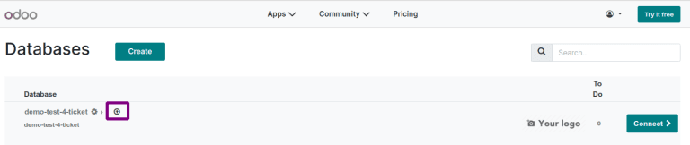
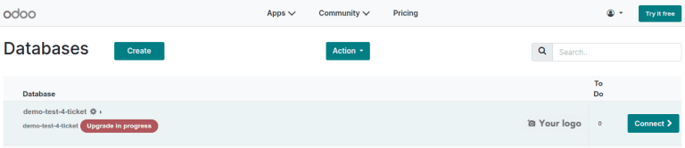
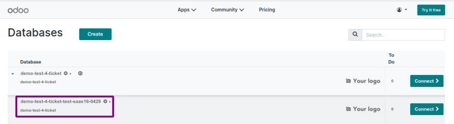

====================================
Upgrade Odoo SaaS to a newer version
====================================

In some cases, it is necessary to upgrade an Odoo SaaS database to a newer version. Reasons for
doing so include removing a bug that occurs in the current version, gaining access to a feature that
has been added in a version update, or simply because the company that owns the database wants to
stay up to date with the newest version. Odoo databases can be manually upgraded directly from the
main Odoo website.

To upgrade an Odoo database, navigate to the `Databases <https://www.odoo.com/my/databases>`_ page
and log in using the credentials of the account owner. The page will then display all of the Odoo
databases associated with the user's account. Any databases that are not already on the most recent
version of Odoo will display an :guilabel:`upgrade` button next to the name of the database.

Click on the :guilabel:`upgrade` button and an :guilabel:`Upgrade your database` pop-up will appear.
In the :guilabel:`drop-down` at the top of the pop-up, select the version of Odoo that the platform
will be upgraded to. In the :guilabel:`Email to notify` field, enter an email address that will
receive email notifications about the database upgrade.

There is also a :guilabel:`Purpose` section on the pop-up that is used to specify the reason for the
upgrade. However, at this stage of the process, the only selectable option is :guilabel:`Test`. This
is because Odoo requires users to create a test copy of the updated database before converting the
actual database. This allows users to confirm that their database configuration will work with the
newer version before making the upgrade permanent.

.. image:: odoo_online/upgrade-pop-up.png
   :align: center
   :alt: The "Upgrade your database" pop-up.

After filling out the form, click the green :guilabel:`Upgrade` button. The pop-up will then
disappear and the database being upgraded will show a red *Upgrade in progress* tag next to its
name. In addition, an email confirming that the upgrade is in progress will be sent to the email
address that was specified on the pop-up.

Once the upgrade is complete, a new test database will appear on the :guilabel:`My Databases` page.
To access the test database, click the drop-down arrow to the left of the main database's name. This
will make the test version appear below it. Finally, click the green :guilabel:`Connect` button on
the right side of the test version's row to go to the database.

Except for being on the newer version of Odoo, the test database will be an exact copy of the
one being upgraded. It is important to do extensive testing in this database to ensure that the
upgrade has not altered or corrupted any data, and that all workflows still proceed as expected.

After confirming the integrity of the new version, return to the *Databases* page. Once again,
click on the :guilabel:`upgrade` button next to the database being upgraded. The :guilabel:`Upgrade
your database` pop-up will appear as before, except that there will now be a :guilabel:`Production`
option under the :guilabel:`Purpose` section.

Select the :guilabel:`Production` option and then click :guilabel:`Upgrade` to begin the upgrade
process. As before, a notification email will be sent to the email address provided and a red
*Upgrade in progress* tag will appear next to the name of the database.

After the upgrade is finished, the *Upgrade in progress* tag will disappear and the database will be
upgraded to the version specified. Access the database by navigating to its URL or by clicking the
green :guilabel:`Connect` button on the right side of the screen.
