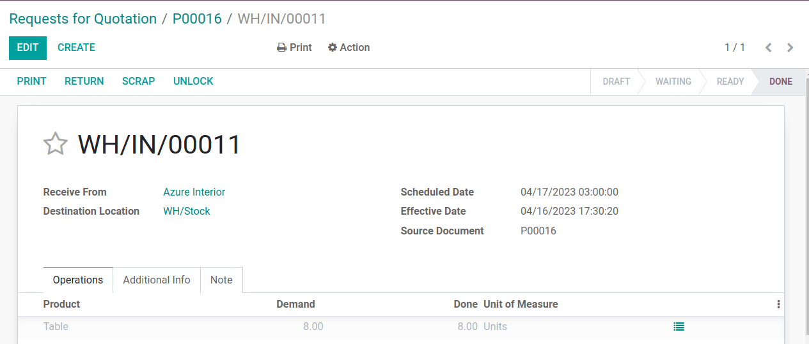

=========================================
Calculate average price on returned goods
=========================================

.. _inventory/avg_cost/definition:

Average cost valuation (AVCO) is an inventory valuation method that evaluates a cost based on the total cost of goods bought or produced
during a period, divided by the total number of items on-hand. Inventory valuation is used to:

- reflect the value of a company's assets;
- keep track of amount of unsold goods;
- account for monetary value in goods that has yet to generate profit, and;
- report on flow of goods throughout the quarter.

Because :abbr:`AVCO (Average Cost Valuation)` uses the weighted average to evaluate the cost, it is
a good fit for companies that sell only a few different products in large quantities. In Odoo, this
costing analysis is *automatically updated* each time products are received.

Thus, how does returning a shipment to its supplier affect the average cost valuation and accounting
entries?

.. note::
   This document addresses a specific use case for theoretical purposes. Navigate :ref:`here
   <inventory/inventory_valuation_config>` for instructions on how to set up and use AVCO in Odoo.

.. seealso::
   - :ref:`Using inventory valuation<inventory/reporting/using_inventory_val>`
   - :ref:`Other inventory valuation methods<inventory/inventory_valuation_config/costing_methods>`

Using average cost valuation
============================

The average cost method updates the inventory valuation of a company each time products are shipped
*into* the warehouse.

When new products arrive, the new average cost for each product is recomputed using the formula:

.. _inventory/avg_cost/formula:

Formula
-------

.. math::
   Avg~Cost = \frac{(Old~Qty \times Old~Avg~Cost) + (Incoming~Qty \times Purchase~Price)}{Final~Qty}

- **Old Qty**: product count in stock before receiving the new shipment;
- **Old Avg Cost**: calculated average cost for a single product from the previous inventory
  valuation;
- **Incoming Qty**: count of products arriving in the new shipment;
- **Purchase Price**: estimated price of products at the reception of products (since vendor bills
  may arrive later). The amount includes not only the price for the products, but also added costs,
  such as shipping, taxes, and :ref:`landed costs<inventory/reporting/landed_costs>`. At
  reception of the vendor bill, this price is adjusted.

.. _inventory/avg_cost/definite_rule:

.. important::
   When products leave the warehouse, the average cost **does not** change. Read why this fails
   :ref:`here<inventory/avg_price/leaving_inventory>`.

Configuration
-------------

To use average cost inventory valuation on a product, navigate to :menuselection:`Inventory -->
Configuration --> Product Categories` and select the category that will be using :abbr:`AVCO
(Average Cost Valuation)`. On the product category page, set :guilabel:`Costing Method` to `Average
Cost (AVCO)` and :guilabel:`Inventory Valuation` to `Automated`.

.. seealso::
   - :ref:`More details on configuration<inventory/inventory_valuation_config>`

.. _inventory/avg_cost/math_table:

Compute average cost
--------------------

To conceptualize how the average cost of a product changes each time a shipment arrives, the
following table contains a sequence of warehouse operations and stock moves. Each is a different example
of how the average cost valuation is affected.

+--------------------------------+---------------+-------------------+---------------+------------+
| Operation                      | Incoming Value| Inventory Value   | Qty On Hand   | Avg Cost   |
+================================+===============+===================+===============+============+
|                                |               | $0                | 0             | $0         |
+--------------------------------+---------------+-------------------+---------------+------------+
| 1. Receive 8 tables at $10/unit| 8 * $10        | $80               | 8             | $10        |
+--------------------------------+---------------+-------------------+---------------+------------+
| 2. Receive 4 tables at $16/unit| 4 * $16        | $144              | 12            | $12        |
+--------------------------------+---------------+-------------------+---------------+------------+
| 3. Deliver 10 tables           | -10 * $12       | $24               | 2             | $12        |
+--------------------------------+---------------+-------------------+---------------+------------+

Stock products for the first time
~~~~~~~~~~~~~~~~~~~~~~~~~~~~~~~~~

The initial stock is 0; therefore all values are $0.

At the first warehouse operation, `8` tables for `$10` each are shipped into the warehouse. The
   average cost is evaluated with the :ref:`formula<inventory/avg_cost/formula>`:

   .. math::
      Avg~Cost = \frac{0 + 8 \times $10}{8} = \frac{$80}{8} = $10

   #. Since *incoming quantity* of tables is `8` and the *purchase price* for each is `$10`;
   #. Multiply `8 * $10` to get `$80` in the numerator (the inventory value of the previous
      operation is `$0`);
   #. `$80` is divided by the total amount of tables to store, `8`;
   #. `$10` is the average cost of a single table from the first shipment.

.. _inventory/avg_price/order_8:

.. exercise::
   Verify in Odoo by ordering 8 tables for $10 each. Do this in the :guilabel:`Purchase` app and
   create a :guilabel:`Request for Quotation`. In the order form, fill in `Table` under the
   :guilabel:`Product` column and set the :guilabel:`Product Type` as `Storable`. Next, use the
   :guilabel:`-->` icon next to the :guilabel:`Product Category` field to set the :guilabel:`Costing
   Method` to `AVCO` and :guilabel:`Inventory Valuation` to `Automated`.

   Exit out of the pop-up windows and confirm the :abbr:`PO (Purchase Order)`. Receive the shipment from the
   vendor and switch to :menuselection:`Inventory --> Reporting --> Inventory Valuation`. By
   default, the entries are grouped by product, so select the drop-down for `Table`. The 8 tables in-stock are worth $80.

   .. image:: avg_price_valuation/inventory_val_8_tables.png
      :align: center
      :alt: Show inventory valuation of 8 tables in Odoo.

.. tip::
   The average cost of a product is also displayed on the :guilabel:`Cost` field, under the
   :guilabel:`General Information` tab, on the product page itself.

Receive additional products
~~~~~~~~~~~~~~~~~~~~~~~~~~~

2. In the second reception, `4` tables are purchased for a price of `$16` each. Refer to the
   :ref:`formula<inventory/avg_cost/formula>` again to update the average cost:

   .. math::
      Avg~Cost = \frac{8 \times $10 + 4 \times $16}{8+4} = \frac{$144}{12} = $12

   #. The *incoming quantity* of tables is `4` and the new *purchase price* is `$16`;
   #. The *old quantity* and *old price* are `8` and `$10`, respectively;
   #. Thus, the numerator is found by adding the product's old inventory value(`$80`) to
      the incoming value (`4 * $16 = $64`), `$80 + $64 = $144`;
   #. The numerator total (`$144`) is divided by the total on-hand stock, `8 + 4 = 12`;
   #. Thus, `$144 / 12 = $12` is the updated average cost per table at this time.

.. exercise::
   Verify this operation in Odoo by creating another :abbr:`PO (Purchase Order)` for 4 tables priced
   $16 each. :guilabel:`Confirm` the order to place it, then click :guilabel:`Validate` and :guilabel:`Receive
   Products`. Now that the 4 tables have entered the warehouse, return to the :guilabel:`Stock
   Valuation` screen to view how the cost of tables has changed.

   In :menuselection:`Inventory --> Reporting --> Inventory Valuation`, select the drop-down for
   `Table`. Displayed are the two stock moves, with the most recent 4 tables displayed on the top.

   .. image:: avg_price_valuation/inventory-val-4-tables.png
      :align: center
      :alt: Show inventory valuation of 4 plus 8 tables.

Deliver products to customers
~~~~~~~~~~~~~~~~~~~~~~~~~~~~~

For outgoing shipments, the former average price is used as the
   product's *purchase price*. To confirm that sending a delivery has no effect on average cost,
   see the :ref:`formula<inventory/avg_cost/formula>`:

   .. math::
      Avg~Cost = \frac{12 \times $12 + -10 \times $12}{12-10} = \frac{24}{2} = $12

   #. Because 10 tables are being sent out to customers, the *incoming quantity* is `-10`. The
      previous average cost (`$12`) is used in lieu of a vendor's *purchase price*;
   #. The *incoming inventory value* is `-10 * $12 = -$120`;
   #. The old *inventory value* (`$144`) is added to the *incoming inventory value* (`-$120`), so
      `$144 + -$120 = $24`;
   #. Only `2` tables remain after shipping out `10` tables from `12`. So the current *inventory
      value* (`$24`) is divided by the on-hand quantity (`2`);
   #. `$24 / 2 = $12`, which is the same average cost as the previous operation.

.. note::
   This shows that :ref:`outbound products have no affect on the average cost valuation
   <inventory/avg_cost/definite_rule>`.

.. example::
   Although the average cost valuation is not recalculated, delivering `10 tables` means that the
   inventory value decreases. In Odoo, sell 10 tables to a customer by going to the
   :guilabel:`Sales` app and creating a new quotation. Fill in the :guilabel:`Customer` field and
   add `Table` under the :guilabel:`Product`. Save and confirm the :abbr:`SO (Sales Order)`, and
   select the :guilabel:`Delivery` smart button to prepare the 10 tables for shipment. On the
   delivery order screen, click :guilabel:`Validate` to confirm that the tables have officially left the warehouse.

   In the inventory valuation report for `Table` found in :menuselection:`Inventory --> Reporting
   --> Inventory Valuation`, the first record in white displays how the delivery decreases the total
   value of the product in stock by 10 units. What is not represented in this stock valuation record is
   the revenue made from this sale, so this decrease is not a loss to the company.

   .. image:: avg_price_valuation/inventory-val-send-10-tables.png
      :align: center
      :alt: Show how deliveries decrease inventory valuation.

Return items to supplier (use case)
===================================

Because the price paid to suppliers can differ from the price the product is valued at with the :abbr:`AVCO (Average Cost Valuation)` method, Odoo handles
returned items in a specific way.

#. Products are returned to suppliers at the original purchase price, but;
#. The internal cost valuation remains unchanged.

The above :ref:`table<inventory/avg_cost/math_table>` is updated as follows:

+--------------------------------+---------------+-------------------+---------------+------------+
| Operation                      | Qty*Avg Cost  | Inventory Value   | Qty On Hand   | Avg Cost   |
+================================+===============+===================+===============+============+
|                                |               | $24               | 2             | $12        |
+--------------------------------+---------------+-------------------+---------------+------------+
| Return 1 table bought at $10   | -1 * $12       | $12               | 1             | $12        |
+--------------------------------+---------------+-------------------+---------------+------------+

In other words, returns are perceived by Odoo as another form of a product exiting the warehouse. To
Odoo, because the table is valued at $12 per unit, the inventory value is reduced by `$12` when the
product is returned; the initial purchase price of `$10` is unrelated to the table's average cost.

.. example::
   To return a table that was purchased for `$10`, go to the :guilabel:`Inventory` app and select
   the :guilabel:`Receipts` card in the Inventory Overview dashboard. This shows a list of all
   incoming shipments that were processed in the warehouse. Select the receipt for the 8 tables purchased in Exercise 1 [link to the Exercise box in the "Stock products for the first time" section].

   Then, click :guilabel:`Return` on the validated delivery order, and modify the quantity to `1` in the reverse transfer window. This creates an outgoing shipment for
   the table. Select :guilabel:`Validate` to confirm the outgoing shipment.

   Return to :menuselection:`Inventory --> Reporting --> Inventory Valuation` to see how the outgoing shipment decreases the inventory
   value by $12.

   .. image:: avg_price_valuation/inventory-valuation-return.png
      :align: center
      :alt: Inventory valuation for return

.. _inventory/avg_price/leaving_inventory:

Eliminate stock valuation errors in outgoing products
-----------------------------------------------------

Inconsistencies occur in a
company's inventory when the average cost valuation is recalculated on outgoing shipments.

To demonstrate this error, the table below displays a scenario in which 1 table is shipped to a customer and another is
returned to a supplier at the purchased price.

+------------------------------------------+---------------+-------------------+---------------+------------+
| Operation                                | Qty*Price     | Inventory Value   | Qty On Hand   | Avg Cost   |
+==========================================+===============+===================+===============+============+
|                                          |               | $24               | 2             | $12        |
+------------------------------------------+---------------+-------------------+---------------+------------+
| Ship 1 product to customer               | -1 \* $12     | $12               | 1             | $12        |
+------------------------------------------+---------------+-------------------+---------------+------------+
| Return 1 Product initially bought at $10 | -1 \* $10     | **$2**            | **0**         | $12        |
+------------------------------------------+---------------+-------------------+---------------+------------+

In the final operation above, the final inventory valuation for table is `$2` even though there are
`0` tables left in stock.

.. admonition:: Correct method

   Use the average cost to value the return. This does not mean the company gets $12 back for a $10
   purchase; the item returned for $10 is valued internally at $12. The inventory value change
   represents a product worth $12 no longer being accounted for in company assets.

Anglo-Saxon accounting
======================

Companies that use **Anglo-Saxon accounting** additionally keep a holding account that tracks the
amount to be paid to vendors. Once a vendor delivers an order, **Inventory value** increases
based on the vendor price of the products that have entered the stock. The holding account (called **stock
input**) is credited and only reconciled once the vendor bill is received.

.. seealso::
   - :ref:`Anglo-Saxon vs. Continental inventory valuation
     <inventory/inventory_valuation_config/accounting>`

The
table below reflects journal entries and accounts. The *stock input* account stores the
money intended to pay vendors when the vendor bill has not yet been received. To balance accounts when
returning products that have a price difference between the price the product is **valued at**
and the price it was bought for, a *price difference* account is created.

+-----------------------------------------+---------------+--------------+-------------------+---------------+------------+
| Operation                               | Stock Input   | Price Diff   | Inventory Value   | Qty On Hand   | Avg Cost   |
+=========================================+===============+==============+===================+===============+============+
|                                         |               |              | $0                | 0             | $0         |
+-----------------------------------------+---------------+--------------+-------------------+---------------+------------+
| Receive 8 tables at $10                 | ($80)         |              | $80               | 8             | $10        |
+-----------------------------------------+---------------+--------------+-------------------+---------------+------------+
| Receive vendor bill $80                 | $0            |              | $80               | 8             | $10        |
+-----------------------------------------+---------------+--------------+-------------------+---------------+------------+
| Receive 4 tables at $16                 | ($64)         |              | $144              | 12            | $12        |
+-----------------------------------------+---------------+--------------+-------------------+---------------+------------+
| Receive vendor bill $64                 | $0            |              | $144              | 12            | $12        |
+-----------------------------------------+---------------+--------------+-------------------+---------------+------------+
| Deliver 10 tables to customer           | $0            |              | $24               | 2             | $12        |
+-----------------------------------------+---------------+--------------+-------------------+---------------+------------+
| Return 1 table initially bought at $10  | **$10**       | **$2**       | **$12**           | 1             | $12        |
+-----------------------------------------+---------------+--------------+-------------------+---------------+------------+
| Receive vendor refund $10               | $0            | $2           | $12               | 1             | $12        |
+-----------------------------------------+---------------+--------------+-------------------+---------------+------------+

Product reception
--------------------

Summary
~~~~~~~

At product reception, Odoo ensures companies can pay for goods that were purchased by preemptively
moving an amount matching the price of received goods into the :doc:`liability account
</applications/finance/accounting/getting_started/cheat_sheet>`, **Stock Input**. Then, once the
bill has been received, the amount in the holding account is transferred to *Accounts Payable*.
Transfers into this account means the bill has been paid. **Stock Input** is reconciled once the
vendor bill is received.

Inventory valuation is a method of
calculating how much each in-stock product is worth internally. Since there is a difference between
the price the product is **valuated at** and the price the product was actually **purchased for**, the
**Inventory Valuation** account is unrelated to the crediting and debiting operations of the **Stock Input** account.

To conceptualize all this,
follow the breakdown below.

Accounts balanced at received products
~~~~~~~~~~~~~~~~~~~~~~~~~~~~~~~~~~~~~~

In this example, a company starts with zero units of a product, `table`, in stock. Then, 8 tables are received from the vendor:

#. The **Stock Input** account stores `$80` of credit owed to the vendor. The amount in this account is
   unrelated to the inventory value.
#. `$80` worth of tables came **in** (**Debit** the *Inventory Value* account `$80`), and
#. `$80` must be paid **out** for received goods (**Credit** the *Stock Input* account `$80`).

In Odoo
*******

Odoo generates an accounting journal entry when shipments that use the :abbr:`AVCO (Average Cost
Valuation)` costing method are received. Configure a :guilabel:`Price Difference Account` by
selecting the :guilabel:`➡️ (arrow)` icon next to the :guilabel:`Product Category` field on the product
page.

Under :guilabel:`Account Properties`, create a new :guilabel:`Price Difference Account` and set the
account :guilabel:`Type` as `Expenses`.

.. image:: avg_price_valuation/create-price-difference.png
   :align: center
   :alt: Create price difference account

To receive the shipment, select :guilabel:`Validate` on the :ref:`Receipt
<inventory/avg_price/order_8>` for a :abbr:`PO (Purchase Order)`.

Next, navigate to the :guilabel:`Accounting` app and go to the menu at the top of the screen to
select :menuselection:`Accounting --> Journal Entries`. In the list, find the :guilabel:`Reference`
that matches the warehouse reception operation for the relevant product.

.. image:: avg_price_valuation/search-for-entry-of-tables.png
   :align: center
   :alt: Show accounting entry of 8 tables from the list

Click on the line for 8 tables. This accounting journal entry shows that when the 8 tables were
received, the `Stock Valuation` account increased by `$80`. Conversely, the **Stock Input** account
(set as `Stock Interim (Received)` account by default) is credited `$80`.

.. image:: avg_price_valuation/accounting-entry-8-tables.png
   :align: center
   :alt: Debit stock valuation and credit stock input 80 dollars

Accounts balanced at received vendor bill
~~~~~~~~~~~~~~~~~~~~~~~~~~~~~~~~~~~~~~~~~

When the bill is received from vendor for 8 tables:

#. Use `$80` in the **Stock Input** account to pay the bill. This cancels out and the account now
   holds `$0`.
#. Debit **Stock Input** `$80` (to reconcile this account).
#. Credit **Accounts payable** `$80`. This account stores the amount the company owes others, so
   accountants use the amount to write checks to vendors.

In Odoo
*******

Once the vendor asks for payment, navigate to the :guilabel:`Purchase` app, and on the purple
header at the top, select :menuselection:`Orders --> Purchase` to locate the :abbr:`PO (Purchase
Order)` used to buy the 8 tables. Inside the :abbr:`PO (Purchase Order)`, select
:guilabel:`Create Bill`.

Click on the tab :guilabel:`Journal Items` to view how `$80` is transferred from the holding
account, `Stock Interim (Received)` to `Accounts Payable`. :guilabel:`Confirm` the bill to record
the payment to the vendor.

.. image:: avg_price_valuation/receive-8-table-bill.png
   :align: center
   :alt: Show bill linked to the purchase order for 8 tables

Receive 4 tables from the vendor (similar to #1)

   #. **Inventory value** increases because more 4 tables with an average cost of `$12` each enters
      the warehouse as an asset.
   #. Conversely, **credit** the **Stock Input** account `$64`.

 .. image:: avg_price_valuation/receive-4-tables.png
    :align: center
    :alt: Accounting entry for receiving 4 tables

#. Like #2, when the bill for 4 tables is received,

   #. **Stock input** account is debited, which reconciles it to `$0`.
   #. On the opposite end, **Accounts Payable** is credited, and the `$64` is handed off to the
      accountants to pay the vendor bill.

      .. image:: avg_price_valuation/receive-4-tables-bill.png
         :align: center
         :alt: Show bill linked to receiving 4 tables

On product delivery
-------------------

#. When 10 products are delivered, the **Stock Input** account is untouched because there are no new
   products coming in. To put it simply:
   #. **Inventory valuation** credited `$120`. Subtracting from inventory valuation represents
      `$120` worth of products exiting the company.
   #. Debit **Accounts Receivable** to record revenue from the sale.

.. image:: avg_price_valuation/sell-10-tables.png
   :align: center
   :alt: Show journal items linked to sale order

.. spoiler:: Understand Anglo-Saxon expensing (that's slightly unrelated to inventory valuation)
   In the image above, the accounts **Product Sales**, **Tax Received**, and **Accounts Receivable**
   all pertain to the sale of the product. **Accounts Receivable** is the account where the customer
   payment will be received.

   Anglo-Saxon accounting recognizes the cost of goods sold (COGS) once the sale is made. So, up
   until the product is sold, scrapped, or returned, costs of keeping the product in stock are not
   accounted for. The **Expense** account is debited `$120` to log the costs of storing 10 tables
   during this period of time.

On product return
-----------------

When returning 1 table purchased at `$10`, a company expects `$10` in the **Accounts payable**
account from the vendor. However, **Stock Input** account must be debited `$12` because the average
cost is `$12` at the time of the return. The missing `$2` is accounted for in the :guilabel:`Price
Difference Account`, which is set up in the product's :guilabel:`Product Category`.

.. note::
   Behavior of *price difference accounts* varies from localization. In this case, the account is
   intended to store differences between vendor price and *automated* inventory valuation methods.

A summary of the image below:

#. Debit **Stock Input** account `$10` to move the table from stock to stock input. This move
   is to indicate that the table is to be processed for an outgoing shipment.
#. Debit **Stock Input** an additional `$2` to account for the **Price Difference**.
#. Credit **Stock Valuation** `$12` because the item is leaving the stock.

.. image:: avg_price_valuation/expensing-price-difference-account.png
   :align: center
   :alt: 2 dollar difference expensed in price difference account

Once the vendor's refund is received,

#. Credit **Stock Input** account `$10` to reconcile the price of the table.
#. Debit *Account payable* `$10` to have the accountants collect and register the payment in
   their journal.

.. image:: avg_price_valuation/return-credit-note.png
   :align: center
   :alt: Return to get 10 dollars back
