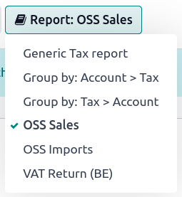

===================================
EU intra-community distance selling
===================================

EU intra-community distance selling refers to the trade of goods between businesses (B2B) or
individuals (B2C) located in different European Union member states. It involves selling and
delivering goods from one EU country to another, where the buyer and seller are both registered for
VAT purposes.

In distance selling, the term "distance" refers to the buyer and seller not being physically present
at the same location. Instead, the transaction is conducted remotely, typically through online
platforms, mail orders, telephone, or other means of communication.

EU intra-community distance selling is subject to specific VAT rules and regulations. The seller
must charge VAT per the VAT rate applicable in the buyer's country.

.. note::
   This remains true even if your organization is located outside of the European Union.

One-Stop Shop (OSS)
===================

The Union :abbr:`One-Stop Shop (OSS)` is an online portal where businesses can register for the OSS
and declare their intra-community distance sales. Each EU member state has its own online OSS
portal integration.

The **EU intra-community Distance Selling** feature helps you comply with this regulation by
creating and configuring new :doc:`fiscal positions <fiscal_positions>` and :doc:`taxes <../taxes>`
based on your company's country.

To enable it, go to :menuselection:`Accounting --> Configuration --> Settings --> Taxes`, enable
:guilabel:`EU intra-community Distance Selling`, and :guilabel:`Save`.

.. _eu_distance_selling/configuration:

.. image:: eu_distance_selling/enable-feature.png
   :align: center
   :alt: EU intra-community Distance Selling feature in Odoo Accounting settings

.. seealso::
   - `European Commission: OSS | Taxation and Customs Union
     <https://ec.europa.eu/taxation_customs/business/vat/oss_en>`_
   - :doc:`../../fiscal_localizations`

.. _eu_distance_selling/taxes:

Fiscal positions and taxes
==========================

Once :ref:`enabled <eu_distance_selling/configuration>`, the feature automatically creates all the
necessary :doc:`taxes <../taxes>` and :doc:`fiscal positions <fiscal_positions>` needed for each EU
member state, based on your company's country.

.. tip::
   Whenever you add or modify taxes, you can automatically update your fiscal positions. To do so,
   go to :menuselection:`Accounting/Invoicing --> Settings --> Taxes --> EU intra-community Distance
   Selling` and click on the :guilabel:`Refresh tax mapping`.
.. note::
   We highly recommend checking that the proposed mapping is suitable for the products and services
   you sell before using it.

.. seealso::
   - :doc:`fiscal_positions`
   - :doc:`../taxes`

Reports
=======

To generate **OSS sales** or **OSS imports reports** and submit them onto the OSS portal, go to
:menuselection:`Accounting --> Reporting --> Tax Report`, click :guilabel:`Tax Report: Global
Summary`, and select either :guilabel:`OSS Sales` or :guilabel:`OSS Imports`. Once selected, click
on :guilabel:`PDF` or :guilabel:`XLSX`, or :guilabel:`XML` in the top-left corner. This generates
the currently-opened report in the chosen format.

Once generated, log into the platform of your competent federal authority to submit it onto the OSS
portal.
