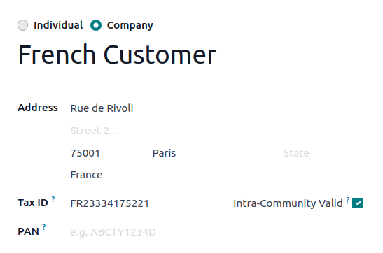

===============================
VAT numbers verification (VIES)
===============================

`VAT Information Exchange System <https://ec.europa.eu/taxation_customs/vies/#/vat-validation>`_, or
**VIES**, is a tool provided by the European Commission that allows you to check the validity of VAT
numbers for companies registered in the European Union.

Odoo uses this tool to verify your contacts' VAT numbers directly from Odoo's interface.

.. note::
   Regardless of whether or not the Verify VAT Numbers feature is enabled, Odoo checks the format of
   a contact's VAT against the expected format of VAT numbers from that country.

.. seealso::
   `VAT identification number formats <https://en.wikipedia.org/wiki/VAT_identification_number>`_

VIES VAT number validation
==========================

To activate this feature, go to the :guilabel:`Taxes` section in :menuselection:`Accounting -->
Configuration --> Settings`, enable the :guilabel:`Verify VAT Numbers` feature, and click on
:guilabel:`Save`.

Once the :guilabel:`Verify VAT Numbers` feature is enabled, if the :guilabel:`Tax ID` field is
populated *and* the contact's country is different from your company's country, Odoo displays an
:guilabel:`Intra-Community Valid` checkbox. Odoo tests the VAT number through the VIES and
automatically checks or unchecks the :guilabel:`Intra-Community Valid` checkbox depending on the
validity of the VAT number.

.. note::
   It is possible to manually override the :guilabel:`Intra-Community Valid` field on a contact in
   case the automatic VIES check is incorrect (for example, if the company was recently created and
   its VAT is not yet in the VIES). This change is logged in the chatter for transparency.

Automatically applying fiscal positions
=======================================

Odoo can :ref:`automatically apply fiscal positions <fiscal_positions/automatic>`. If the Verify VAT
Numbers feature is enabled, any fiscal positions with VAT required enabled will require
Intra-Community valid VAT numbers to apply automatically.
