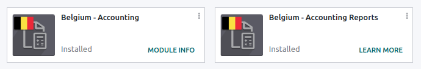
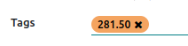
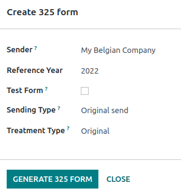
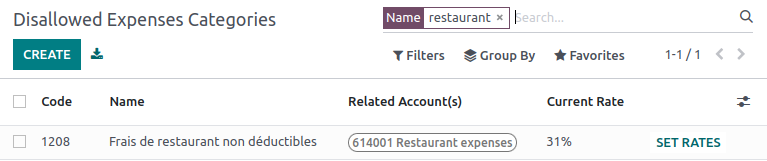
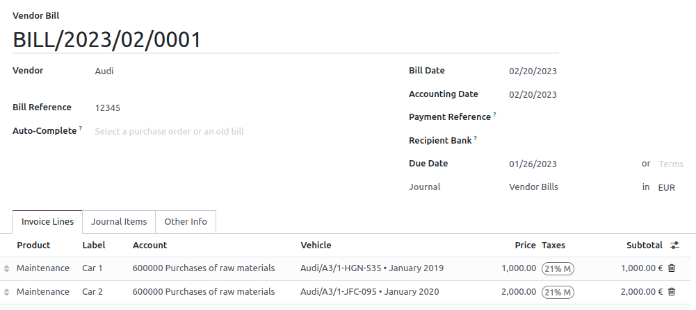
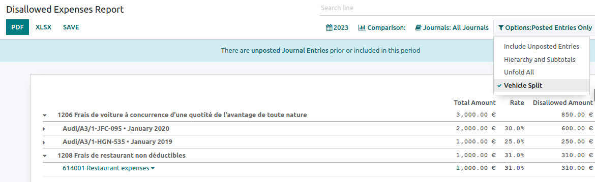
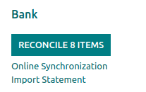
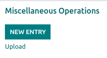

=======
Belgium
=======

Configuration
=============

If not yet installed, :ref:`install <general/install>` the :guilabel:`Belgium - Accounting` and the
:guilabel:`Belgium - Accounting Reports` modules to get all the features of the Belgian
localization, following the :abbr:`IFRS(International Financial Reporting Standards)` rules.

.. list-table::
   :header-rows: 1

   * - Name
     - Technical name
     - Description
   * - :guilabel:`Belgium - Accounting`
     - `l10n_be`
     - Installing this module grants you access to the basic accounting features for Belgium,
       including Belgian taxes, Chart of accounts and fiscal positions.
   * - :guilabel:`Belgium - Accounting Reports`
     - `l10n_be_reports`
     - Installing this module grants you access to specific accounting reports for Belgium.

Chart of accounts
=================

You can reach the :guilabel:`Chart of accounts` by going to :menuselection:`Accounting -->
Configuration --> Accounting: Chart of Accounts`.

The Belgian :guilabel:`Chart of accounts` includes pre-configured accounts as described in the
:abbr:`PCMN(Plan Comptable Minimum Normalisé)`. To add a new account, click :guilabel:`New`. A new
line appears. Fill it in, :guilabel:`Save` and click :guilabel:`Setup` to configure it further.

.. seealso::
   - Odoo Tutorial: `Chart of accounts <https://www.odoo.com/slides/slide/chart-of-accounts-1630?fullscreen=1>`_.
   - Odoo Tutorial: `Update your Chart of accounts tutorial <https://www.odoo.com/slides/slide/update-your-chart-of-accounts-1658?fullscreen=1>`_.

Taxes
=====

Default Belgian taxes are created automatically when the :guilabel:`Belgium - Accounting` and
the :guilabel:`Belgium - Accounting Reports` modules are installed. Each tax impacts the Belgian
:guilabel:`Tax Report`, available by going to :menuselection:`Accounting --> Reporting -->
Statements Reports: Tax Report`.

In Belgium, the standard rate is **21%**, but there are lower rates for some categories of goods
and services. A rate of **12%** is applied on social housing and food served in restaurants, while a
rate of **6%** applies to most basic goods, such as food, water supply, books, and medicine. A
**0%** rate is available on some daily and weekly publications, as well as recycled goods.

.. seealso::
   :doc:`../accounting/reporting/tax_returns`.

Non-deductible taxes
--------------------

In Belgium, some taxes are not fully deductible, such as taxes on maintenance of cars. It means that
a part of these taxes is considered as an expense.

In Odoo, you can configure non-deductible taxes by creating tax rules for these taxes and linking
them to the corresponding accounts. This way, the system automatically calculates the taxes and
allocates them to the appropriate accounts.

To configure a new non-deductible tax, go to :menuselection:`Accounting --> Configuration -->
Accounting: Taxes`, and click :guilabel:`New`. :guilabel:`Add a line` and set as :guilabel:`Base` in
the :guilabel:`Based On` column, :guilabel:`Add a line` with the **non-deductible** percentage in
the :guilabel:`%` column, set :guilabel:`of tax` in the :guilabel:`Based On` column, and select the
:guilabel:`Tax Grid(s)` related to your tax. Finally, :guilabel:`Add a line` with the **deductible**
percentage in the :guilabel:`%` column, set :guilabel:`of tax` in :guilabel:`Based On`, select
:guilabel:`411000 VAT recoverable` as account, and select the related tax grid.

.. note::
   Make sure to repeat the same steps for the :guilabel:`Distribution for invoices` section and the
   :guilabel:`Distribution for refunds` section.
.. seealso::
  :doc:`Taxes <../accounting/taxes>`.

Once you have created the non-deductible tax, you can apply it to your transactions by selecting the
appropriate tax during the creation of invoices or bills. The system automatically calculates
the tax amount and allocates it to the corresponding accounts based on the tax rules configured.

.. note::
   With the Belgian localization, the **21% car** tax is created by default (50% non-deductible).

Accounting reports
==================

Here is the list of Belgian-specific reports available on Odoo Enterprise:

- Balance sheet;
- Profit & loss;
- Tax report;
- Partner VAT Listing;
- Intrastat.

.. seealso::
   :doc:`../accounting/reporting`.

Fee form 281.50 and form 325
============================

Fee form 281.50
---------------

Annually, individual :guilabel:`Fee form 281.50` must be reported to the fiscal authorities.

The tag :guilabel:`281.50` must be added on the :guilabel:`Contact form` (res.partner) of the
supplier you want to generate a 281.50 report to. To do so, go to the :guilabel:`Contacts` app,
select the supplier you want to create a :guilabel:`Fee form 281.50` for, and add the
:guilabel:`281.50` tag in the :guilabel:`Tags` field.

Then, go to :menuselection:`Accounting --> Configuration --> Acounting: Chart of Accounts`, and
click on :guilabel:`Setup` to add the corresponding :guilabel:`281.50` tag on the impacted accounts,
ie.: :guilabel:`281.50 - Commissions`, depending on the nature of the expense.

Form 325
--------

You can create :guilabel:`Form 325` by going to :menuselection:`Accounting --> Reporting -->
Belgium: Create 325 form`. A new page pops up: select the right options and click
:guilabel:`Generate 325 Form`.

Go to :menuselection:`Accounting --> Reporting --> Belgium: Open 325 forms` to view the
:guilabel:`325 forms` you already generated.

Disallowed expenses report
==========================

**Disallowed expenses** are expenses that can be deducted from your bookkeeping result but not from
your fiscal result.

The :guilabel:`Disallowed Expenses Report` is available by going to
:menuselection:`Accounting --> Reporting --> Management: Disallowed Expenses`. It allows financial
results in real-time, and periodic changes. This report is generated based on the
:guilabel:`Disallowed Expenses Categories`, that you can reach by going to
:menuselection:`Accounting --> Configuration --> Management: Disallowed Expenses Categories`. Some
categories already exist by default but do not have any rates. Click on :guilabel:`Set Rates` to
update a specific category.

.. tip::
  - You can add multiple rates for various dates. In that case, when a expense is calculated, it
    takes the corresponding amount to the date mentioned.
  - Tick the :guilabel:`Car Category` box when applicable. This makes the vehicle mandatory while
    booking a vendor bill.

To link a :guilabel:`Disallowed Expenses Category` with a specific account, go to
:menuselection:`Accounting --> Configuration --> Acounting: Chart of Accounts`. Find the account you
want, and click on :guilabel:`Setup`. Add the :guilabel:`Disallowed Expense category` in the
:guilabel:`Disallowed Expenses` field. From now, when an expense is created with this account, the
disallowed expense is calculated based on the rate mentioned in the
:guilabel:`Disallowed Expense category`.

Let’s take an example reflecting **car expenses** and **restaurant expenses**.

Restaurant expenses
-------------------

In Belgium, 31% of **restaurants** expenses are non-deductible. Set the :guilabel:`Current Rate` and
:guilabel:`Related Account(s)`.

Car expenses: vehicle split
---------------------------

In Belgium, the deductible percentage varies from car to car and, therefore, should be indicated for
each vehicle. To do so, go to the :guilabel:`Fleet` app and select a vehicle. In the
:guilabel:`Tax info` tab, go to the :guilabel:`Disallowed Expenses Rate` section and click on
:guilabel:`Add a line`. Add a :guilabel:`Start Date` and a :guilabel:`%`. The amounts goes in the
same account for all car expenses.

When you create a bill for car expenses, you can link each expense to a specific car by filling the
:guilabel:`Vehicle` column, so the right percentage is applied.

The :guilabel:`vehicle split` option available in the :guilabel:`Disallowed Expenses Report` allows
you to see the rate and disallowed amount for each car.

Electronic invoicing
====================

The :guilabel:`E-FFF` and :guilabel:`Peppol BIS Billing 3.0 (UBL)` formats are enabled by default
when the Belgian localization is installed.

You can update the settings by going to :menuselection:`Accounting --> Configuration --> Journals
--> Customer Invoices --> Advanced Settings --> Electronic Invoicing`.

.. seealso::
   :doc:`../accounting/customer_invoices/electronic_invoicing`

CODA
====

:guilabel:`CODA` is an electronic XML format used to import Belgian bank statements. You can
download CODA files from your bank and import them directly in Odoo by clicking
:guilabel:`Import Statement` from your :guilabel:`Bank` journal on your dashboard, and select the
CODA file(s) you want. This automatically creates your bank statements into your :guilabel:`Bank`
journal.

.. note::
   The :guilabel:`Belgium - Import Bank CODA Statements` module is installed by default when the
   :guilabel:`Belgium - Accounting` and the :guilabel:`Belgium - Accounting Reports` modules are
   installed.

.. seealso::
   :ref:`Import bank statements file <transactions/import>`.

SODA
====

:guilabel:`SODA` is an electronic XML format used to import accounting entries related to salaries.
SODA files can be imported in the :guilabel:`Miscellaneous` journal, by clicking :guilabel:`Upload`.

Once your :guilabel:`SODA` files are imported, the entries are created automatically in your
**MISC** journal.

Cash discount
=============

In Belgium, the tax is calculated based on the product price after discount, whether it effectively
applies or not.

.. Seealso::
   :doc:`../accounting/customer_invoices/cash_discounts`.

.. _belgium/introduction:

Fiscal certification: POS restaurant
====================================

In Belgium, the owner of a cooking business such as a restaurant or food truck is required by law to
use a government-certified **Cash Register System** for their receipts. This applies if their yearly
earnings (excluding VAT, drinks, and take-away food) exceed 25,000 euros.

This government-certified system entails the use of a :ref:`certified POS system
<belgium/certified>`, along with a device called a :ref:`Fiscal Data Module <belgium/fdm>` (or
**black box**) and a :ref:`VAT Signing Card <belgium/vat>`.

.. important::
   Do not forget to register as *foodservice industry manager* on the `Federal Public Service
   Finance registration form <https://www.systemedecaisseenregistreuse.be/fr/enregistrement>`_.

.. _belgium/certified:

Certified POS system
--------------------

The Odoo POS system is certified for the major versions of databases hosted on **Odoo Online** and
**Odoo.sh**. Please refer to the following table to ensure that your POS system is certified.

.. list-table::
   :header-rows: 1
   :stub-columns: 1

   * -
     - Odoo Online
     - Odoo.sh
     - On-Premise
   * - Odoo 16.0
     - Review in progress
     - Review in progress
     - Not certified
   * - Odoo 15.2
     - Not certified
     - Not certified
     - Not certified
   * - Odoo 15.0
     - Certified
     - Certified
     - Not certified
   * - Odoo 14.0
     - Certified
     - Certified
     - Not certified

.. seealso::
   :doc:`/administration/maintain/supported_versions`

A `certified POS system <https://www.systemedecaisseenregistreuse.be/systemes-certifies>`_ must
adhere to rigorous government regulations, which means it operates differently from a non-certified
POS.

- On a certified POS, you cannot:

  - Set up and use the **global discounts** feature (the `pos_discount` module is blacklisted and
    cannot be activated).
  - Set up and use the **loyalty programs** feature (the `pos_loyalty` module is blacklisted and
    cannot be activated).
  - Reprint receipts (the `pos_reprint` module is blacklisted and cannot be activated).
  - Modify prices in order lines.
  - Modify or delete order lines in POS orders.
  - Sell products without a valid VAT number.
  - Use a POS that is not connected to an IoT box.

- The :doc:`cash rounding <../../sales/point_of_sale/pricing/cash_rounding>` feature must be
  activated and set to a :guilabel:`Rounding Precision` of `0,05` and a :guilabel:`Rounding Method`
  set as :guilabel:`Half-Up`.
- Taxes must be set as included in the price. To set it up, go to :menuselection:`Point of Sale -->
  Configuration --> Settings`, and from the :guilabel:`Accounting` section, open the
  :guilabel:`Default Sales Tax` form by clicking the arrow next to the default sales tax field.
  There, click :guilabel:`Advanced Options` and enable :guilabel:`Included in Price`.
- At the start of a POS session, users must click :guilabel:`Work in` to clock in. Doing so allows
  the registration of POS orders. If users are not clocked in, they cannot make POS orders.
  Likewise, they must click :guilabel:`Work Out` to clock out at the end of the session.

.. warning::
   If you configure a POS to work with a black box, you cannot use it again without it.

.. _belgium/fdm:

The Fiscal Data Module
----------------------

The :abbr:`FDM (Fiscal Data Module)`, or `black box <https://www.boîtenoire.be/fonctionnement>`_, is
a government-certified device that works together with the Point of Sale application and saves your
POS orders information. Concretely, a **hash** (:dfn:`unique code`) is generated for each POS order
and added to its receipt. This allows the government to verify that all revenue is declared.

.. note::
   Ensure your black box is approved by the Belgian government. You can check the compliance of your
   black box by visiting the `Federal Public Service Finance
   <https://www.systemedecaisseenregistreuse.be/systemes-certifies#FDM%20certifiés>`_ website.

Configuration
~~~~~~~~~~~~~

Before setting up your database to work with an FDM, ensure you have the following hardware:

- a registered :ref:`black box <belgium/blackbox>` (go to `www.boîtenoire.be
  <https://www.boîtenoire.be/ma-caisse/>`_ to order yours);
- an RS-232 serial null modem cable per FDM;
- an RS-232 serial-to-USB adapter per FDM;
- an :ref:`IoT Box <belgium/iotbox>` (one IoT box per black box); and
- a receipt printer.

.. _belgium/blackbox:

Black box module
****************

As a pre-requisite, :ref:`activate <general/install>` the `Belgian Registered Cash Register` module
(technical name: `pos_blackbox_be`).

.. image:: belgium/be-modules.png
   :align: center
   :alt: black box modules for belgian fiscal certification

Once the module is activated, add your VAT number to your company information. To set it up, go to
:menuselection:`Settings --> Companies --> Update Info`, and fill in the :guilabel:`VAT` field.
Then, enter a national registration number for every staff member who operates the POS system. To do
so, go to the :guilabel:`Employees` app and open an employee form. There, go to :menuselection:`HR
settings tab --> Attendance/Point of Sale`, and fill in the :guilabel:`INSZ or BIS number` field.

.. image:: belgium/bis-number.png
   :align: center
   :alt: ISNZ or BIS number field on employee form

.. tip::
   To input your information, click on your avatar, go to :menuselection:`My Profile --> Preference
   tab`, and enter your INSZ or BIS number in the designated field.

.. warning::
   You must configure the black box directly in the production database. Utilizing it in a testing
   environment may result in incorrect data being stored within the black box.

.. _belgium/iotbox:

IoT Box
*******

In order to use a Fiscal Data Module, you need a registered IoT Box. To register your IoT box, you
must contact us through our `support contact form <https://www.odoo.com/help>`_ and provide the
following information:

- your VAT number;
- your company's name, address, and legal structure; and
- the Mac address of your IoT Box.

Once your IoT box is certified, :doc:`connect <../../productivity/iot/config/connect>` it to your
database. To verify that the IoT Box recognizes the FDM, go to the IoT homepage and scroll down the
:guilabel:`IOT Device` section, which should display the FDM.

.. image:: belgium/iot-devices.png
   :align: center
   :alt: Hardware status page on a registered IoT Box

Then, add the IoT to your POS. To do so, go to :menuselection:`Point of Sale --> Configuration -->
Point of Sale`, select your POS, scroll down to the :guilabel:`Connected Device` section, and enable
:guilabel:`IoT Box`. Lastly, add the FMD in the :guilabel:`Fiscal Data Module` field.

.. note::
   To be able to use an FDM, you must at least connect one :guilabel:`Receipt Printer`.

.. _belgium/vat:

VAT signing card
----------------

When you open a POS session and make your initial transaction, you are prompted to enter the PIN
provided with your :abbr:`VSC (VAT signing card)`. The card is delivered by the :abbr:`FPS (Service
Public Federal Finances)` upon `registration <https://www.systemedecaisseenregistreuse.be/fr/enregistrement>`_.
