=====
Chile
=====

Webinars
========

The videos below show a general description of the localization and the tutorials show specific
workflows that will be very useful while using Odoo in Chile.

- `VIDEO WEBINAR OF CHILEAN LOCALIZATION: INTRO AND DEMO <https://youtu.be/BHnByZiyYcM>`_.
- `VIDEO WEBINAR OF DELIVERY GUIDE <https://youtu.be/X7i4PftnEdU>`_.
- `TUTORIALS <https://youtube.com/playlist?list=PL1-aSABtP6AB6UY7VUFnVgeYOaz33fb4P>`_.

Introduction
============

The Chilean localization has been improved and extended in Odoo 16. In this version, the next
modules are available:

- **l10n_cl:** Adds accounting features for the Chilean localization, which represent the minimal
  configuration required for a company to operate in Chile and under the SII (Servicio de Impuestos
  Internos) regulations and guidelines.
- **l10n_cl_edi:** Includes all technical and functional requirements to generate and receive
  electronic invoice via web service, based on the :abbr:`SII (Servicio de Impuestos Internos)`
  regulations.
- **l10n_cl_reports:** Adds the reports Propuesta F29 y Balance Tributario (8 columnas).
- **l10n_cl_boletas:** Includes all technical and functional requirements to generate and receive
  electronic receipts via web service, based on the :abbr:`SII (Servicio de Impuestos Internos)`
  regulations.
- **l10n_cl_edi_stock:** Includes all technical and functional requirements to generate delivery
  guides via web service, based on the :abbr:`SII (Servicio de Impuestos Internos)` regulations.
- **l10n_cl_edi_exports:** Includes all technical and functional requirements to generate electronic
  invoices for exporting goods, based on the :abbr:`SII (Servicio de Impuestos Internos)` and
  customs regulations.

Configuration
=============

Install the Chilean localization modules
----------------------------------------

For this, go to :menuselection:`Apps` and search for `Chile`. Then click :guilabel:`Install` for all
modules.

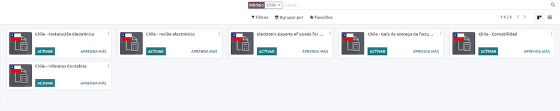

.. note::
   When a database is created from scratch and selecting :guilabel:`Chile` as the country, Odoo will
   automatically install the base module: *Chile - Accounting*. The module *l10n_cl_edi_stock* is
   dependent on the *Inventory* application.

Company settings
~~~~~~~~~~~~~~~~

Once the modules are installed, the first step is to set up the company data.

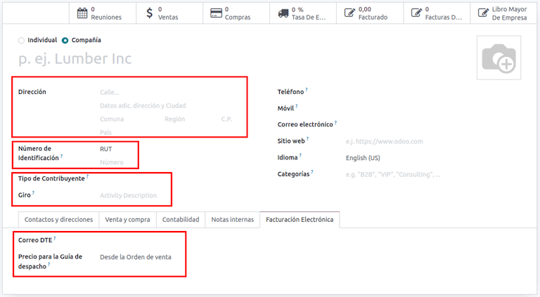

.. important::
   All the following configuration and functionality is only available in Odoo if your company
   already passed the `Certification process
   <https://www.sii.cl/factura_electronica/factura_mercado/proceso_certificacion.htm>`_ in the
   :abbr:`SII (Servicio de Impuestos Internos)` - Sistema de Facturación de Mercado, this
   certification enables you to generate electronic invoices from your ERP and send them
   automatically to the :abbr:`SII (Servicio de Impuestos Internos)`. If your company has not passed
   this certification yet, make sure you communicate this to your Account Manager as a special
   process outside Odoo is required in order to complete this certification.

Additional to the basic information, you need to add all the data and elements required for
*electronic invoice*, the easiest way to configure it is in :menuselection:`Accounting --> Settings
--> Chilean Localization`.

Fiscal information
~~~~~~~~~~~~~~~~~~

Fill in the fiscal information for your company according to the :abbr:`SII (Servicio de Impuestos
Internos)` register, follow the instructions on each section.

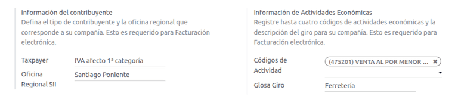

Electronic invoice data
~~~~~~~~~~~~~~~~~~~~~~~

This is part of the main information required to generate electronic invoice, select your
environment and the legal information, as well as the email address to receive invoices from your
vendors and the alias you use to send invoices to your customers.

.. image:: chile/electronic-invoice-data.png
   :align: center
   :alt: Required information for electronic invoice.

Configure DTE incoming email server
~~~~~~~~~~~~~~~~~~~~~~~~~~~~~~~~~~~

In order to receive the claim and acceptance emails from your customers, it is crucial to define the
:abbr:`DTE (Documentos Tributarios Electrónicos)` incoming email server, considering this
configuration:

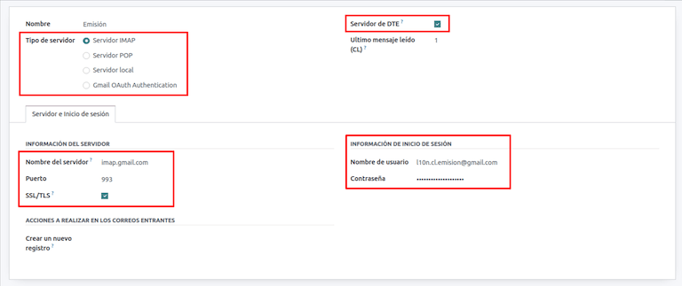

.. tip::
   Before going live, make sure you archive/remove from your inbox all the emails related to vendor
   bills that are not required to be processed in Odoo.

Certificate
~~~~~~~~~~~

In order to generate the electronic invoice signature, a digital certificate with the extension
:file:`.pfx` is required, proceed to the next section in the localization settings and load your
file and password.

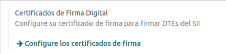

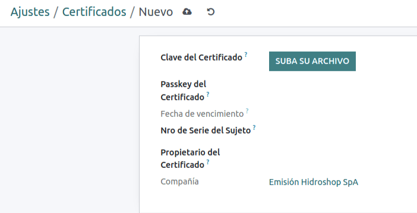

A certificate can be shared between several users. If this is the case leave the user field empty,
so all your billing users can use the same one. On the other hand, if you need to restrict the
certificate for a particular user, just define the users in the certificate.

.. note::
   In some cases, depending on the certificate format, it is possible that the field
   :guilabel:`Subject Serial Number` is not loaded automatically. If this is the case, you can
   manually edit this field by filling it with the Certificate's legal representative RUT.

Multicurrency
~~~~~~~~~~~~~

The official currency rate in Chile is provided by the Chilean service `mindicador.cl
<https://mindicador.cl>`_. You can find this service in the currency rate configuration, and you can
set a predefined interval for the rate updates.

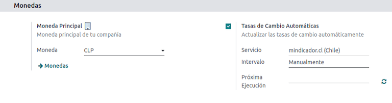

Chart of accounts
~~~~~~~~~~~~~~~~~

The :doc:`chart of accounts
</applications/finance/accounting/getting_started/initial_configuration/chart_of_accounts>` is
installed by default as part of the set of data included in the localization module. The accounts
are mapped automatically in:

- Taxes.
- Default Account Payable.
- Default Account Receivable.
- Transfer Accounts.
- Conversion Rate.

Master Data
-----------

Partner
~~~~~~~

Identification Type and VAT
***************************

As part of the Chilean localization, the identification types defined by the :abbr:`SII (Servicio de
Impuestos Internos)` are now available on the partner form. This information is essential for most
transactions.

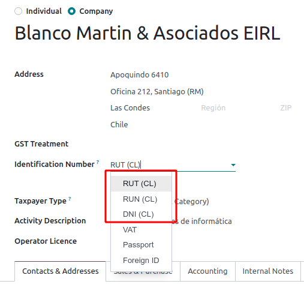

Taxpayer Type
*************

In Chile, the document type associated with customers and vendors transactions is defined based on
the :guilabel:`Taxpayer Type`. This field should be defined in the partner form, when creating a
customer is important you make sure this value is set:

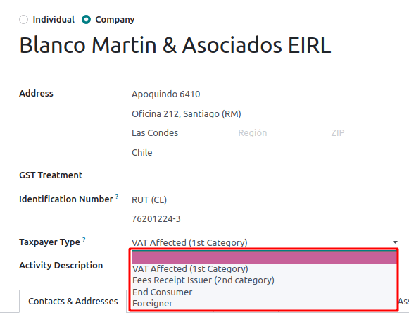

Electronic invoice data
***********************

As part of the information sent in the electronic invoice, the :abbr:`DTE (Documentos Tributarios
Electrónicos)` email that will appear as the sender to the customer needs to be defined as well as
the :guilabel:`Activity Description` and the :guilabel:`Delivery Guide Price`.

.. image:: chile/dte-email-electronic-invoice.png
   :align: center
   :alt: Chilean electronic invoice data for partners.

The options available for the :guilabel:`Delivery Guide Price` are:

- :guilabel:`From Sales Order`: Delivery guide takes the product price from the sales order and
  shows it on the document.
- :guilabel:`From Product Template`: Odoo takes the price configured in the product template and
  shows it on the document.
- :guilabel:`Do Not Show price`: No price is shown in the delivery guide.

Taxes
~~~~~

As part of the localization module, the taxes are created automatically with their related financial
account and configuration.

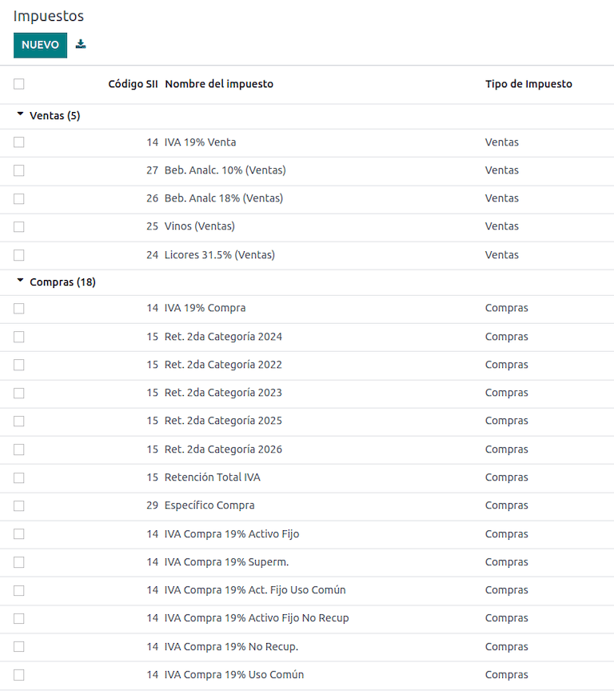

Tax types
*********

Chile has several tax types, the most common ones are:

- VAT: Is the regular VAT and it can have several rates.
- ILA (Impuesto a la Ley de Alcholes): Taxes for alcoholic drinks. It has a different rate.

Fiscal positions
~~~~~~~~~~~~~~~~

Based on the purchase transactions, the VAT can have different affections. This will be done
in Odoo using the default purchase fiscal positions.

Document types
~~~~~~~~~~~~~~

In some Latin American countries, including Chile, some accounting transactions like invoices and
vendor bills are classified by document types defined by the government fiscal authorities (In Chile
case: :abbr:`SII (Servicio de Impuestos Internos)`).

The document type is essential information that needs to be displayed in the printed reports and
needs to be easily identified within the set of invoices as well as account moves.

Each document type can have a unique sequence per company. As part of the localization, the document
type includes the country on which the document is applicable and the data is created automatically
when the localization module is installed.

The information required for the document types is included by default so the user doesn't need to
fill anything on this view:

.. image:: chile/chilean-document-types.png
   :align: center
   :alt: Chilean fiscal document types list.

.. note::
   There are several document types that are inactive by default but can be activated if needed.

Use on invoices
***************

The document type on each transaction will be determined by:

- The journal related to the invoice, identifying if the journal uses documents.
- Condition applied based on the type of issuer and recipient (ex. Type of fiscal regimen of the
  buyer and type of fiscal regimen of the vendor).

Journals
--------

Usage
~~~~~

Sales
*****

*Sales journals* in Odoo usually represent a business unit or location, example:

- Ventas Santiago.
- Ventas Valparaiso.

For the retail stores it is common to have one journal per :abbr:`POS (Point of Sale)`:

- Cashier 1.
- Cashier 2.

Purchases
*********

The purchase transactions can be managed with a single journal, but sometimes companies use more
than one in order to handle some accounting transactions that are not related to vendor bills but
can easily be registered using this model, for example:

- Tax payments to the government.
- Employees payments.

Configuration
~~~~~~~~~~~~~

When creating sales journals the next information must be filled in:

:guilabel:`Point of sale type`: If the sales journal will be used for electronic documents, the
option :guilabel:`Online` must be selected. Otherwise, if the journal is used for invoices imported
from a previous system or if you are using the :abbr:`SII (Servicio de Impuestos Internos)` portal
*Facturación MiPyme* you can use the option :guilabel:`Manual`.

:guilabel:`Use Documents`: This field is used to define if the journal will use document types. It
is only applicable to purchase and sales journals that can be related to the different sets of
document types available in Chile. By default, all the sales journals created will use documents.

.. important::
   For the Chilean localization, it is important to define the default debit and credit accounts as
   they are required for one of the debit notes use cases.

.. _chile/caf-documentation:

CAF
---

A CAF (Folio Authorization Code) is required for each document type that will be issued
electronically. The :abbr:`CAF (Folio Authorization Code)` is a file the :abbr:`SII (Servicio de
Impuestos Internos)` provides to the issuer with the folios/sequences authorized for the electronic
invoice documents.

Your company can make several requests for folios and obtain several :abbr:`CAF (Folio Authorization
Code)`s, each one associated with different ranges of folios. The :abbr:`CAF (Folio Authorization
Code)`s are shared within all the journals, this means that you only need one active :abbr:`CAF
(Folio Authorization Code)` per document type and it will be applied on all journals.

Please refer to the `SII documentation <https://palena.sii.cl/dte/mn_timbraje.html>`_ to check the
details on how to acquire the :abbr:`CAF (Folio Authorization Code)` files.

.. important::
   The :abbr:`CAFs (Folio Authorization Code)` required by the :abbr:`SII (Servicio de Impuestos
   Internos)` are different from production to test (certification mode). Make sure you have the
   correct :abbr:`CAF (Folio Authorization Code)` set depending on your environment.

Configuration
~~~~~~~~~~~~~

Once the :abbr:`CAF (Folio Authorization Code)` files have been acquired from the :abbr:`SII
(Servicio de Impuestos Internos)` portal, they need to be uploaded in the database following the
next steps:

#. Navigate to :menuselection:`Accounting --> Settings --> CAF`.
#. Upload the file.
#. Save the :abbr:`CAF (Folio Authorization Code)`.

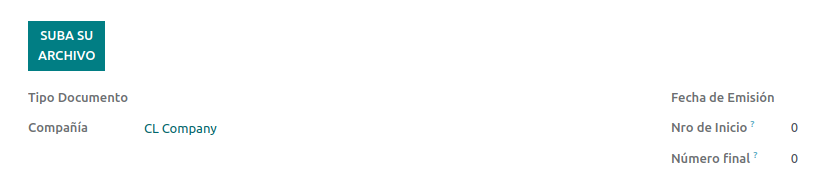

Once loaded, the status changes to :guilabel:`In Use`. At this moment, when a transaction is used
for this document type, the invoice number takes the first folio in the sequence.

.. important::
   The document types have to be active before uploading the :abbr:`CAF (Folio Authorization Code)`
   files. In case some folios have been used in the previous system, the next valid folio has to be
   set when the first transaction is created.

Usage and testing
=================

Electronic Invoice Workflow
---------------------------

In the Chilean localization the electronic invoice workflow covers the emission of customer invoices
and the reception of vendor bills. In the next diagram, it is explained how the information is
transmitted to the :abbr:`SII (Servicio de Impuestos Internos)`, customers and vendors.

.. image:: chile/electronic-invoice-workflow.png
   :align: center
   :alt: Diagram with Electronic invoice transactions.

Customer invoice emission
-------------------------

After the partners and journals are created and configured, the invoices are created in the standard
way, for Chile one of the differentiators is the document type which is selected automatically based
on the taxpayer.

You can manually change the document type if needed.

.. image:: chile/customer-invoice-document-type.png
   :align: center
   :alt: Customer invoice document type selection.

.. important::
   :guilabel:`Documents type 33` electronic invoice must have at least one item with tax, otherwise
   the :abbr:`SII (Servicio de Impuestos Internos)` rejects the document validation.

.. _chile/electronic-invoice-validation:

Validation and DTE status
~~~~~~~~~~~~~~~~~~~~~~~~~

When all the invoice information is filled, either manually or automatically when it's created
from a sales order, proceed to validate the invoice. After the invoice is posted:

- The :abbr:`DTE (Documentos Tributarios Electrónicos)` file (Electronic Tax Document) is created
  automatically and added in the :guilabel:`chatter`.
- The :abbr:`DTE (Documentos Tributarios Electrónicos)` :abbr:`SII (Servicio de Impuestos Internos)`
  status is set as :guilabel:`Pending` to be sent.

  .. image:: chile/xml-creation.png
     :align: center
     :alt: DTE XML File displayed in chatter.

The :abbr:`DTE (Documentos Tributarios Electrónicos)` status is updated automatically by Odoo with a
scheduled action that runs every day at night, if you need to get the response from the :abbr:`SII
(Servicio de Impuestos Internos)` immediately you can do it manually as well. The :abbr:`DTE
(Documentos Tributarios Electrónicos)` status workflow is as follows:

.. image:: chile/dte-status-flow.png
   :align: center
   :alt: Transition of DTE status flow.

#. In the first step the :abbr:`DTE (Documentos Tributarios Electrónicos)` is sent to the :abbr:`SII
   (Servicio de Impuestos Internos)`, you can manually send it using the button :guilabel:`Enviar
   Ahora`, a :guilabel:`SII Tack number` is generated and assigned to the invoice, you can use this
   number to check the details the :abbr:`SII (Servicio de Impuestos Internos)` sent back by email.
   The :guilabel:`DTE status` is updated to :guilabel:`Ask for Status`.
#. Once the :abbr:`SII (Servicio de Impuestos Internos)` response is received Odoo updates the
   :guilabel:`DTE status`, in case you want to do it manually just click on the button
   :guilabel:`Verify on SII`. The result can either be :guilabel:`Accepted`, :guilabel:`Accepted
   With Objection` or :guilabel:`Rejected`.

   .. image:: chile/dte-status-steps.png
      :align: center
      :alt: Identification transaction for invoice and Status update.

   There are several internal status in the :abbr:`SII (Servicio de Impuestos Internos)` before you
   get acceptance or rejection, in case you click continuously the button :guilabel:`Verify in SII`,
   you will receive in the chatter the detail of those intermediate statuses:

   .. important::
      These internal statuses take a few seconds of processing time, to avoid any issues, it is
      recommended to not click continuously the :guilabel:`Verify in SII` button, so the flow can
      work smoothly.

   .. image:: chile/chatter-internal-statuses.png
      :align: center
      :alt: Electronic invoice data statuses.

#. The final response from the :abbr:`SII (Servicio de Impuestos Internos)`, can take on of these
   values:

   - :guilabel:`Accepted`: Indicates the invoice information is correct, our document is now
     fiscally valid and it's automatically sent to the customer.
   - :guilabel:`Accepted with objections`: Indicates the invoice information is correct but a minor
     issue was identified, nevertheless our document is now fiscally valid and it's automatically
     sent to the customer.
   - :guilabel:`Rejected`: Indicates the information in the invoice is incorrect and needs to be
     corrected, the detail of the issue is received in the emails you registered in the :abbr:`SII
     (Servicio de Impuestos Internos)`, if it is properly configured in Odoo, the details are also
     retrieved in the chatter once the email server is processed.

     If the invoice is rejected please follow these steps:

      - Change the document to :guilabel:`Draft`.
      - Make the required corrections based on the message received from the :abbr:`SII (Servicio de
        Impuestos Internos)`.
      - Post the invoice again.

     .. image:: chile/rejected-invoice.png
        :alt: Message when an invoice is rejected.

Crossed references
~~~~~~~~~~~~~~~~~~

When the invoice is created as a result of another fiscal document, the information related to the
originator document must be registered in the :guilabel:`Cross-Reference` tab, which is commonly
used for credit or debit notes, but in some cases can be used on customer invoices as well. In the
case of the credit and debit notes, they are set automatically by Odoo:

.. image:: chile/cross-reference-tab-registration.png
   :align: center
   :alt: Crossed referenced document(s).

.. _chile/electronic-invoice-pdf-report:

Invoice PDF report
~~~~~~~~~~~~~~~~~~

Once the invoice is accepted and validated by the :abbr:`SII (Servicio de Impuestos Internos)` and
the PDF is printed, it includes the fiscal elements that indicate that the document is fiscally
valid:

.. image:: chile/sii-validation-elements.png
   :align: center
   :alt: SII Validation fiscal elements.

.. important::
   If you are hosted in Odoo SH or On-Premise, you should manually install the :guilabel:`pdf417gen`
   library. Use the following command to install it: :command:`pip install pdf417gen`.

Commercial validation
~~~~~~~~~~~~~~~~~~~~~

Once the invoice has been sent to the customer:

#. :guilabel:`DTE Partner Status` changes to :guilabel:`Sent`.
#. The customer must send a reception confirmation email.
#. Subsequently, if all the commercial terms and invoice data are correct, they will send the
   acceptance confirmation, otherwise they send a claim.
#. The field :guilabel:`DTE Acceptance Status` is updated automatically.

.. image:: chile/partner-dte-status.png
   :align: center
   :alt: Message with the commercial acceptance from the customer.

Processed for claimed invoices
~~~~~~~~~~~~~~~~~~~~~~~~~~~~~~

Once the invoice has been accepted by the :abbr:`SII (Servicio de Impuestos Internos)` **it can not
be cancelled in Odoo**. In case you get a claim for your customer the correct way to proceed is with
credit note to either cancel the invoice or correct it. Please refer to the
:ref:`chile/credit-notes` section for more details.

.. image:: chile/accepted-invoice.png
   :align: center
   :alt: Invoice Commercial status updated to claimed.

Common Errors
~~~~~~~~~~~~~

There are multiple reasons behind a rejection from the :abbr:`SII (Servicio de Impuestos Internos)`,
but these are some of the common errors you might have and how to solve them:

- | **Error:** `RECHAZO- DTE Sin Comuna Origen`
  | **Hint:** Make sure the company address is properly filled including the state and city.
- | **Error:** `en Monto - IVA debe declararse`
  | **Hint:** The invoice lines should include one VAT tax, make sure you add one on each invoice
    line.
- | **Error:** `Rut No Autorizado a Firmar`
  | **Hint:** The RUT entered is not allowed to invoice electronically, make sure the company RUT is
    correct and is valid in the :abbr:`SII (Servicio de Impuestos Internos)` to invoice
    electronically.
- | **Error:** `Fecha/Número Resolucion Invalido RECHAZO- CAF Vencido : (Firma_DTE[AAAA-MM-DD] -
    CAF[AAAA-MM-DD]) &gt; 6 meses`
  | **Hint:** Try to add a new CAF related to this document as the one you're using is expired.
- | **Error:** `Element '{http://www.sii.cl/SiiDte%7DRutReceptor': This element is not expected.
    Expected is ( {http://www.sii.cl/SiiDte%7DRutEnvia ).`
  | **Hint:** Make sure the field :guilabel:`Document Type` and :guilabel:`VAT` are set in the
    customer and in the main company.
- | **Error:** `Usuario sin permiso de envio.`
  | **Hint:** This error indicates that most likely, your company has not passed the `Certification
    process <https://www.sii.cl/factura_electronica/factura_mercado/proceso_certificacion.htm>`_ in
    the :abbr:`SII (Servicio de Impuestos Internos)` - Sistema de Facturación de Mercado. If this is
    the case, please contact your Account Manager or Customer Support as this certification is not
    part of the Odoo services, but we can give you some alternatives. If you already passed the
    certification process, this error appears when a user different from the owner of the
    certificate is trying to send :abbr:`DTE (Documentos Tributarios Electrónicos)` files to the
    :abbr:`SII (Servicio de Impuestos Internos)`.
- | **Error:** `CARATULA`
  | *Hint:* There are just five reasons why this error could show up and all of them are related to
    the *Caratula* section of the XML:

    - The company's RUT number is incorrect or missing.
    - The certificate owner RUT number is incorrect or missing.
    - The SII's RUT number (this should be correct by default).
    - The resolution date.
    - The resolution number.

.. _chile/credit-notes:

Credit notes
------------

When a cancellation or correction is needed over a validated invoice, a credit note must be
generated. It is important to consider that a CAF file is required for the credit note, which is
identified as :guilabel:`Document Type` :guilabel:`61` in the :abbr:`SII (Servicio de Impuestos
Internos)`.

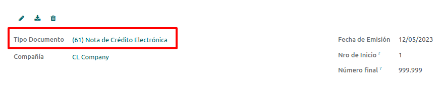

.. tip::
   Refer to the :ref:`CAF section <chile/caf-documentation>` where we described the process to load
   the CAF on each document type.

Use cases
~~~~~~~~~

Cancel referenced document
**************************

In case you need to cancel or invalid an invoice, use the button :guilabel:`Add Credit note` and
select :guilabel:`Full Refund`, in this case the :abbr:`SII (Servicio de Impuestos Internos)`
reference code is automatically set to :guilabel:`Anula Documento de referencia`.

.. image:: chile/credit-note-cancel-ref-doc.png
   :align: center
   :alt: Credit note canceling the referenced document.

Correct referenced document
***************************

If a correction in the invoice information is required, for example the *street name*, use the
button :guilabel:`Add Credit Note`, select :guilabel:`Partial Refund` and select the option
:guilabel:`Only Text Correction`. In this case the :guilabel:`SII Reference Code` is automatically
set to :guilabel:`Corrects Referenced Document Text`.

.. image:: chile/credit-note-correct-text.png
   :align: center
   :alt: Credit note correcting referenced document text.

Odoo creates a credit note with the corrected text in an invoice and :guilabel:`Price` `0.00`.

.. image:: chile/text-correction-label.png
   :align: center
   :alt: Credit note with the corrected value on the invoice lines.

.. important::
   It's important to define the :guilabel:`Default Credit Account` in the sales journal as it is
   taken for this use case in specific.

Corrects referenced document amount
***********************************

When a correction on the amounts is required, use the button :guilabel:`Add Credit note` and select
:guilabel:`Partial Refund`. In this case the :guilabel:`SII Reference Code` is automatically set to
:guilabel:`Corrige el monto del Documento de Referencia`.

.. image:: chile/credit-note-correct-amount.png
   :align: center
   :alt: Credit note for partial refund to correct amounts, using the SII reference code 3.

Debit notes
-----------

As part of the Chilean localization, besides creating credit notes from an existing document you can
also create debit notes. For this just use the button :guilabel:`Add Debit Note`. The two main use
cases for debit notes are detailed below.

Use cases
~~~~~~~~~

Add debt on invoices
********************

The most common use case for debit notes is to increase the value of an existing invoice, you need
to select option :guilabel:`3` in the field :guilabel:`Reference Code SII`:

.. image:: chile/debit-note-correct-amount.png
   :align: center
   :alt: Debit note correcting referenced document amount.

In this case Odoo automatically includes the :guilabel:`Source Invoice` in the :guilabel:`Cross
Reference` tab:

.. image:: chile/auto-ref-debit-note.png
   :align: center
   :alt: Automatic reference to invoice in a debit note.

.. tip::
   You can only add debit notes to an invoice already accepted by the SII.

Cancel credit notes
*******************

In Chile the debits notes are used to cancel a valid credit note, in this case just select the
button :guilabel:`Add Debit Note` and select the first option in the wizard :guilabel:`1: Anula
Documentos de referencia`.

.. image:: chile/debit-note-cancel-ref-doc.png
   :align: center
   :alt: Debit note to cancel the referenced document (credit note).

Vendor bills
------------

As part of the Chilean localization, you can configure your incoming email server as the same you
have registered in the :abbr:`SII (Servicio de Impuestos Internos)` in order to:

- Automatically receive the vendor bills :abbr:`DTE (Documentos Tributarios Electrónicos)` and
  create the vendor bill based on this information.
- Automatically send the reception acknowledgement to your vendor.
- Accept or claim the document and send this status to your vendor.

Reception
~~~~~~~~~

As soon as the vendor email with the attached :abbr:`DTE (Documentos Tributarios Electrónicos)` is
received:

#. The vendor bill maps all the information included in the XML.
#. An email is sent to the vendor with the reception acknowledgement.
#. The :guilabel:`DTE Status` is set as :guilabel:`Acuse de Recibido Enviado`.

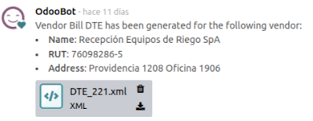

Acceptation
~~~~~~~~~~~

If all the commercial information is correct on your vendor bill then you can accept the document
using the :guilabel:`Aceptar Documento` button. Once this is done the :guilabel:`DTE Acceptation
Status` changes to :guilabel:`Accepted` and an email of acceptance is sent to the vendor.

.. image:: chile/accept-vendor-bill-btn.png
   :align: center
   :alt: Button for accepting vendor bills.

Claim
~~~~~

In case there is a commercial issue or the information is not correct on your vendor bill, you can
claim the document before validating it, using the button :guilabel:`Claim`, once this is done, the
:guilabel:`DTE Acceptation Status` changes to :guilabel:`Claim` and an email of rejection is sent
to the vendor.

.. image:: chile/claim-vendor-bill-btn.png
   :align: center
   :alt: Claim button in vendor bills to inform the vendor all the document is comercially rejected.

If you claim a vendor bill, the status changes from draft to cancel automatically. Considering this
as best practice, all the claimed documents should be canceled as they won't be valid for your
accounting records.

Delivery guide
--------------

To install the :guilabel:`Delivery Guide` module, go to :menuselection:`Apps` and search for `Chile
(l10n_cl)`. Then click :guilabel:`Install` on the module :guilabel:`Chile - E-Invoicing Delivery
Guide`.

.. note::
   :guilabel:`Chile - E-Invoicing Delivery Guide` has a dependency with :guilabel:`Chile -
   Facturación Electrónica`. Odoo will install the dependency automatically when the
   :guilabel:`Delivery Guide` module is installed.

The *Delivery Guide* module includes sending the :abbr:`DTE (Documentos Tributarios Electrónicos)`
to :abbr:`SII (Servicio de Impuestos Internos)` and the stamp in PDF reports for deliveries.

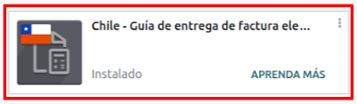

Once all configurations have been made for electronic invoices (e.g., uploading a valid company
certificate, setting up master data, etc.), delivery guides need their own CAFs. Please refer to the
:ref:`CAF documentation <chile/caf-documentation>` to check the details on how to acquire the CAFs
for electronic Delivery Guides.

Verify the following important information in the :guilabel:`Price for the Delivery Guide`
configuration:

- :guilabel:`From Sales Order`: Delivery guide takes the product price from the sales order and
  shows it on the document.
- :guilabel:`From Product Template`: Odoo takes the price configured in the product template and
  shows it on the document.
- :guilabel:`No show price`: No price is shown in the delivery guide.

Electronic delivery guides are used to move stock from one place to another and they can represent
sales, sampling, consignment, internal transfers, and basically any product move.

Delivery guide from a sales process
~~~~~~~~~~~~~~~~~~~~~~~~~~~~~~~~~~~

When a sales order is created and confirmed, a delivery order is generated. After validating the
delivery order, the option to create a delivery guide is activated.

.. image:: chile/delivery-guide-creation-btn.png
   :align: center
   :alt: Create Delivery Guide button on a sales process.

When clicking on :guilabel:`Create Delivery Guide` for the first time, a warning message pops up,
stating the following:

.. warning::
   "No se encontró una secuencia para la guía de despacho. Por favor, establezca el primer número
   dentro del campo número para la guía de despacho"

   .. image:: chile/delivery-guide-number-warning.png
      :align: center
      :alt: First Delivery Guide number warning message.

This warning message means the user needs to indicate the next sequence number Odoo has to take to
generate the delivery guide (next available CAF number), and only happens the first time a delivery
guide is created in Odoo. After the first document has been correctly generated, Odoo takes the next
available number in the CAF file to generate the following delivery guide.

After the delivery guide is created:

- The :abbr:`DTE (Documentos Tributarios Electrónicos)` file (Electronic Tax Document) is
  automatically created and added to the :guilabel:`chatter`.
- The :guilabel:`DTE SII Status` is set as :guilabel:`Pending to be sent`.

.. image:: chile/chatter-delivery-guide.png
   :align: center
   :alt: Chatter notes of Delivery Guide creation.

The :guilabel:`DTE Status` is automatically updated by Odoo with a scheduled action that runs every
day at night. To get a response from the :abbr:`SII (Servicio de Impuestos Internos)` immediately,
press the :guilabel:`Send now to SII` button.

Once the delivery guide is sent, it may then be printed by clicking on the :guilabel:`Print Delivery
Guide` button.

.. image:: chile/print-delivery-guide-btn.png
   :align: center
   :alt: Printing Delivery Guide PDF.

Delivery guide will have fiscal elements that indicate that the document is fiscally valid when
printed (if hosted in Odoo SH or on Premise remember to manually add the :guilabel:`pdf417gen`
library mentioned in the :ref:`Invoice PDF report section <chile/electronic-invoice-pdf-report>`).

Electronic receipt
------------------

To install the :guilabel:`Electronic Receipt` module, go to :menuselection:`Apps` and search for
`Chile (l10n_cl)`. Then click :guilabel:`Install` on the module :guilabel:`Chile - Electronic
Receipt`.

.. note::
   :guilabel:`Chile - Electronic Receipt` has a dependency with :guilabel:`Chile - Facturación
   Electrónica`. Odoo will install the dependency automatically when the :guilabel:`E-invoicing
   Delivery Guide` module is installed.

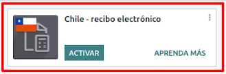

Once all configurations have been made for electronic invoices (e.g., uploading a valid company
certificate, setting up master data, etc.), electronic receipts need their own :abbr:`CAFs (Folio
Authorization Code)`. Please refer to the :ref:`CAF documentation <chile/caf-documentation>` to
check the details on how to acquire the :abbr:`CAFs (Folio Authorization Code)` for electronic
receipts.

Electronic receipts are useful when clients do not need an electronic invoice. By default, there is
a partner in the database called :guilabel:`Anonymous Final Consumer` with a generic RUT
`66666666-6` and taxpayer type of :guilabel:`Final Consumer`. This partner can be used for
electronic receipts or a new record may be created for the same purpose.

.. image:: chile/electronic-receipt-customer.png
   :align: center
   :alt: Electronic Receipt module.

Although electronic receipts should be used for final consumers with a generic RUT, it can also be
used for specific partners. After the partners and journals are created and configured, the
electronic receipts are created in the standard way as electronic invoice, but the type of document
:guilabel:`(39) Electronic Receipt` should be selected:

.. image:: chile/document-type-39.png
   :align: center
   :alt: Document type 39 for Electronic Receipts.

Validation and DTE Status
~~~~~~~~~~~~~~~~~~~~~~~~~

When all of the electronic receipt information is filled, either manually or automatically from a
sales order, proceed to validate the receipt. By default, :guilabel:`Electronic Invoice` is selected
as the :guilabel:`Document Type`, however in order to validate the receipt correctly, make sure to
edit the :guilabel:`Document Type` and change to :guilabel:`Electronic Receipt`.

After the receipt is posted:

- The :abbr:`DTE (Documentos Tributarios Electrónicos)` file (Electronic Tax Document) is created
  automatically and added to the :guilabel:`chatter`.
- The :guilabel:`DTE SII Status` is set as :guilabel:`Pending to be sent`.

.. image:: chile/electronic-receipt-ste-status.png
   :align: center
   :alt: Electronic Receipts STE creation status.

The :guilabel:`DTE Status` is automatically updated by Odoo with a scheduled action that runs every
day at night. To get a response from the :abbr:`SII (Servicio de Impuestos Internos)` immediately,
press the :guilabel:`Send now to SII` button.

Please refer to the :ref:`DTE Workflow <chile/electronic-invoice-validation>` for electronic
invoices as the workflow for electronic receipt follows the same process.

Electronic Export of Goods
--------------------------

To install the :guilabel:`Electronic Exports of Goods` module, go to :menuselection:`Apps` and
search for `Chile (l10n_cl)`. Then click :guilabel:`Install` on the module :guilabel:`Electronic
Exports of Goods for Chile`.

.. note::
   :guilabel:`Chile - Electronic Exports of Goods for Chile` has a dependency with :guilabel:`Chile
   - Facturación Electrónica`.

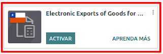

Once all configurations have been made for electronic invoices (e.g., uploading a valid company
certificate, setting up master data, etc.), electronic exports of goods need their own :abbr:`CAFs
(Folio Authorization Code)`. Please refer to the :ref:`CAF documentation <chile/caf-documentation>`
to check the details on how to acquire the :abbr:`CAFs (Folio Authorization Code)` for electronic
receipts.

Electronic invoices for the export of goods are tax documents that are used not only for the
:abbr:`SII (Servicio de Impuestos Internos)` but are also used with customs and contain the
information required by it.

Contact configurations
~~~~~~~~~~~~~~~~~~~~~~

.. image:: chile/taxpayer-type-export-goods.png
   :align: center
   :alt: Taxpayer Type needed for the Electronic Exports of Goods module.

Chilean customs
~~~~~~~~~~~~~~~

When creating an electronic exports of goods invoice, these new fields in the :guilabel:`Other Info`
tab are required to comply with Chilean regulations.

.. image:: chile/chilean-custom-fields.png
   :align: center
   :alt: Chilean customs fields.

Electronic Exports of Goods PDF Report
~~~~~~~~~~~~~~~~~~~~~~~~~~~~~~~~~~~~~~

Once the invoice is accepted and validated by the :abbr:`SII (Servicio de Impuestos Internos)` and
the PDF is printed, it includes the fiscal elements that indicate that the document is fiscally
valid and a new section needed for customs.

.. image:: chile/pdf-report-section.png
   :align: center
   :alt: PDF report section for the Electronic Exports of Goods PDF Report.

Financial Reports
=================

Balance Tributario de 8 Columnas
--------------------------------

This report presents the accounts in detail (with their respective balances), classifying them
according to their origin and determining the level of profit or loss that the business had within
the evaluated period of time.

You can find this report in :menuselection:`Accounting --> Reporting --> Balance Sheet` and
selecting in the :guilabel:`Report` field the option :guilabel:`Chilean Fiscal Balance (8 Columns)
(CL)`.

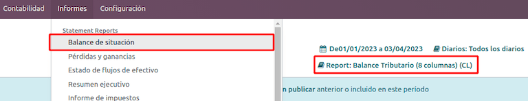

.. image:: chile/8-col-fiscal-balance-report.png
   :align: center
   :alt: Chilean Fiscal Balance (8 Columns).

Propuesta F29
-------------

The form *F29* is a new system that the :abbr:`SII (Servicio de Impuestos Internos)` enabled to
taxpayers, and that replaces the *Purchase and Sales Books*. This report is integrated by Purchase
Register (CR) and the Sales Register (RV). Its purpose is to support the transactions related to
VAT, improving its control and declaration.

This record is supplied by the electronic tax documents (DTE's) that have been received by the
:abbr:`SII (Servicio de Impuestos Internos)`.

You can find this report in :menuselection:`Accounting --> Reporting --> Tax Reports` and selecting
the :guilabel:`Report` option :guilabel:`Propuesta F29 (CL)`.

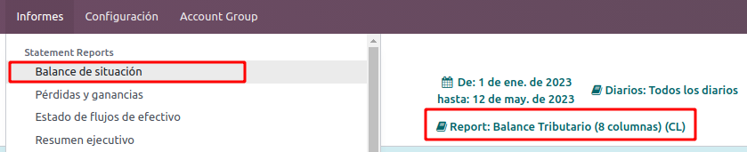

It is possible to set the :guilabel:`PPM` (provisional monthly payments rate) and the
:guilabel:`Proportional Factor` for the fiscal year in the :menuselection:`Accounting -->
Configuration --> Settings` settings.

.. image:: chile/f29-report.png
   :align: center
   :alt: Default PPM and Proportional Factor for the Propuesta F29 Report.

Or manually in the reports by clicking on the :guilabel:`✏️ (pencil)` icon.

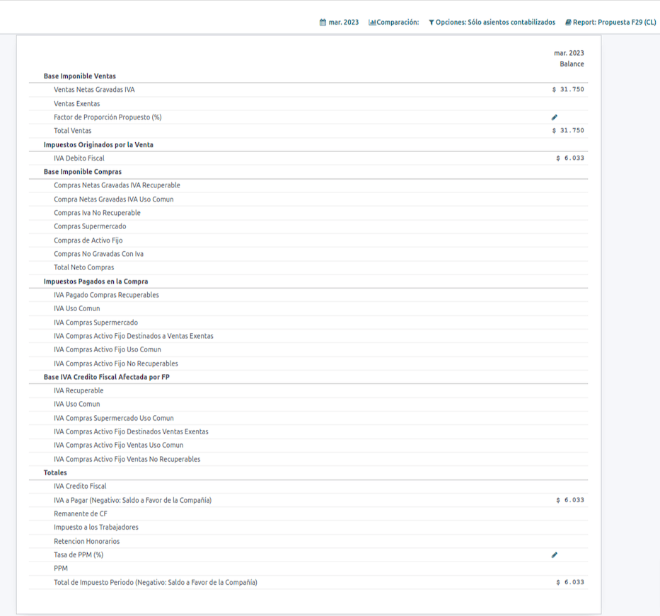

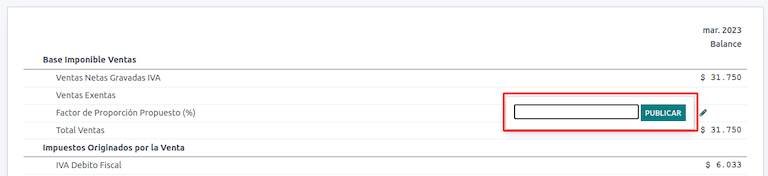

.. image:: chile/manual-ppm-f29-report.png
   :align: center
   :alt: Manual PPM for the Propuesta F29 Report.

Demo mode
=========

For a quick demonstration of the different :abbr:`DTE (Documentos Tributarios Electrónicos)`
workflows, the Chilean localization can be tested in the demo mode provided in test databases or in
`runbot.odoo.com <https://runbot.odoo.com/>`_.

.. important::
   Do not use demo mode in a production environment.

To activate demo mode in runbot you must:

- Access `runbot.odoo.com <https://runbot.odoo.com/>`_
- Install the Chilean Localization modules

After these steps, a new Chilean company *CL Company* is installed in the database with the company
configurations needed, demo contacts, demo mode selected and test :abbr:`CAFs (Folio Authorization
Code)` installed.

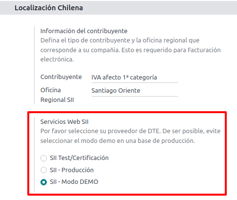

Some important considerations to take into account when using demo mode:

- The :abbr:`DTE (Documentos Tributarios Electrónicos)` files created in demo mode are not sent to
  the :abbr:`SII (Servicio de Impuestos Internos)`, for that reason, all of the files will be
  created and accepted automatically, as this will be a simulation.
- Rejection errors or accepted with objections will not appear in this mode, these situations should
  be validated in Test/Certification mode with the files actually being sent to the :abbr:`SII
  (Servicio de Impuestos Internos)`.
- Every internal validation can be tested in demo mode.

.. tip::
   Demo mode files are not sent to the :abbr:`SII (Servicio de Impuestos Internos)`. Test mode is
   the configuration needed to use testing :abbr:`CAFs (Folio Authorization Code)` obtained from the
   :abbr:`SII (Servicio de Impuestos Internos)`. In this mode, the direct connection flows with the
   :abbr:`SII (Servicio de Impuestos Internos)` can be tested.
