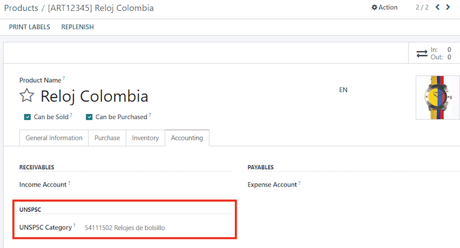
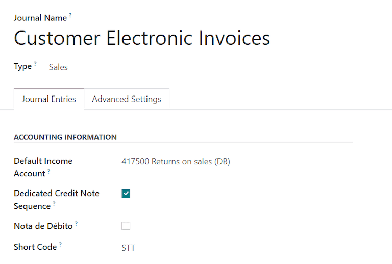
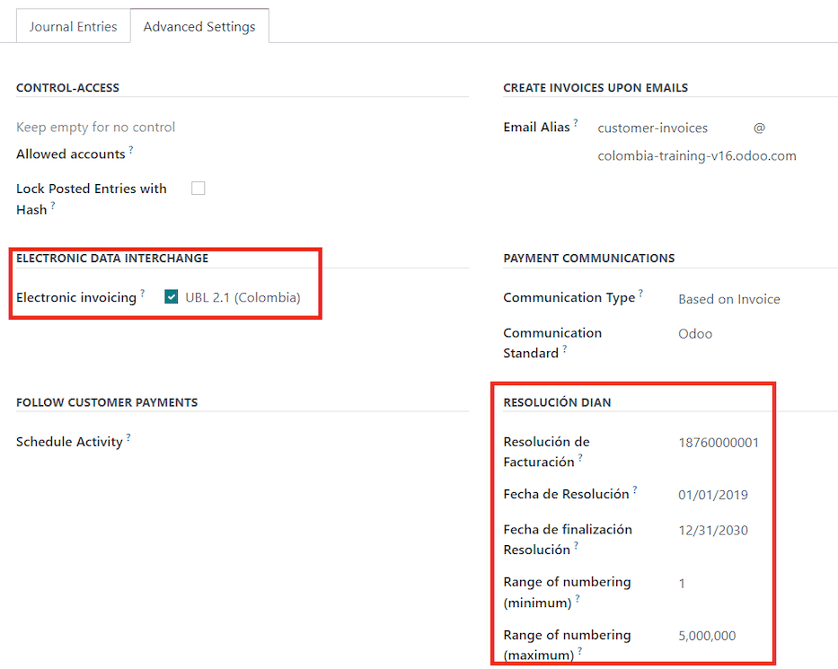
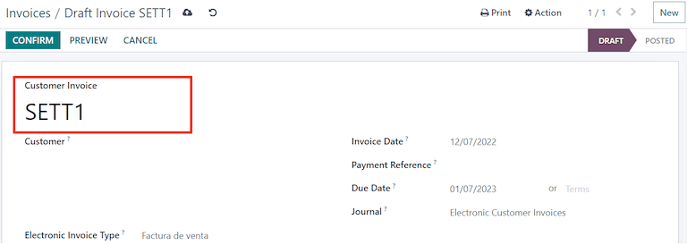
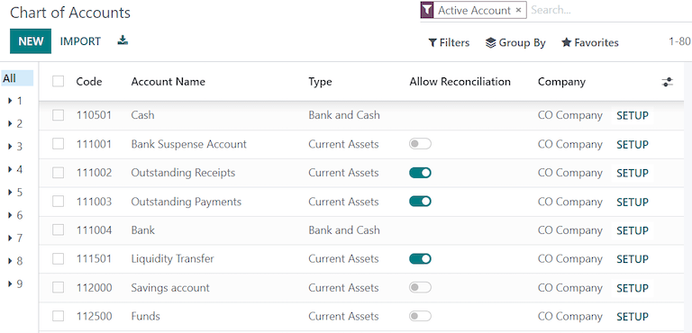

:show-content:

========
Colombia
========

Introduction
============

Odoo *localization for Colombia* provides accounting, fiscal and legal features in Colombia such as
Chart of Accounts, Taxes and Electronic Invoicing.

Please refer to the documentation below regarding Colombia localization configuration, workflows and
financial reporting.

In addition, we have a series of videos covering how to start from scratch, configuration, main
workflows, as well as special use cases.

.. seealso::
   `Odoo Colombian localization videos
   <https://www.youtube.com/playlist?list=PL1-aSABtP6ABxZshems3snMjx7bj_7ZsZ>`_.

Configuration
=============

Modules installation
--------------------

:ref:`Install <general/install>` the following modules to get all the features of the Colombian
localization:

.. list-table::
   :header-rows: 1
   :widths: 25 25 50

   * - Name
     - Technical name
     - Description
   * - :guilabel:`Colombia - Accounting`
     - `l10n_co`
     - Default :ref:`fiscal localization package <fiscal_localizations/packages>`. This module adds
       the base accounting features for the Colombian localization: Chart of Accounts, taxes,
       withholdings, identification document type.
   * - :guilabel:`Colombia - Colombian - Accounting Reports`
     - `l10n_co_reports`
     - Includes accounting reports for sending certifications to suppliers for withholdings applied.
   * - :guilabel:`Colombia E-invoice Integration`
     - `l10n_co_edi`
     - This module includes the features that are required for the integration with Carvajal and
       generates the electronic invoices and support document for vendor bills based on :abbr:`DIAN
       (Dirección de Impuestos y Aduanas Nacionales)` regulations.
   * - :guilabel:`Colombia - Colombian - Point of Sale`
     - `l10n_co_pos`
     - Includes Point of Sale Receipt for Colombian Localization.

.. note::
   When a database is created from scratch selecting :guilabel:`Colombia` as the country, Odoo
   automatically installs the base module *Colombia - Accounting* and *Colombia - Accounting
   Reports*.

Configure your company
----------------------

To configure your company information, go to the :menuselection:`Contacts` app and search the name
given to your company or activate :ref:`developer mode <developer-mode>` and go to
:menuselection:`Company --> Contact` and then edit the contact to configure the following
information:

#. General data

   - :guilabel:`Company Name`
   - :guilabel:`Address`: Include :guilabel:`City`, :guilabel:`Department` and :guilabel:`Zip Code`.
   - :guilabel:`Tax ID`: When it is a `NIT` it must have the *verification digit* at the end of the
     ID followed by a hyphen.

   .. image:: colombia/company-configuration.png
      :align: center
      :alt: Configure your company contact form in Odoo.

#. :guilabel:`Fiscal Information`

   On the :guilabel:`Sales \& Purchases` tab, configure the following information:

   - :guilabel:`Fiscal Position`: Determines the taxes/accounts used for this contract.
   - :guilabel:`Obligaciones y Responsabilidades`
   - :guilabel:`Gran Contribuyente`
   - :guilabel:`Fiscal Regimen`
   - :guilabel:`Commercial Name`

   .. image:: colombia/fiscal-information.png
      :align: center
      :alt: Configure the fiscal information of your company in Odoo.

Configure credentials for Carvajal web service
----------------------------------------------

Once the modules are installed, the user credentials need to be configured in order to connect with
Carvajal Web Service. First, navigate to :menuselection:`Accounting --> Configuration --> Settings`
and look for the :guilabel:`Colombian Electronic Invoice` section. Then, fill in the required
configuration information provided by Carvajal.

Complete the following data:

- :guilabel:`Username` and :guilabel:`Password`: Corresponds to the username and password provided
  by Carvajal to the company.
- :guilabel:`Company Registry`: Company's NIT number without the verification code.
- :guilabel:`Account ID`: Company ID followed by `_01`.
- :guilabel:`Colombia Template Code`: Select one of the two available templates (:guilabel:`CGEN03`
  or :guilabel:`CGNE04`) to be used in the PDF format of the electronic invoice.

.. image:: colombia/carvajal-configuration.png
   :align: center
   :alt: Configure credentials for Carvajal web service in Odoo.

Check the :guilabel:`Test mode` checkbox to connect with the Carvajal testing environment.

.. important::
   The testing mode must be used only on replicated databases but **NOT** in the production
   environment.

Once Odoo and Carvajal are fully configured and ready for production, uncheck the :guilabel:`Test
mode` checkbox to use the production database.

Configure report data
---------------------

Report data can be defined for the fiscal section and the bank information in the PDF as part of the
configurable information that is sent in the XML.

Navigate to :menuselection:`Accounting --> Configuration --> Settings` and look for the
:guilabel:`Colombian Electronic Invoice` section.

.. image:: colombia/report-config.png
   :align: center
   :alt: Configure the report data in Odoo.

.. _fiscal_localizations/colombia/configure_xml:

Configure master data
---------------------

Partner
~~~~~~~

Configure the *identification information* and *fiscal information*.

Identification information
**************************

As part of the Colombian Localization, the document types defined by the :abbr:`DIAN (Dirección de
Impuestos y Aduanas Nacionales)` are now available on the partner form. Colombian partners have to
have their :guilabel:`Identification Number` (VAT) and :guilabel:`Document Type` set:

.. image:: colombia/partner-rut-doc-type.png
   :align: center
   :alt: Identification number and the document type set in Odoo.

.. tip::
   When the :guilabel:`Document Type` is `NIT` the :guilabel:`Identification Number` needs to be
   configured in Odoo including the *verification digit*, Odoo will split this number when the data
   to the third party vendor is sent.

Fiscal information
******************

The partner's responsibility codes (section 53 in the RUT document) are included as part of the
electronic invoice module given it is part of the information required by the :abbr:`DIAN (Dirección
de Impuestos y Aduanas Nacionales)`.

The required fields can be found in :menuselection:`Partner --> Sales & Purchase Tab --> Fiscal
Information`.

.. image:: colombia/partner-fiscal-information.png
   :align: center
   :alt: The fiscal information included in the electronic invoice module in Odoo.

Additionally, two boolean fields were added in order to specify the :guilabel:`Fiscal Regimen` of
the partner.

Products
~~~~~~~~

In addition to adding the basic information in the product form, the :guilabel:`UNSPSC Category`,
:guilabel:`Barcode` or the :guilabel:`Internal Reference` field should be configured.

Taxes
~~~~~

If sales transactions include products with taxes, the :guilabel:`Value Type` field in the
:guilabel:`Advanced Options` tab needs to be configured per tax.

Retention tax types (:guilabel:`ICA`, :guilabel:`IVA`, :guilabel:`Fuente`) are also included in the
options to configure taxes. This configuration is used in order to correctly display taxes in the
invoice PDF.

.. image:: colombia/retention-tax-types.png
   :align: center
   :alt: The ICA, IVA and Fuente fields in the Advanced Options tab in Odoo.

Sales journals
~~~~~~~~~~~~~~

Once the :abbr:`DIAN (Dirección de Impuestos y Aduanas Nacionales)` has assigned the official
sequence and prefix for the electronic invoice resolution, the sales journals related to the invoice
documents need to be updated in Odoo.

Navigate to :menuselection:`Accounting --> Configuration --> Journals`.

Complete the following data in the :guilabel:`Advanced Settings` tab:

- :guilabel:`Electronic invoicing`: Check :guilabel:`UBL 2.1 (Colombia)`.
- :guilabel:`Invoicing Resolution`: Resolution number issued by :abbr:`DIAN (Dirección de Impuestos
  y Aduanas Nacionales)` to the company.
- :guilabel:`Resolution Date`: Initial effective date of the resolution.
- :guilabel:`Resolution end date`: End date of the resolution's validity.
- :guilabel:`Range of Numbering (minimum)`: First authorized invoice number.
- :guilabel:`Range of Numbering (maximum)`: Last authorized invoice number.

.. note::
   The sequence and resolution on the journal, should match with the one configured in Carvajal and
   the :abbr:`DIAN (Dirección de Impuestos y Aduanas Nacionales)`.

Invoice sequence
****************

The invoice sequence and prefix must be correctly configured when the first document is created.

.. note::
   Odoo will automatically assign a prefix and sequence to the following documents.

Purchase journals
*****************

Once the :abbr:`DIAN (Dirección de Impuestos y Aduanas Nacionales)` has assigned the official
sequence and prefix for the support document for vendor bills, the purchase journals related to
their supporting documents need to be updated in Odoo. The process is similar to the configuration
of the sales journals.

Chart of Accounts
*****************

The :doc:`chart of accounts
</applications/finance/accounting/getting_started/initial_configuration/chart_of_accounts>` is
installed by default as part of the set of data included in the localization module, the accounts
are mapped automatically in taxes, default account payable, default account receivable. The chart of
accounts for Colombia is based on the PUC (Plan Unico de Cuentas).

.. seealso::
   - :doc:`/applications/finance/fiscal_localizations/colombia/workflows`
   - :doc:`/applications/finance/fiscal_localizations/colombia/reports`

.. toctree::
   :titlesonly:

   colombia/workflows
   colombia/reports
