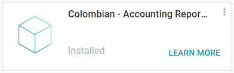

=================
Financial reports
=================

Overview
========

This information is a quick reference to the accounting reports included in the *Colombian
Localization Accounting Reports* module.

The reports module (labeled :guilabel:`l10n_co_reports` in the Odoo :menuselection:`Apps`
application) is automatically installed when creating a database for the country Colombia.

Reports
=======

Certificado de Retención en ICA
-------------------------------

This report is a certification to vendors for withholdings made for the Colombian Industry and
Commerce tax (ICA).

Go to :menuselection:`Accounting --> Reporting --> Colombian Statements --> Certificado de Retención
en ICA`.

.. image:: reports/ica-report.png
   :align: center
   :alt: Certificado de Retención en ICA report in Odoo Accounting.

Certificado de Retención en IVA
-------------------------------

This report issues a certificate on the amount withheld from vendors for VAT withholding.

Go to :menuselection:`Accounting --> Reporting --> Colombian Statements --> Certificado de Retención
en IVA`.

.. image:: reports/iva-report.png
   :align: center
   :alt: Certificado de Retención en IVA report in Odoo Accounting.

Certificado de Retención en la Fuente
-------------------------------------

This certificate is issued to partners for the withholdings tax that they have made.

Go to :menuselection:`Accounting --> Reporting --> Colombian Statements --> Certificado de Retención
en Fuente`.

.. image:: reports/fuente-report.png
   :align: center
   :alt: Certificado de Retención en Fuente report in Odoo Accounting.

.. seealso::
   - :doc:`/applications/finance/fiscal_localizations/colombia/workflows`
