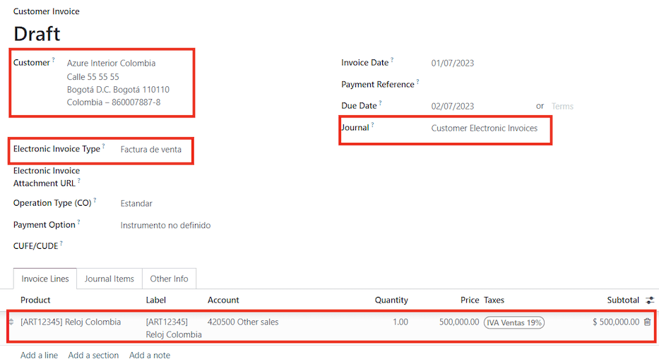
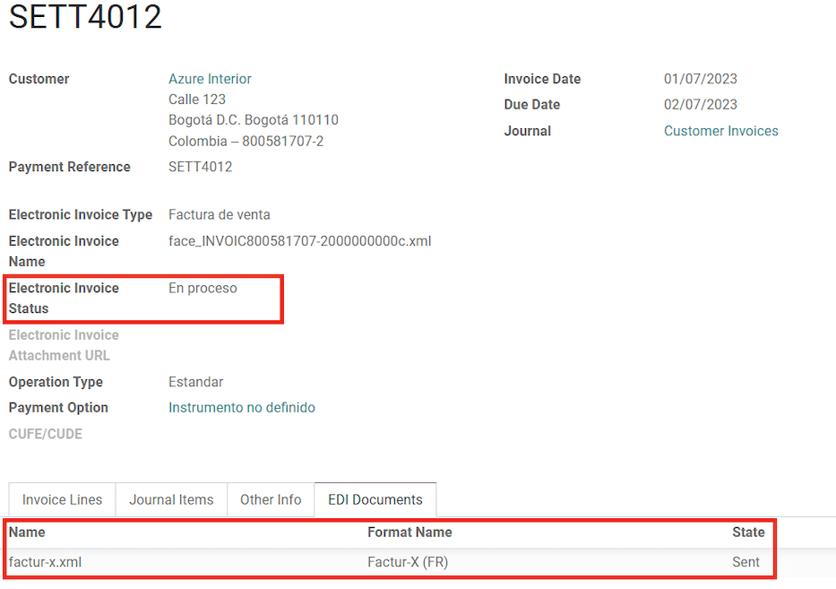
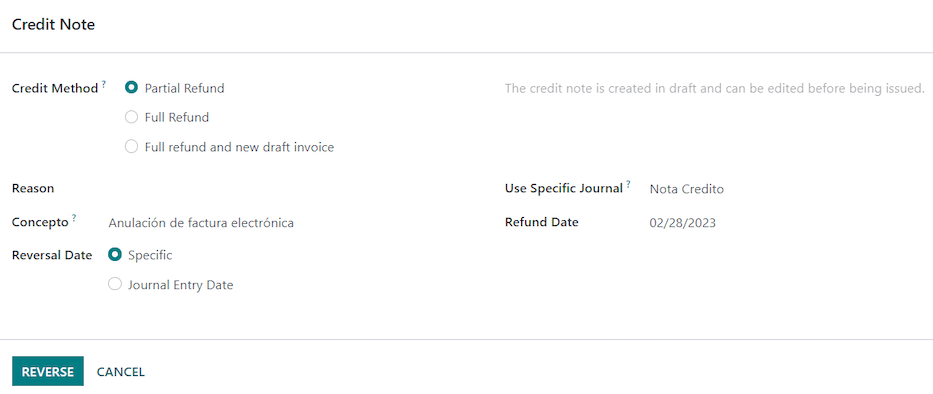
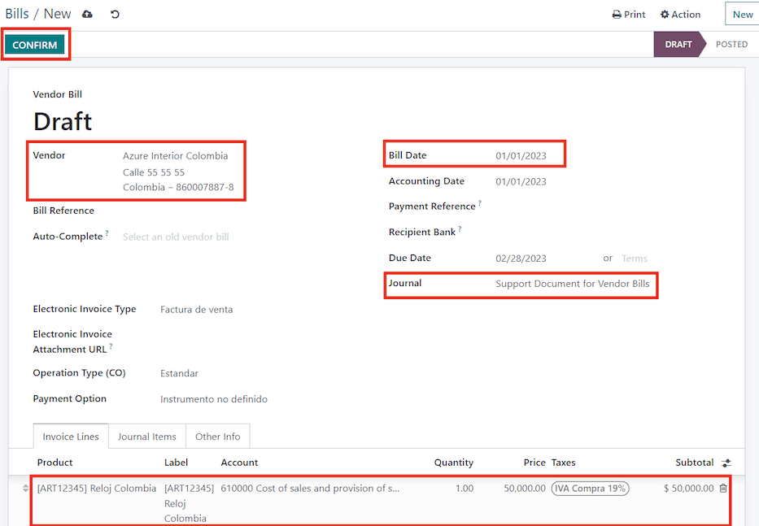

=========
Workflows
=========

Electronic documents workflow
=============================

Odoo *Localization for Colombia* includes the workflow for electronic invoices and support documents
for vendor bills. The following diagram illustrates how electronic invoices are generated and
transmitted to acquirers and :abbr:`DIAN (Dirección de Impuestos y Aduanas Nacionales)` once you
have configured your database.

.. image:: workflows/electronic-invoice-workflow.png
   :align: center
   :alt: Electronic invoice workflow in Odoo.

Electronic Invoices
-------------------

With all of the master data and credentials configured, it is possible to start using the electronic
invoice workflow.

Invoice creation
~~~~~~~~~~~~~~~~

.. note::
   The functional workflow that takes place before an invoice validation doesn't change. The main
   changes that are introduced with the electronic invoice.

Electronic invoices are generated and sent to the :abbr:`DIAN (Dirección de Impuestos y Aduanas
Nacionales)` and the customer through Carvajal's web service integration. These documents can be
created from your sales order or manually. Go to :menuselection:`Accounting --> Customers -->
Invoices`

Complete the following data:

- :guilabel:`Customer`: Customer's information.
- :guilabel:`Journal`: Journal for electronic invoices.
- :guilabel:`Electronic Invoice Type`: Select the type of document. By default, :guilabel:`Factura
  de Venta` is selected.
- :guilabel:`Invoice Line`: Specify the products with the correct taxes.

Invoice validation
~~~~~~~~~~~~~~~~~~

After the invoice is confirmed, an :file:`.XML` file is created and sent automatically to Carvajal.
The invoice will be processed asynchronously by the E-invoicing service: UBL 2.1 (Colombia).

This file is also displayed in the chatter.

.. image:: workflows/invoice-sent.png
   :align: center
   :alt: Carvajal XML invoice file in Odoo chatter.

The :guilabel:`Electronic Invoice Name` field is now displayed in the :guilabel:`EDI Documents` tab
with the name of the :file:`.XML` file. Additionally, the :guilabel:`Electronic Invoice Status`
field is displayed with the initial value :guilabel:`In progress`.

Reception of legal XML and PDF
~~~~~~~~~~~~~~~~~~~~~~~~~~~~~~

The electronic invoice vendor (Carvajal) receives the :file:`.XML` file and proceeds to validate the
structure and the information in it.

In the :menuselection:`Action` dropdown, select the :guilabel:`Check Carvajal Status` button. If
everything is correct the :guilabel:`Electronic Invoice Status` field value changes to
:guilabel:`Validated`. Then, proceed to generate a legal XML which includes a digital signature and
a unique code (CUFE), a PDF invoice that includes a QR code and the CUFE is also generated.

A :file:`.ZIP` containing the legal electronic invoice in XML format and the invoice in PDF format
is downloaded and displayed in the invoice chatter:

  .. image:: workflows/invoice-zip.png
     :align: center
     :alt: ZIP file displayed in the invoice chatter in Odoo.

The electronic invoice status changes to :guilabel:`Accepted`.

Credit notes
------------

The process for credit note is exactly the same as the invoice, the functional workflow remains the
same as well. To create a credit note with reference to an invoice Go to :menuselection:`Accounting
--> Customers --> Invoices`. On the invoice select the :guilabel:`Add Credit Note` button, by
clicking on this button you will be directed to the create credit note form. Then complete the
following information:

- :guilabel:`Credit Method`: Select the type of credit method.

  - :guilabel:`Partial Refund`: Use this option when it is a partial credit note.
  - :guilabel:`Full Refund`: Use this option if the credit note is for the total invoice
  - :guilabel:`Full refund and new draft invoice`: Use this option if the credit note is for the
    total invoice and you need the credit note and auto-create a new draft invoice.

- :guilabel:`Reason`: Type the reason for the credit note.
- :guilabel:`Reversal Date`: Select if you want a specific date for the credit note or if it is the
  journal entry date.
- :guilabel:`Use Specific Journal`: Select the journal for your credit note, or leave it empty if
  you want to use the same journal as the original invoice.
- :guilabel:`Refund Date`: If you chose a specific date, select the date for the credit note.

Once reviewed, you can click on the :guilabel:`Reverse` button.

Debit notes
-----------

The process for a debit note is similar to the credit note. The functional workflow remains the same
as well. To create a debit note with reference to an invoice Go to :menuselection:`Accounting -->
Customers --> Invoices`. On the invoice select the :guilabel:`Add Debit Note` button, by clicking on
this button you will be directed to the debit note form. Then complete the following information:

- :guilabel:`Reason`: Type the reason for the debit note.
- :guilabel:`Debit note date`: Select the specific options.
- :guilabel:`Copy lines`: Select this option if you need to register a debit note with the same
  lines of invoice.
- :guilabel:`Use Specific Journal`: Select the printer point for your debit note, or leave it empty
  if you want to use the same journal as the original invoice.

Once reviewed you can click on the :guilabel:`Create debit note` button.

.. image:: workflows/debit-note.png
   :align: center
   :alt: Completing the debit note form in Odoo.

Support document for vendor bills
---------------------------------

With all of the master data, credentials and purchase journal configured for support documents for
vendor bills, it is possible to start using the support document workflow. The workflow is analogous
to the invoicing process.

Support documents for vendor bills can be created from your purchase order or manually. Go to
:menuselection:`Accounting --> Vendors --> Bills`.

Complete the following data:

- :guilabel:`Vendor`: Type the vendor's information.
- :guilabel:`Bill Date`: Select the date of the bill.
- :guilabel:`Journal`: Select the journal for support documents for vendor bills.
- :guilabel:`Invoiced Lines`: Specify the products with the correct taxes.

Once reviewed, you can click on the :guilabel:`Confirm` button.

Common errors
-------------

During the XML validation the most common errors are usually related to missing master data
(*Contact Tax ID*, *Address*, *Products*, *Taxes*). In such cases, error messages are shown in the
chatter after updating the electronic invoice status.

.. image:: workflows/xml-validation-errors.png
   :align: center
   :alt: XML validation errors shown in the invoice chatter in Odoo.

After the master data is corrected, it's possible to reprocess the XML with the new data and send
the updated version, using the following button in the :menuselection:`Action` dropdown.

.. seealso::
   - :doc:`/applications/finance/fiscal_localizations/colombia/reports`
   - :doc:`/applications/finance/fiscal_localizations/colombia`
