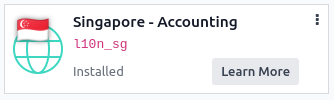
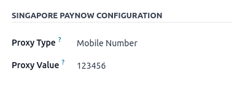

=========
Singapore
=========

Configuration
=============

:ref:`Install <general/install>` the :guilabel:`Singapore - Accounting` module to get the features
of the SG localization.

Add PayNow QR codes to invoices
===============================

PayNow is a payment service platform that allows customers to make instant domestic payments to
individuals and merchants in Singapore dollars via online and mobile banking.

Activate QR codes
-----------------

Go to :menuselection:`Accounting --> Configuration --> Settings`. Under the :guilabel:`Customer
Payments` section, activate the :guilabel:`QR Codes` feature.

.. image:: singapore/sg-qr-code-setting.png
   :align: center
   :alt: "QR Codes" feature activated

PayNow bank account configuration
---------------------------------

Go to :menuselection:`Contacts --> Configuration --> Bank Accounts` and select the bank account for
which you want to activate PayNow. Set the :guilabel:`Proxy Type` and fill in the :guilabel:`Proxy
Value` field depending on the type you chose.

.. note::
   The account holder's country must be set to Singapore on its contact form.

.. seealso::
   :doc:`../accounting/bank`

Bank journal configuration
--------------------------

Go to :menuselection:`Accounting --> Configuration --> Journals`, open the bank journal, then fill
out the :guilabel:`Account Number` and :guilabel:`Bank` under the :guilabel:`Journal Entries` tab.

.. image:: singapore/sg-bank-account-journal-setting.png
   :align: center
   :alt: Bank Account's journal configuration

Issue invoices with PayNow QR codes
-----------------------------------

When creating a new invoice, open the :guilabel:`Other Info` tab and set the :guilabel:`Payment
QR-code` option to *EMV Merchant-Presented QR-code*.

.. image:: singapore/sg-qr-code-invoice-setting.png
   :align: center
   :alt: Select EMV Merchant-Presented QR-code option

Ensure that the :guilabel:`Recipient Bank` is the one you configured, as Odoo uses this field to
generate the PayNow QR code.
