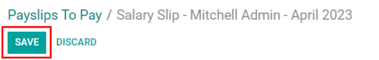
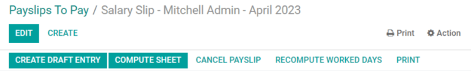
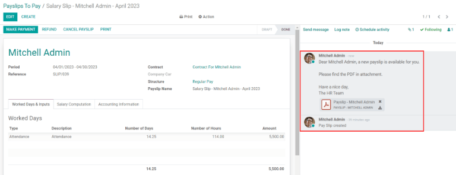
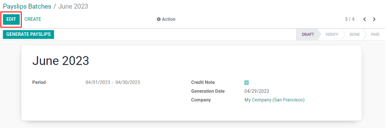
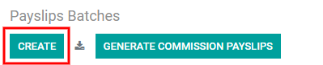
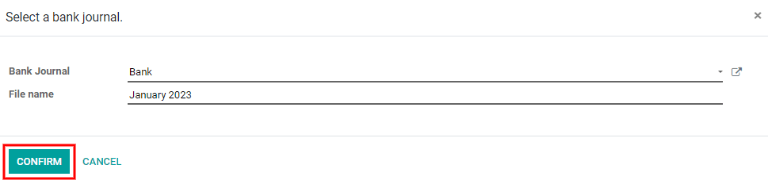
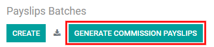

========
Payslips
========

In Odoo *Payroll*, the :guilabel:`Payslips` drop-down header menu consists of three
sections: :guilabel:`To Pay`, :guilabel:`All Payslips`, and :guilabel:`Batches`.

.. image:: payslips/payslips.png
   :align: center
   :alt: Payslips menu selection in Payroll.

These three sections provide all the tools needed to create payslips for employees, including
individual payslips, a batch of payslips, or commission payslips.

To pay
======

Click on :menuselection:`Payroll app --> Payslips --> To Pay` to see the payslips that need to be paid.
On this page, Odoo displays the payslips that have not been generated yet, and can be created from
this dashboard.

.. image:: payslips/all-pay-slips.png
   :align: center
   :alt: View all payslips that need to be paid by clicking on Payslips - To Pay.

Each payslip will list the :guilabel:`Reference` number for the individual payslip, the
:guilabel:`Employee` name, :guilabel:`Batch Name`, the :guilabel:`From` and :guilabel:`To` date
range, the :guilabel:`Company`, the :guilabel:`Basic Wage`, :guilabel:`Net Wage`, and the
:guilabel:`Status` of the payslip. Clicking on an individual payslip entry will show the details for
the individual payslip.

.. _payroll/new-payslip:

Create new payslip
------------------

A new payslip can be created from the :guilabel:`Payslip To Pay` page (:menuselection:`Payroll app
--> Payslips --> To Pay`) or the :guilabel:`Employee Payslips` page (:menuselection:`Payroll app
--> Payslips --> All Payslips`), by clicking the :guilabel:`Create` button in the top-left corner.

.. image:: payslips/create-payslip.png
   :align: center
   :alt: Click the Create button to make a new payslip.

Clicking :guilabel:`Create` reveals a blank payslip form, wherein the necessary payslip information
can be entered. Fill out the payslip information.

Required fields on payslip form
~~~~~~~~~~~~~~~~~~~~~~~~~~~~~~~

On the blank payslip form, a number of fields are required to be filled in with the necessary
information. These required fields are represented by **bold** lines.

.. image:: payslips/new-payslip.png
   :align: center
   :alt: The necessary fields for a new payslip.

- :guilabel:`Employee`: Type in the name of an employee, or select the desired employee from the
  drop-down list. Upon selecting an employee, several other fields on the payslip form may
  auto-populate. Typically, after making a selection in the :guilabel:`Employee` field, Odoo
  auto-populates the :guilabel:`Contract`, :guilabel:`Structure`, and :guilabel:`Payslip Name`
  fields, but only if that information is already on that employee's detail form in the database.
- :guilabel:`Period`: Click the default date to reveal a pop-up calendar. Using this calendar, use
  the left and right arrows to select the desired month, and click on the desired day to select that
  specific date as the start date for the payslip. Repeat this process to add an end date for the
  payslip in the field below.
- :guilabel:`Contract`: Using the drop-down menu, select the desired contract for the employee. Only
  the available corresponding contracts for the selected employee appear as options.
- :guilabel:`Structure`: Using the drop-down menu, select the salary structure type. Only the
  available corresponding structures for the selected contract for that specific employee appear as
  options.
- :guilabel:`Payslip Name`: In the blank field, type in the name for the payslip. The name should be
  short and descriptive, such as "April 2023".

.. image:: payslips/new-payslip-tab.png
   :align: center
   :alt: The necessary fields for a new payslip in the Accounting Information tab.

- :guilabel:`Company`: In the :guilabel:`Accounting Information` tab, select the company the payslip
  applies to from the :guilabel:`Company` drop-down menu.
- :guilabel:`Salary Journal`: In the :guilabel:`Accounting Information` tab, enter the salary
  journal that the payment will be reflected in and found in the *Accounting* application.

.. important::
   It is recommended to check with the accounting department to ensure any entry that affects the
   *Accounting* application is correct.

Optional fields on payslip form
~~~~~~~~~~~~~~~~~~~~~~~~~~~~~~~

 - :guilabel:`Reference`: Any note or reference message for the new entry can be entered here.
 - :guilabel:`Company Car`: If applicable, select the company car from the drop-down.
 - :guilabel:`Worked Days`: In the :guilabel:`Worked Days & Inputs` tab, the entries under
   :guilabel:`Worked Days` (including the :guilabel:`Type`, :guilabel:`Description`,
   :guilabel:`Number of Days`, :guilabel:`Number of Hours`, and :guilabel:`Amount`) are
   automatically filled in based off what was entered for the :guilabel:`Period`,
   :guilabel:`Contract`, and :guilabel:`Structure` fields of the payslip form.
 - :guilabel:`Salary Computation`: The :guilabel:`Salary Computation` tab is automatically filled in
   after the :guilabel:`Compute Sheet` button is clicked. Doing so displays all the wages,
   deductions, taxes, etc for the entry.
 - :guilabel:`Batch Name`: Located in the :guilabel:`Accounting Information` tab, select the payslip
   batch this new payslip should be added to from the drop-down.
 - :guilabel:`Date Account`: Located in the :guilabel:`Accounting Information` tab, enter the date
   the payslip should be posted to, by clicking on the drop-down and navigating to the correct month
   and year by using the arrow icons in the calendar pop-up. Then, click on the desired date.
 - :guilabel:`Salary Journal`: This field, located in the :guilabel:`Accounting Information` tab,
   represents the journal that the payslip will be logged in, and is automatically selected when the
   :guilabel:`Contract` and :guilabel:`Structure` are entered in the payslip form.
 - :guilabel:`Accounting Entry`: This field, located in the :guilabel:`Accounting Information` tab,
   is automatically filled in once the payslip is confirmed.

Save and process new payslip
~~~~~~~~~~~~~~~~~~~~~~~~~~~~

When all the necessary information on the payslip is entered, click :guilabel:`Save` to save the
data, or click :guilabel:`Discard` to delete the entry.

.. note::
   Saving the entry is not required. The :guilabel:`Compute Sheet` button can be clicked without
   first saving the payslip.

Once the payslip form is saved, click the :guilabel:`Compute Sheet` button to register all the
information, and have the :guilabel:`Salary Computation` tab populated. If any modifications need to
be made, click the :guilabel:`Edit` button, make the desired changes, then click the
:guilabel:`Recompute Worked Days` button to have the changes reflected in the :guilabel:`Worked
Days` and :guilabel:`Salary Computation` tabs.

To print the payslip, click the :guilabel:`Print` button. To cancel the payslip, click the
:guilabel:`Cancel Payslip` button.

Once everything on the payslip form is correct, click the :guilabel:`Create Draft Entry` button to
create the payslip. The chatter (to the right side of the payslip form page) is automatically
updated to show the email sent to the employee, along with a PDF copy of the payslip.

Next, the payment must be sent to the employee. To do this, click the :guilabel:`Make Payment`
button. Doing so reveals a pop-up, in which the desired :guilabel:`Bank Journal` that the payment
should be made against must be selected from a drop-down menu. Then click the :guilabel:`Confirm`
button to confirm the journal, and return to the payslip.

.. image:: payslips/make-payment.png
   :align: center
   :alt: Click Make Payment to send the payment to the employee.

If a payment needs to be cancelled or refunded, click the corresponding :guilabel:`Refund` or
:guilabel:`Cancel Payslip` buttons at the top of the payslip form.

.. important::
   In order for a payslip to be paid, the employee *must* have a bank account entered in their
   contact information. If there is no bank information, a payslip cannot be paid and an error will
   appear when the :guilabel:`Make Payment` button is clicked. Banking information can be found in
   the `Private Information` tab in the employee's card. Edit the employee card and add banking
   information if it is missing.

   .. image:: payslips/banking.png
      :align: center
      :alt: Banking information can be entered in an employee's card.

All payslips
============

To view all the payslips regardless of status, go to :menuselection:`Payroll app --> Payslips -->
All Payslips`. Here, all payslips are organized by batch (in a default list view).

Click on the arrow next to the individual batch name to view all the payslips in that particular
batch, along with all the payslip details. The number of payslips in the batch is written in
parenthesis after the batch name. The status for each individual payslip will appear on the far
right, indicating if it is in `Draft Mode`, `Waiting`, or if it is `Done`.

.. note::
    - `Draft Mode` indicates the payslip is created and there is still time to make edits since the
      amounts are not calculated.
    - `Waiting` indicates the payslip has been calculated and the salary details can be found in the
      **Salary Computation** tab.
    - `Done` indicates the payslip is calculated and ready to be paid.

.. image:: payslips/all-payslips.png
   :align: center
   :alt: View all payslips organized by batches. Click on the arrow to expand each batch.

Click on an individual payslip to view the details for that payslip on a separate page. Using the
breadcrumb menu, click :guilabel:`Employee Payslips` to go back to the list view of all payslips.

A new payslip can be created from the :guilabel:`Employee Payslips` page, by clicking the
:guilabel:`Create` button in the upper-left corner. Doing so reveals a separate blank payslip form
page. On that blank payslip form page, enter all the necessary information, as described in the
:ref:`Create a new payslip <payroll/new-payslip>` section.

To print payslips to a PDF from the :guilabel:`Payslips to Pay` or :guilabel:`Employee Payslips`
pages, first select the desired payslips by clicking on the individual checkbox next to each payslip
to be printed. Or, click the box next to :guilabel:`Reference`, which selects all visible payslips
on the page. Then, click the :guilabel:`Print` button to print the payslips to a PDF file.

.. image:: payslips/print.png
   :align: center
   :alt: Click on the Print smart button to print payslips to a PDF.

Payslips can also be exported to an Excel spreadsheet. When exporting, all payslips will be exported
regardless if some are checked off/selected or not. Click on the :guilabel:`Export All` smart
button (download icon) to export all payslips to an Excel spreadsheet.

.. image:: payslips/export.png
   :align: center
   :alt: Click on the Export All smart button to export all payslips to an Excel payslip.

.. note::
   Both *To Pay* and *All Payslips* display all the detailed information for each payslip.

Batches
=======

To view payslips in batches, navigate to :menuselection:`Payroll app --> Payslips --> Batches` to
display all the payslip batches that have been created. These payslip batches are displayed in a
list view, by default.

Each batch displays the :guilabel:`Name`, :guilabel:`Date From` and :guilabel:`Date To` dates, if it
was a :guilabel:`Credit note`, the :guilabel:`Status`, and :guilabel:`Company`.

.. image:: payslips/batches.png
   :align: center
   :alt: View displaying all batches created.

Click on an individual batch to view the details for that batch on a separate page. On this batch
detail page, modifications can be made. To make any modifications to a batch, click the
:guilabel:`Edit` button. Then, proceed to make any necessary changes.

When all desired changes have been made, click either :guilabel:`Save` to save the changes, or
:guilabel:`Discard` to revert back to the original data.

After modifications have been saved, click the :guilabel:`Generate Payslips` button to reveal a
:guilabel:`Generate Payslips` pop-up, in which payslips affected by the changes can be created (or
modified).

All payslips associated with the batch will be displayed in the employees section of the
:guilabel:`Generate Payslips` pop-up. To filter the results by either the
:guilabel:`Salary Structure` and/or the :guilabel:`Department`, select a salary structure and/or
department from the respective drop-down menus. Only employees that match the selected
:guilabel:`Salary Structure` and/or :guilabel:`Department` will appear in the employees list. Click
the :guilabel:`Generate` button at the bottom of the :guilabel:`Generate Payslips` pop-up to
generate the modified payslips and close the pop-up window.

.. image:: payslips/generate-payslips-batch.png
   :align: center
   :alt: Generate payslips from the edited batch.

Back on the batch details page, click the :guilabel:`Create Draft Entry` smart button to create a
draft of the payslips.

.. image:: payslips/draft-from-batch.png
   :align: center
   :alt: Generate payslips from the edited batch.

Once the draft payslips are created, the button changes to say :guilabel:`Make Payment`. Click the
:guilabel:`Make Payment` button. A pop-up appears to enter the bank journal information. Select the
:guilabel:`Bank Journal` from the drop-down list, and click :guilabel:`Confirm` to process the
payslips and pay the employees.

On the batch detail page, the number of payslips in the batch appears in the :guilabel:`Payslips`
smart button, located in the top-right corner. Individual payslips for the batch can be viewed by
clicking the :guilabel:`Payslips` smart button in the top-right corner.

Use the breadcrumb menu to navigate back to the individual batch detail page, or back to the list of
all batches.

.. image:: payslips/payslip-batches.png
   :align: center
   :alt: Click the Payslips smart button to view the ndividual payslips in the batch.

Create a new batch
------------------

To create make a new batch of payslips from the :guilabel:`Payslips Batches` page
(:menuselection:`Payroll app --> Payslips --> Batches`), click the :guilabel:`Create` button in the
upper-left corner. Doing so reveals a blank batch payslip detail form on a separate page.

On this blank batch payslip detail form, enter the :guilabel:`Name` for the batch, and select the
date range the batch applies to, by clicking the drop-down arrows in the :guilabel:`Period` fields,
which reveals a calendar pop-up. From this calendar pop-up, navigate to the correct month, and click
on the corresponding day for both the start and end dates.

.. image:: payslips/new-batch-details.png
   :align: center
   :alt: Enter the details for the new batch.

If the batch is a credit note, check the box next to :guilabel:`Credit Note`. In the
:guilabel:`Generation Date` field, select the date the payslips should be generated from a calendar
pop-up. This generated date is reflected in the accounting journal entries.

Lastly, in the :guilabel:`Company` field, select the company these payslips are written against.

When all the information on the batch payslip detail form is correct, click the :guilabel:`Save`
button to save the information. To delete the entry, click the :guilabel:`Discard` button.

To create the payslips for the newly-created batch, click the :guilabel:`Generate Payslips` button
at the top of the form.

When clicked, a pop-up appears showing all the payslips that will be created. To remove any
individual payslips, click the black :guilabel:`🗙 (clear)` icon at the far right of the payslip line.

If a specific :guilabel:`Salary Structure` or :guilabel:`Department` needs to be specified for the
batch, select them from the corresponding drop-down menus.

Click the :guilabel:`Generate` button at the bottom of the pop-up to create the payslips for the
batch.

.. image:: payslips/generate-payslips.png
   :align: center
   :alt: Generata payslips for the new batch.

.. note::
   On the :guilabel:`Generate Payslips` pop-up, selecting a :guilabel:`Department` and/or
   :guilabel:`Salary Structure` only displays payslips that apply to those specifically-selected
   parameters.

If there are any errors or issues preventing the payslips from being generated, a detailed error
message appears in the top-right section. This error box disappears after several seconds, or the
'X' can be clicked to close the alert.

To remedy the issue, make any necessary modifications (such as removing any payslip lines that
cannot be processed), then click the :guilabel:`Generate` button again.

Once the payslips have been successfully generated, the screen returns to the batch payslip detail
form.

From here, click the :guilabel:`Generate Draft Entry` button to change the payslips status from
*Draft* to *Done*.

Once payslips have been generated, click the :guilabel:`Make Payment` button to process the
payments. Doing so reveals a pop-up in which the proper banking information must be entered. On this
pop-up, select the appropriate :guilabel:`Bank Journal` from the drop-down, and enter the file name.

When done, click the :guilabel:`Confirm` button to confirm the information, or click
:guilabel:`Cancel` to discard.

Generate commission payslips
----------------------------

Commission payslips can be generated directly from the :guilabel:`Payslips Batches` page
(:menuselection:`Payroll app --> Payslips --> Batches`). To generate commission payslips from this
page, click on the desired batch (or batches) to create commissions payslips for, the click the
:guilabel:`Generate Commission Payslips` button.

Doing so reveals a :guilabel:`Generate Commission Payslip` pop-up, in which necessary information
must be filled out.

.. image:: payslips/commission-details.png
   :align: center
   :alt: Enter the commission details.

On this pop-up, click on the drop-down menus beside the :guilabel:`Period` field to reveal calendar
pop-ups. On these calendar pop-ups, select the desired period for which the payslips are being
generated. Using the left and right arrow, navigate to the correct month, and click on the date to
select it.

In the :guilabel:`Department` field, select the desired department from the drop-down menu.

When a department is selected, the employees listed for that department appear in the
:guilabel:`Employee` section.

Under the :guilabel:`Employee` section, enter the :guilabel:`Commission Amount` for each employee in
the appropriate column. To remove an employee, click the :guilabel:`🗑️ (delete)` icon to remove
the line.

Add a new entry by clicking :guilabel:`Add a Line`, and entering the :guilabel:`Employee` and the
appropriate :guilabel:`Commission Amount`.

Click the :guilabel:`Upload Your File` button to add a file, if necessary. Any file type is
accepted.

Using the drop-down menu beside the :guilabel:`Commission Type` field, select either
:guilabel:`Classic Commission` or :guilabel:`Warrant`. :guilabel:`Classic` is the most typical of
commission, while :guilabel:`Warrant` is primarily used for Belgium companies only.

Once all the commissions are properly entered, click the :guilabel:`Generate Payslips` button to
create the commission payslips.
