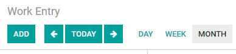
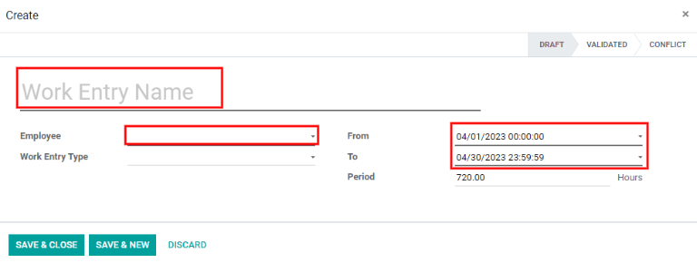
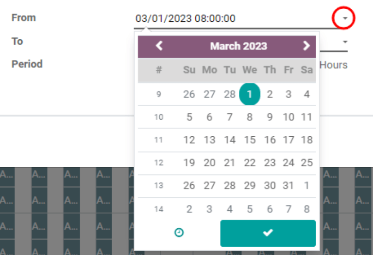
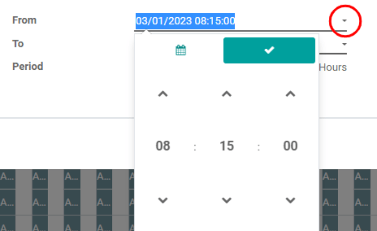

============
Work Entries
============

The :guilabel:`Work Entries` dashboard, which can be found by going to :menuselection:`Payroll
--> Work Entries --> Work Entries`, provides a visual overview of the individual time sheets of
every employee, with each day split into a morning shift and an afternoon shift.

.. image:: work_entries/work-entries-overview.png
   :align: center
   :alt: Work Entries dashboard view showing all employee's work entries.

To change the view so that only the entries for a single day, week, or month are shown, click on
either :guilabel:`Day`, :guilabel:`Week`, or :guilabel:`Month`.

Use the :guilabel:`arrow icons` on the left and right side of the :guilabel:`Today` button to adjust
the displayed dates. The arrows will adjust the date based on the type of time selected. For
example, if month is selected, the arrows will move one month with each click of the arrow. If week
or day is selected, the time will move by either a week or a day for each click of the arrow,
respectively.

Adding a new work entry
=======================

If a work entry is missing and needs to be added, such as  sick time or time off, click
:guilabel:`Add` to create a new work entry. A pop-up will appear, with several fields to fill in.

Enter the :guilabel:`Work Entry Name`, such as 'Sick Time' or any other short description. Select
the :guilabel:`Employee` and the :guilabel:`Work Entry Type` from the respective drop-down lists.

Next, enter the date and time for the work entry in the :guilabel:`From` and :guilabel:`To`
drop-downs. First, select the date by navigating to the correct month and year using the
:guilabel:`arrow icons` icons, then click on the specific day.

Then, select the time by clicking on the :guilabel:`clock icon`, and using the :guilabel:`up and
down arrows` for each section to enter the hour, minute, and second for the time period.

The :guilabel:`Period` will display the hours based on the :guilabel:`To` and :guilabel:`From`
entries.

.. tip::
   Before clicking either :guilabel:`Save & Close` or :guilabel:`Save & New`, it is good to double
   check the :guilabel:`Period` to ensure the time stated corresponds to the :guilabel:`To` and
   :guilabel:`From` fields.

   .. image:: work_entries/period.png
      :align: center
      :alt: Check the hours entered by looking at the total time in the Period section.

Once the information is entered, click :guilabel:`Save & Close` to save the entry and close the
pop-up, or :guilabel:`Save & New` to save the entry and create another :guilabel:`Work Entry Type`.

Regenerate work entries
=======================

After a work entry has been either added or modified, the work entries need to be regenerated for
the affected employee(s). Click on the :guilabel:`Regenerate Work Entries` button, and a pop-up will
appear.

   .. image:: work_entries/regenerate.png
      :align: center
      :alt: Regenrate work entires after modifying them.

Select the :guilabel:`Employee` to regenerate work entries for from the :guilabel:`drop-down menu`,
and adjust the :guilabel:`From` and :guilabel:`To` fields so the correct date range is displayed.
Click the :guilabel:`Regenerate Work Entries` button and the work entries will be recreated. Once
finished, the pop-up will close.

   .. image:: work_entries/regenerate-details.png
      :align: center
      :alt: Regenerate a work entry for a particular employee.

Conflicts
=========

A conflict appears for any request that has not been approved, such as sick time or vacation, or if
there are any errors on the work entry, such as required fields being left blank. Conflicts are
required to be resolved before payslips can be generated.

Any work entry that has a conflict to be resolved is indicated on the main :guilabel:`Work Entry`
overview dashboard, or by going to :menuselection:`Payroll --> Work Entries --> Conflicts`, where
only conflicts needing resolution are shown.

.. image:: work_entries/conflicts.png
   :align: center
   :alt: Conflicts dashboard view showing all employee's conflicts in work entries.

Conflicts are indicated with an orange triangle in the top left corner of each individual entry.
Click on an individual :guilabel:`work entry` to see the conflict details in a pop-up.

The conflict is briefly explained in an orange text box.

.. image:: work_entries/conflict-detail.png
   :align: center
   :alt: Details for a conflict appear in the pop-up.

The :guilabel:`Work Entry Name`, :guilabel:`Employee`, and :guilabel:`Work Entry Type` are listed on
the left side of the pop-up. The :guilabel:`From` and :guilabel:`To` date range, as well as the
total time requested (in hours), appear in the :guilabel:`Period` field on the right side.

If there is a conflict because a time-off request for the same time already exists in the system,
the time-off will be entered in the :guilabel:`Time Off` field. Clicking the :guilabel:`External
Link` button next to the :guilabel:`Time Off` entry will bring up the duplicate time off request.

The details for the time-off request appear in the pop-up. The request can be modified if needed.
Click either the :guilabel:`Validate` or :guilabel:`Refuse` button to approve or deny the request,
then click the :guilabel:`Save` button to save the changes.

.. image:: work_entries/validate.png
   :align: center
   :alt: Edit and/or validate a duplicate time-off request.

Once the duplicate time-off request has been approved and saved, the screen goes back to the
conflict. Click :guilabel:`Refuse Time Off` or :guilabel:`Approve Time Off` via the buttons in the
top right to either approve or deny the request. Repeat for all conflicts until there are no
conflicts to resolve.

After conflicts have been resolved, work entries must be regenerated for each employee by clicking
the :guilabel:`Regenerate Work Entries` button, and entering the corresponding information for each
employee.

.. image:: work_entries/regenerate-employee.png
   :align: center
   :alt: Regenerate each employee who has had work entires modified.

Generating payslips
===================

To generate payslips, navigate to the time period the payslips should be generated for, either day,
week, or month. When the desired pay period is displayed, click the :guilabel:`Generate Payslips`
button.

   .. image:: work_entries/generate-payslips.png
      :align: center
      :alt: Create payslips by clicking the Generate Payslips button.

.. tip::
   If the :guilabel:`Generate Payslips` button is not active (appears light turquoise instead of
   dark turquoise), that indicates there are conflicts. *Solve conflicts first* will appear as a
   warning when :guilabel:`Generate Payslips` is moused over. Resolve all conflicts before
   generating payslips.

A batch entry will appear for the time period selected. The batch name appears at the top in the
:guilabel:`Name` field, typically listing the month and year for the particular batch.

The date range the payslips apply to appears in the :guilabel:`Period` field. The company appears in
the :guilabel:`Company` field, along with an option to mark the payslips as a credit note. To make
changes, click the :guilabel:`Edit` button in the top left, make any changes, then click either
:guilabel:`Save` to accept the changes or :guilabel:`Discard` to revert to the original data.

   .. image:: work_entries/batch.png
      :align: center
      :alt: Batch information that appears when making a batch.

Click the :guilabel:`Create Draft Entry` button to create the payslips for the batch.

Click on the :guilabel:`Payslips` button in the top right to view all the payslips for the batch.

.. Note::
   Payslips will have a status of *Waiting* until the :guilabel:`Create Draft Entry` button has been
   clicked. After, the payslip status will change to *Done*.

Payslips can be printed by clicking the box next to each payslip to print, or clicking the box next
to :guilabel:`Reference` to select all the payslips at once. Click the :guilabel:`Print` button, and
a PDF file will be created with all the specified payslips.

   .. image:: work_entries/print-payslips.png
      :align: center
      :alt: Click the Print button to print the payslips.

