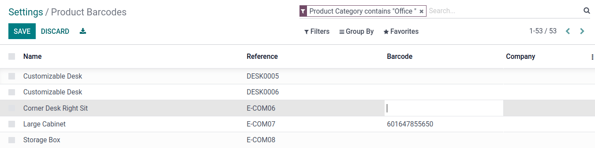

========================
GS1 barcode nomenclature
========================

`GS1 nomenclature <https://www.gs1us.org/>`_ summarizes product information in a single barcode. A
barcode consists of a series of numbers and letters which follow specific rules. These  can be used
to identify products, categorize where they're located, how they're packaged, and specify their
quantities. Some GS1 barcodes include a check digit, which is calculated based on the other numbers
in the barcode to prevent errors.

.. _barcode/operations/app-id: https://www.gs1.org/standards/barcodes/application-identifiers

.. seealso::
   - `All GS1 barcodes <barcode/operations/app-id>`_
   - :ref:`Odoo's default GS1 rules <barcode/gs1_nomenclature/list>`

Set up barcode nomenclature
===========================

To use GS1 nomenclature, navigate to the :menuselection:`Inventory app --> Configuration -->
Settings`. Then under the :guilabel:`Barcode` section, check the :guilabel:`Barcode Scanner` box.
Next, select :menuselection:`Barcode Nomenclature --> Default GS1 Nomenclature` in the dropdown of
the list of default barcode nomenclature options.

To view and edit a list of GS1 *rules* and *barcode patterns* Odoo supports by default, click the
:guilabel:`➡️ (External link)` icon to the right of the :guilabel:`Barcode Nomenclature` selection.

.. image:: gs1_nomenclature/setup-gs1-nomenclature.png
   :align: center
   :alt: Choose GS1 from dropdown and click the internal link to see list of GS1 rules.

This opens an editable pop-up table of GS1 :guilabel:`Rule Names` that identify the items,
locations, and values with the corresponding :guilabel:`Barcode Pattern`. These patterns must match
the exact amount of numeric or letter characters for the rule. Barcode patterns are universally
defined and understood by systems interpreting GS1 barcodes. To describe the patterns concisely,
Odoo uses :ref:`regular expressions <barcode/gs1/regex>` (regex). Every barcode pattern has an
`application identifier <barcode/operations/app-id>`_ (A.I.), which is a required 2-4 digit
identifier for a rule.

.. _barcode/gs1/regex:

Quick guide to regular expressions
----------------------------------

Odoo's default :ref:`GS1 barcode list<barcode/gs1_nomenclature/list>` uses :abbr:`regex (regular
expressions)` to specify the required number of letters and numbers for a valid GS1 barcode.
Characters in barcodes are represented by special patterns like `\\d` for a numerical digit and
`A-Z` for any uppercase letter.

.. example::
   The barcode pattern that identifies a Global Trade Item Number (GTIN), or product, is
   `(01)(\\d{14})`. This means valid barcode patterns for products begin with the :abbr:`A.I
   (application identifier)` `01`, followed by any 14-digit combination. The :abbr:`regex (regular
   expression)` is broken down as follows:

    - `\\d{6}` matches any 6-digit combination, like `123456` or `246810`. `\\d` represents a
      numerical digit, and `\\d` followed by `{}` specifies the amount of digits in the barcode
      pattern.
    - `01` matches `01` literally. With this before the `\\d{6}`, it requires the number to start
      with `01`.
    - Thus, valid barcode patterns for products are 16-digit numbers that begin with `01`.

.. spoiler:: The barcode pattern for batch or lot number, (10)([!"%-/0-9:-?A-Z_a-z]{0,20}),
     consists of which characters?

   The barcode pattern starts with the :abbr:`A.I (application identifier)` `10` that Odoo uses to
   recognize the sequence that follows describes a batch or lot number. Then, the pattern is
   followed by 0 - 20 characters that can be letters or numbers. (e.g. `10BATCH`, `10Lot-44B`).
   Characters enclosed in square brackets `[]` mean that any of those characters can be used in the
   barcode pattern.

Create rules
------------

To add more `GS1 barcodes <barcode/operations/app-id>`_ onto Odoo's default list, first navigate to
the GS1 rules table in the :menuselection:`Inventory app --> Configuration --> Settings`. To open
the table, scroll to the :guilabel:`Barcode` heading and click the :guilabel:`External link` icon (
➡️ ) to the right of :guilabel:`Barcode Nomenclature`.

Next, select :guilabel:`Add a line` at the bottom of the pop-up table, which opens a new window. The
:guilabel:`Rule Name` field is used internally to identify what the barcode represents. The barcode
:guilabel:`Types` are different classifications of information that can be understood by the system
(e.g. product, quantity, best before date, package, coupon). The :guilabel:`Sequence` represents the
priority of the rule; this means the smaller the value, the higher the rule appears on the table.
Odoo follows the sequential order of this table and will use the first rule it matches with the
following sequence. The :guilabel:`Barcode Pattern` is how the sequence of letters or numbers is
recognized by the system to contain information about the product.

After filling the information, click the :guilabel:`Save & New` button to make another rule or click
:guilabel:`Save & Close` to save and return to the table of rules.

.. note::
    While Odoo does not check whether barcode patterns are valid GS1 barcodes, a :guilabel:`Type` of
    barcode must be picked when creating a new rule. This limits the type information that can be
    included in barcodes.

.. _barcode/operations/app-id-3254:
   https://www.gs1.org/standards/barcodes/application-identifiers/3254?lang=en

.. example::
   For example, to add an additional rule to categorize the width of products, set the
   :guilabel:`Type` as :menuselection:`Quantity`, :guilabel:`GS1 Content Type` as
   :menuselection:`Measure`. These are inputs pre-determined by GS1. Then, look up and match the
   :guilabel:`Barcode Pattern` to the corresponding barcode pattern for the rule on the `official
   GS1 page <barcode/operations/app-id-3254>`_, `(3254)(\\d{6})`. Finally, fill in the desired
   :guilabel:`Rule Name` and :guilabel:`Sequence` that suits the company.

    .. image:: gs1_nomenclature/create-new-rule.png
       :align: center
       :alt: Create new GS1 rule in pop-up.

.. _barcode/operations/gs1/products:

Link products to barcodes
-------------------------

.. _barcode/operations/check-digit: https://www.gs1.org/services/check-digit-calculator

To link barcodes to products in Odoo, navigate to the intended product form in
:menuselection:`Inventory --> Products --> Products` and select the intended the product. Here on
the product form, click :guilabel:`Edit`. Then, in the :guilabel:`General Information` tab, fill in
the :guilabel:`Barcode` field with the 14-digit Global Trade Item Number (GTIN) of the product. Use
the `check digit calculator <barcode/operations/check-digit>`_ to generate the 14th digit of the
product GTIN, as the required GS1 check digit.

.. important::
   On the product form, omit the :abbr:`A.I. (application identifier)` `01` for GTIN product barcode
   pattern, as it is only used during barcode scanning to identify the barcode.

.. example::
   Create a GS1 product barcode by selecting the first 13 digits. In this example, the sequence
   `3377885621455` was selected. Using the check digit calculator, the final digit is 8. Enter the
   full 14-digit GTIN `33778856214558` into the :guilabel:`Barcode` field on the product form.

   .. image:: gs1_nomenclature/barcode-field.png
      :align: center
      :alt: Enter 14-digit GTIN into the Barcode field on product form.

It is also possible to view a list of all products and barcodes. To access this list, go to
:menuselection:`Inventory --> Configuration --> Settings`. Under the :guilabel:`Barcode` heading,
click on the :guilabel:`Configure Product Barcodes` button. Enter the 14-digit GTIN into the
:guilabel:`Barcode` column, then click :guilabel:`Save`.

Verify barcode
==============

To test valid barcodes in Odoo, open the :menuselection:`Barcode` app. Generate printable PDFs of
barcodes by clicking on the :guilabel:`barcode commands for Inventory` link on the
:menuselection:`Barcode` landing page. Link products to barcodes by following the instructions in
the :ref:`previous sections<barcode/operations/gs1/products>`.

.. seealso::
   :ref:`Set up barcode scanner <barcode/setup/hardware>`

Test without scanner
--------------------

To test barcodes without a scanner, navigate to the :menuselection:`Barcode app --> Operations` and
click on operation type, then the operations to process. In an operation with a :guilabel:`Ready`
status, right click the page and select :menuselection:`Inspect`. This opens the webpage inspector.
Next, switch to the :menuselection:`Console` tab.

.. seealso::
   - `Chrome DevTools docs <https://developer.chrome.com/docs/devtools/>`_
   - `Firefox DevTools <https://firefox-source-docs.mozilla.org/devtools-user/>`_
   - `Edge DevTools
     <https://learn.microsoft.com/en-us/microsoft-edge/devtools-guide-chromium/overview>`_

Then, in the code block below, replace the second trigger parameter, "INSERT BARCODE HERE", with the
full barcode pattern, including the :abbr:`A.I. (application identifier)` (e.g. `01` for product
GTINs). Copy the full code block with a valid GS1 barcode and paste it into the console.

.. code-block:: javascript

   odoo.__DEBUG__.services['web.core'].bus.trigger(
      'barcode_scanned',
      "INSERT BARCODE HERE",
      $(".o_web_client")[0],
   )

.. example::
   The product, `Large Cabinet` is being received in the warehouse. The barcode is configured as
   follows:

   - Product identifier uses the :abbr:`A.I. (application identifier)` `01` + the 14-digit product
     barcode (including check digit) `33778856214558`.

   - Specify the quantity of products `30` + the quantity `00000001`.
   - Batch number uses the :abbr:`A.I. (application identifier)` `10` + `BATCH00000015`

   So, in :menuselection:`Barcode --> Operations --> Receipts`, open a receipt for the product and
   open the console. Paste the code block with the configured barcode in the console.

   .. code-block:: javascript

      odoo.__DEBUG__.services['web.core'].bus.trigger(
         'barcode_scanned',
         "0133778856214558300000000110BATCH00000015",
         $(".o_web_client")[0],
      )

   .. image:: gs1_nomenclature/paste-in-console.png
      :align: center
      :alt: Paste code block into console.

   To check whether the batch number was assigned to the product through the barcode scan, navigate
   to the :guilabel:`Batch Transfers` page in :menuselection:`Inventory app --> Operations --> Batch
   Transfers`.

   .. image:: gs1_nomenclature/batch-list.png
      :align: center
      :alt: Check whether batch was added through the barcode.

   **Note**: Clotilde, help ): I don't see BATCH15 in this list.

.. _barcode/gs1_nomenclature/list:

GS1 nomenclature list
=====================

The table below contains Odoo's default list of GS1 rules. Barcode patterns are written in
:ref:`regular expressions<barcode/gs1/regex>`. Only the first three rules require a `check digit
<check-digit>`_ as the final character.

+---------------------------------+-------------+------------------------------+--------------------+
|            Rule Name            |    Type     |       Barcode Pattern        |       Fourth       |
+=================================+=============+==============================+====================+
| Serial Shipping Container Code  | Package     | (00)(\\d{18})                | Numeric identifier |
+---------------------------------+-------------+------------------------------+--------------------+
| Global Trade Item Number (GTIN) | Unit        | (01)(\\d{14})                | Numeric identifier |
|                                 | Product     |                              |                    |
+---------------------------------+-------------+------------------------------+--------------------+
| GTIN of contained trade items   | Unit        | (02)(\\d{14})                | Numeric identifier |
|                                 | Product     |                              |                    |
+---------------------------------+-------------+------------------------------+--------------------+
| Ship to / Deliver to global     | Destination | (410)(\\d{13})               | Numeric identifier |
| location                        | location    |                              |                    |
+---------------------------------+-------------+------------------------------+--------------------+
| Ship / Deliver for forward      | Destination | (413)(\\d{13})               | Numeric identifier |
|                                 | location    |                              |                    |
+---------------------------------+-------------+------------------------------+--------------------+
| I.D of a physical location      | Location    | (414)(\\d{13})               | Numeric identifier |
+---------------------------------+-------------+------------------------------+--------------------+
| Batch or lot number             | Lot         | (10)                         | Alpha-numeric name |
|                                 |             | ([!"%-/0-9:-?A-Z_a-z]{0,20}) |                    |
+---------------------------------+-------------+------------------------------+--------------------+
| Serial number                   | Lot         | (21)                         | Alpha-numeric name |
|                                 |             | ([!"%-/0-9:-?A-Z_a-z]{0,20}) |                    |
+---------------------------------+-------------+------------------------------+--------------------+
| Packaging date (YYMMDD)         | Packaging   | (13)(\\d{6})                 | Date               |
|                                 | Date        |                              |                    |
+---------------------------------+-------------+------------------------------+--------------------+
| Best before date (YYMMDD)       | Best before | (15)(\\d{6})                 | Date               |
|                                 | Date        |                              |                    |
+---------------------------------+-------------+------------------------------+--------------------+
| Expiration date (YYMMDD)        | Expiration  | (17)(\\d{6})                 | Date               |
|                                 | Date        |                              |                    |
+---------------------------------+-------------+------------------------------+--------------------+
| Variable count of items         | Quantity    | (30)(\\d{0,8})               | Measure            |
+---------------------------------+-------------+------------------------------+--------------------+
| Count of trade items            | Quantity    | (37)(\\d{0,8})               | Measure            |
+---------------------------------+-------------+------------------------------+--------------------+
| Net weight: kilograms (kg)      | Quantity    | (310[0-5])(\\d{6})           | Measure            |
+---------------------------------+-------------+------------------------------+--------------------+
| Length in meters (m)            | Quantity    | (311[0-5])(\\d{6})           | Measure            |
+---------------------------------+-------------+------------------------------+--------------------+
| Net volume: liters (L)          | Quantity    | (315[0-5])(\\d{6})           | Measure            |
+---------------------------------+-------------+------------------------------+--------------------+
| Net volume: cubic meters (m^3)  | Quantity    | (316[0-5])(\\d{6})           | Measure            |
+---------------------------------+-------------+------------------------------+--------------------+
| Length in inches (in)           | Quantity    | (321[0-5])(\\d{6})           | Measure            |
+---------------------------------+-------------+------------------------------+--------------------+
| Net weight/volume: ounces (oz)  | Quantity    | (357[0-5])(\\d{6})           | Measure            |
+---------------------------------+-------------+------------------------------+--------------------+
| Net volume: cubic feet (ft^3)   | Quantity    | (365[0-5])(\\d{6})           | Measure            |
+---------------------------------+-------------+------------------------------+--------------------+
| Packaging type                  | Packaging   | (91)                         | Alpha-numeric name |
|                                 | Type        | ([!"%-/0-9:-?A-Z_a-z]{0,90}) |                    |
+---------------------------------+-------------+------------------------------+--------------------+
