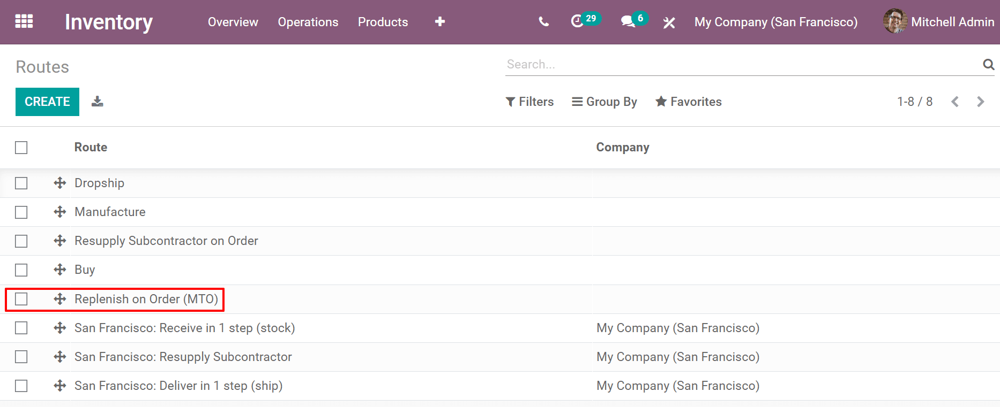

========================
Replenish on order (MTO)
========================

Replenish on order, also known as Make to Order (MTO), is a replenishment strategy that creates a
draft order for a product every time a Sales Order is created for it. For products that are
purchased from a vendor, a Request for Quotation is created, while a Sales Order for a product
manufactured in house will trigger the creation of a Manufacturing Order. The creation of a Request
for Quotation or Manufacturing Order will occur every time a sales order is created, regardless of
the current stock level of the product being ordered.

Unarchive the Replenish on Order (MTO) route
============================================

By default, Odoo sets the MTO route as archived. This is because MTO is a somewhat niche workflow
that is only used by certain companies. However, it is easy to unarchive the route in just a few
simple steps.

Begin by navigating to :menuselection:`Inventory --> Configuration --> Routes`. Click the
:guilabel:`Filters` button and select the :guilabel:`Archived` option. This will show all routes
that are currently archived.

.. image:: mto/archived-filter.png
   :align: center
   :alt: The archived filter on the Routes page.

Enable the checkbox next to :guilabel:`Replenish on Order (MTO)`, then click the :guilabel:`Action`
button and select :guilabel:`Unarchive`.

.. image:: mto/unarchive-button.png
   :align: center
   :alt: The unarchive action on the Routes page.

Finally, remove the :guilabel:`Archived` filter from the :guilabel:`Search...` bar. The routes page
will now show all available routes, including Replenish on Order (MTO), which will be selectable on
the inventory tab of each product page.

Configure a product to use the MTO route
========================================

With the MTO route unarchived, products can now be properly configured to use Replenish on Order.
Begin by going to :menuselection:`Inventory --> Products --> Products`, then select an existing
product or click :guilabel:`Create` to configure a new one.

First, select the :guilabel:`Inventory` tab and enable the :guilabel:`Replenish on Order (MTO)`
route in the *Routes* section, along with one other route.

.. important::
   The Replenish on Order (MTO) route will not work unless another route is selected as well. This is
   because Odoo needs to know how to replenish the product when an order is placed for it (buy it,
   manufacture it, etc.).

.. image:: mto/select-routes.png
   :align: center
   :alt: Select the MTO route and a second route on the Inventory tab.

If the product will be purchased from a vendor to fulfill sales orders, enable the :guilabel:`Can be
Purchased` checkbox under the product name. This will make the :guilabel:`Purchase` tab appear
below. Select the tab and specify a :guilabel:`Vendor` and the :guilabel:`Price` they sell the
product for.

.. image:: mto/specify-vendor.png
   :align: center
   :alt: Enable "Can be Purchased" and specify a vendor.

If the product will be manufactured, click the :guilabel:`Bill of Materials` smart button at the top
of the screen, then :guilabel:`Create` to configure a new Bill of Materials for the product. Add the
components used to manufacture the product on the :guilabel:`Components` tab, along with the
operations required for the manufacturing workflow on the :guilabel:`Operations` tab. Finally, click
:guilabel:`Save` to save the Bill of Materials.

Fulfill a Sales Order using the MTO route
=========================================

After configuring a product to use the MTO route, a replenishment order will be created for it every
time a Sales Order including the product is confirmed. The type of order created depends on the
second route selected in addition to MTO. For example, if *Buy* was the second route
selected, then a Purchase Order will be created upon confirmation of a Sales Order.

.. important::
   When the MTO route is enabled for a product, a replenishment order will always be created upon
   confirmation of a Sales Order. This is the case even if there is enough stock of the product on
   hand to fulfill the Sales Order without buying or manufacturing additional units of it.

While the MTO route can be used in unison with a variety of other routes, the *Buy* route
will be used as the example for this workflow. Begin by navigating to the :guilabel:`Sales` app,
then click :guilabel:`Create` to create a new Quotation.

Add a :guilabel:`Customer` to the Quotation, then click :guilabel:`Add a product` under the
:guilabel:`Order Lines` tab and enter a product that has been configured to use the MTO and Buy
routes. Click :guilabel:`Confirm` and the Quotation will be turned into a Sales Order.

A :guilabel:`Purchase` smart button will now appear in the top right corner of the Sales Order.
Click it to be taken to the associated Request for Quotation. Click :guilabel:`Confirm Order` to
confirm the Request for Quotation and turn it into a Purchase Order. A green :guilabel:`Receive
Products` button will now appear at the top of the Purchase Order. Once the products are received,
click it to register them into inventory.

Return to the Sales Order by clicking the SO breadcrumb or by navigating to :menuselection:`Sales
--> Orders --> Orders` and selecting the Sales Order. Click the :guilabel:`Delivery` smart button in
the top right of the order to be taken to the delivery order. Once the products have been shipped to
the customer, click :guilabel:`Validate` to confirm the delivery.
