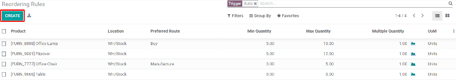
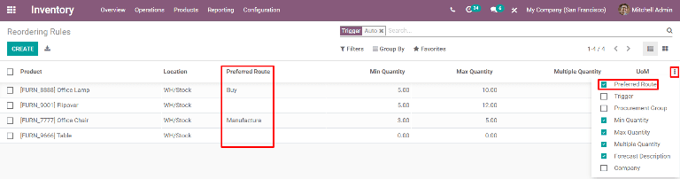

================
Reordering rules
================

Reordering rules are used to keep forecasted stock levels above a certain threshold without
exceeding an upper limit. This is accomplished by specifying a minimum quantity that stock should
not fall below and a maximum quantity that stock will be replenished up to.

Reordering rules can be configured for each product based on the route used to replenish it. If a
product uses the *Buy* route, then a Request for Quotation (RFQ) will be created when the reordering
rule is triggered. If a product uses the *Manufacture* route, then a Manufacturing Order (MO) will
be created instead. This will be the case for whichever replenishment route is selected.

Configure products for reordering rules
=======================================

In order to use reordering rules for a product, it must first be correctly configured. Begin by
navigating to :guilabel:`Inventory --> Products --> Products`, then select an existing product or
create a new one by clicking :guilabel:`Create`.

First, on the :guilabel:`General Information` tab, make sure that the :guilabel:`Product Type` is
set to :guilabel:`Storable Product`. This is necessary because Odoo only tracks stock quantities for
storable products, and this number is used to trigger reordering rules.

.. image:: reordering_rules/product-type.png
   :align: center
   :alt: Set the Product Type as Storable.

Next, click on the :guilabel:`Inventory` tab and select one or more routes from the
:guilabel:`Routes` section. Doing so tells Odoo which route to use to replenish the product.

.. image:: reordering_rules/select-routes.png
   :align: center
   :alt: Select one or more routes on the Inventory tab.

If the product will be reordered using the :guilabel:`Buy` route, confirm that the :guilabel:`Can be
Purchased` checkbox is enabled under the product name. This will make the :guilabel:`Purchase` tab
appear. Click on the :guilabel:`Purchase` tab and specify at least one vendor and the price that
they sell the product for, so that Odoo knows which company the product should be purchased from.

.. image:: reordering_rules/specify-vendor.png
   :align: center
   :alt: Specify a vendor and price on the Purchase tab.

If the product will be replenished using the :guilabel:`Manufacture` route, it needs to have at
least one Bill of Materials (BoM) associated with it. This is necessary because Odoo will only
create Manufacturing Orders for products with a :abbr:`BoM (Bill of Materials)`.

If a :abbr:`BoM (Bill of Materials)` does not already exist for the product, select the
:guilabel:`Bill of Materials` smart button at the top of the product page, then click
:guilabel:`Create` to configure a new :abbr:`BoM (Bill of Materials)`.

.. image:: reordering_rules/BoM-smart-button.png
   :align: center
   :alt: The Bill of Materials smart button on a product page.

Create a new reordering rule
============================

To create a new reordering rule, navigate to :menuselection:`Inventory --> Configuration -->
Reordering Rules`, then click :guilabel:`Create`, and fill out the new line as follows:

- :guilabel:`Product`: the product that will be replenished by the rule
- :guilabel:`Location`: the location where the product is stored
- :guilabel:`Min Quantity`: the minimum quantity that can be forecasted without the rule being
  triggered; when forecasted stock falls below this number, a replenishment order for the product
  will be created
- :guilabel:`Max Quantity`: the maximum quantity that stock will be replenished up to
- :guilabel:`Multiple Quantity`: specify if the product should be replenished in batches of a
  certain quantity; for example, a product could be replenished in batches of 20
- :guilabel:`UoM`: the unit of measure used for reordering the product; this value can simply be
  `Units` or a specific unit of measurement for weight, length, etc.

.. tip::
   Reordering rules can also be created from each product page. To do so, navigate to
   :menuselection:`Inventory --> Products --> Products`, then select a product. Click on
   :menuselection:`Reordering Rules --> Create`, then fill out the new line as detailed above.

Once a reordering rule has been created for a product, if its forecasted quantity is below the
rule's *Min Quantity* when the scheduler runs, a replenishment order for the product will be
automatically generated. By default, the scheduler runs once each day.

.. tip::
   To manually trigger a reordering rule before the scheduler runs, select :menuselection:`Inventory
   --> Operations --> Run Scheduler`. Then, select the green :guilabel:`Run Scheduler` button on the
   pop-up that appears. Be aware that this will also trigger any other scheduled actions.

If the :guilabel:`Buy` route is selected, then an :abbr:`RfQ (Request for Quotation)` will be
generated. To view and manage :abbr:`RFQs (Requests for Quotation)`, navigate to
:menuselection:`Purchase --> Orders --> Requests for Quotation`.

If the :guilabel:`Manufacture` route is selected, then an :abbr:`MO (Manufacturing Order)` will be
generated. To view and manage :abbr:`MOs (Manufacturing Orders)`, navigate to
:menuselection:`Manufacturing --> Operations --> Manufacturing Orders`.

Select a preferred route to use for reordering
==============================================

Odoo allows for multiple routes to be selected under the :guilabel:`Inventory` tab on each product
page. For instance, it is possible to select both :guilabel:`Buy` and :guilabel:`Manufacture`, thus
enabling the functionality of both routes.

Odoo also enables users to set a preferred route for a product's reordering rule. This is the route
that the rule will default to if multiple are selected. To select a preferred route, begin by
navigating to :menuselection:`Inventory --> Configuration --> Reordering Rules`.

By default, the :guilabel:`Preferred Route` column is hidden on the :guilabel:`Reordering Rules`
page. Enable it by selecting the three-dot :guilabel:`Options` button on the right side of the page
and checking the :guilabel:`Preferred Route` checkbox.

The :guilabel:`Preferred Route` column will now appear. Click inside of the column on the row of a
reordering rule and a :guilabel:`drop-down` will show all available routes for that rule. Select
one, and it will be set as the preferred route.

.. important::
   If multiple routes are enabled for a product but no preferred route is set for its reordering
   rule, the product will be reordered using the selected route that is listed first on the Inventory
   tab of the product page.
