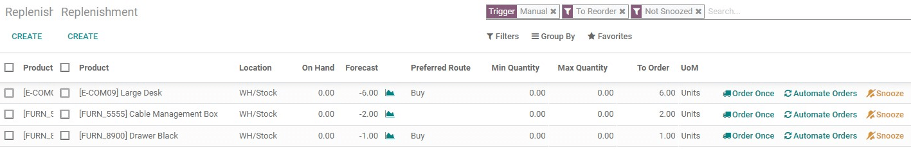
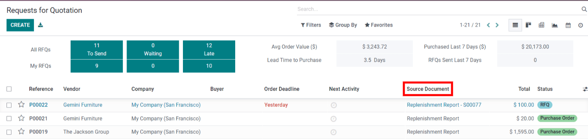
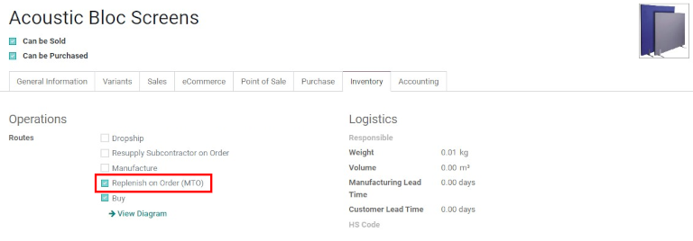

==================================
Selecting a replenishment strategy
==================================

In Odoo, there are two strategies for automatically replenishing inventory: **Reordering Rules** and
the **Make to Order (MTO)** route. Although these strategies differ slightly, they both have similar
consequences: triggering the automatic creation of a :abbr:`PO (purchase order)` or :abbr:`MO
(manufacturing order)`. The choice of which strategy to use depends on the business's manufacturing
and delivery processes.

Terminology
===========

Replenishment report and reordering rules
-----------------------------------------

The **Replenishment Report** is a list of all products that have a negative forecast quantity.

**Reordering Rules** are used to ensure that there's always a minimum amount of a product in stock
in order to manufacture products and/or fulfill sales orders. When the stock level of a product
reaches its minimum, Odoo automatically generates a purchase order with the quantity needed to reach
the maximum stock level.

Reordering rules can be created and managed in the replenishment report, or from the product form.

Make to order
-------------

Make to Order (MTO) is a procurement route that creates a draft purchase order (or manufacturing
order) each time a sales order is confirmed, *regardless of the current stock level*.

Unlike products replenished using reordering rules, Odoo automatically links the sales order to the
:abbr:`PO (purchase order)` or :abbr:`MO (manufacturing order)` generated by the MTO route.

Another difference between reordering rules and MTO is, with MTO, Odoo generates a draft :abbr:`PO
(purchase order)` or :abbr:`MO (manufacturing order)` immediately after the :abbr:`SO (sales order)`
is confirmed. With reordering rules, Odoo generates a draft :abbr:`PO (purchase order)` or :abbr:`MO
(manufacturing order)` when the product's forecasted stock falls below the set minimum quantity.

In addition, Odoo will automatically add quantities to the :abbr:`PO (purchase order)` or :abbr:`MO
(manufacturing order)` as the forecast changes, as long as the :abbr:`PO (purchase order)` or
:abbr:`MO (manufacturing order)` is not confirmed.

The MTO route is the best replenishment strategy for products that are customized and/or no stock is
kept on hand.

Configuration
=============

Replenishment report and reordering rules
-----------------------------------------

To access the replenishment report, go to :menuselection:`Inventory app --> Operations -->
Replenishment.`

By default, the replenishment report shows every product that needs to be manually reordered. If
there is no specific rule for a product, Odoo assumes that the :guilabel:`Minimum Quantity` and
:guilabel:`Maximum Quantity` stock are both `0.00`

.. note::
   For products that don't have a set reordering rule, Odoo calculates the forecast based on
   confirmed sales orders, deliveries, and receipts. For products that have a set reordering rule,
   Odoo calculates the forecast normally, but also takes into account the purchase/manufacturing
   lead time and security lead time.

.. important::
   Before creating a new reordering rule, make sure the product has a *vendor* or a *bill of
   materials* configured on the product form. To check this, go to :menuselection:`Inventory app
   --> Products --> Products`, and select the product to open its product form. The vendor, if
   configured, is listed in the :guilabel:`Purchase` tab, and the bill on materials, if configured,
   is found in the :guilabel:`Bill of Materials` smart button at the top of the form.

   The product type, located in the :guilabel:`General Information` tab on the product form,
   **must** be set to :guilabel:`Storable Product`. By definition, a consumable product does not
   have its inventory levels tracked, so Odoo cannot account for a consumable product in the
   replenishment report.

To create a new reordering rule from the replenishment report, go to :menuselection:`Inventory app
--> Operations --> Replenishment`, click :guilabel:`Create`, and select the desired product from the
drop-down menu in the :guilabel:`Product` column. If necessary, a :guilabel:`Min Quantity` and a
:guilabel:`Max Quantity` can be configured in the corresponding columns on the replenishment report
page, as well.

To create a new reordering rule from the product form, go to :menuselection:`Inventory app -->
Products --> Products`, and select a product to open its product form. Click the
:guilabel:`Reordering Rules` smart button, click :guilabel:`Create`, and fill out the fields.

Replenishment report fields
~~~~~~~~~~~~~~~~~~~~~~~~~~~

The following fields are on the :guilabel:`Replenishment` report. If any of these fields are not
visible, click the additional options icon (three vertical dots) on the far right side of the
report, then click the checkbox next to a field to make it visible.

- :guilabel:`Product`: The product that requires a replenishment.
- :guilabel:`Location`: The specific location where the product is stored.
- :guilabel:`Wahrehouse`: The warehouse the product is stored.
- :guilabel:`On Hand`: The amount of product currently available.
- :guilabel:`Forecast`: The amount of product available after all current orders (sales,
  manufacutirng, purchase, etc) are taken into account.
- :guilabel:`Preferred Route`: How the product is procured, either :guilabel:`Buy`,
  :guilabel:`Manufactured`, :guilabel:`Droship`, etc.
- :guilabel:`Vendor`: The company the product is acquired from.
- :guilabel:`Bill of Materials`: If a bill of materials is set for the product, it is listed here.
- :guilabel:`Trigger`: How the replenishment is created, either :guilabel:`Auto` (automatically,
  once the :guilabel:`On Hand` quantity goes below the :guilabel:`Min Quantity`) or
  :guilabel:`Manual` (only when the replenishment is requested).
- :guilabel:`Procurement Group`: The reference number for how the product is being acquired, such
  as a sales order, purchase order, or manufacturing order.
- :guilabel:`Min Quantity`: The minimum amount of product that should be available. When inventory
  levels goes below this number, the replenishment is triggered.
- :guilabel:`Max Quantity`: The amount of product that should be available after replenishing the
  product.
- :guilabel:`Multiple Quantity`: If the product should be ordered in specific quantities, enter the
  number that should be ordered. For example, if the :guilabel:`Multiple Quantity` is set to 5, and
  only 3 are needed, 5 products will be replenished.
- :guilabel:`To Order`: The amount of product that is currently needed, and will be ordered, if the
  :guilabel:`Order Once` or :guilabel:`automate Orders` button is clicked.
- :guilabel:`UoM`: The unit of measure used to acquire the product.
- :guilabel:`Company`: The company the product is acquired for.

By default, the quantity in the :guilabel:`To Order` field is the quantity required to reach the set
:guilabel:`Max Quantity`. However, the :guilabel:`To Order` quantity can be adjusted by clicking on
the field and, changing the value, and clicking :guilabel:`Save`. To replenish a product manually,
click :guilabel:`Order Once`.

To automate a replenishment (from the :guilabel:`Replenishment` page) click :guilabel:`Automate
Orders` on the right side of the line, with a :guilabel:`🔄 (circular arrow)` icon.

When this button is clicked, Odoo will automatically generate a draft :abbr:`PO (purchase order)`/
:abbr:`MO (manufacturing order)` every time the forecasted stock level falls below the set
:guilabel:`Min Quantity` of the reordering rule.

On the :guilabel:`Replenishment` page, a reordering rule or manual replenishment can be temporarily
deactivated for a given period, by clicking the :guilabel:`🔕 (snooze)` icon on the far-right of the
line.

.. image:: strategies/reordering-rule-snooze-settings.png
   :align: center
   :alt: Snooze options to turn off notifications for reordering for a period of time.

A :abbr:`PO (purchase order)` or :abbr:`MO (manufacturing order)` created by a manual replenishment
has a :guilabel:`Replenishment Report` as the source document. A :abbr:`PO (purchase order)` or
:abbr:`MO (manufacturing order)` created by an automated reordering rule will have the
:abbr:`SO (sales order(s))` reference number(s) that triggered the rule as the source document.

Make to order (MTO)
===================

Since the :abbr:`MTO (make to order)` route is recommended for customized products, the route is
hidden by default.

To activate the Make to Order (MTO) route in Odoo:
 #. Go to :menuselection:`Inventory app --> Configuration  --> Settings`.
 #. Activate the :guilabel:`Multi-Step Routes` setting, located under the :guilabel:`Warehouse`
    section, and click :guilabel:`Save`.
 #. Then, go to :menuselection:`Inventory app --> Configuration  --> Routes`.
 #. Click on :menuselection:`Filters --> Archived` to show archived routes.
 #. Select the checkbox next to :guilabel:`Replenish on Order (MTO)`, and click on
    :menuselection:`Action --> Unarchive`.

.. note::
   Activating the :guilabel:`Multi-Step Routes` setting also activates :guilabel:`Storage
   Locations`. If these features aren't applicable to the warehouse, disable these settings after
   unarchiving the MTO route.

To set a product's procurement route to MTO, go to :menuselection:`Inventory app --> Products -->
Products`, click on the desired product to open its product form, and click :guilabel:`Edit`.

Then, click the :guilabel:`Inventory` tab, and in the :guilabel:`Routes` section of options, select
:guilabel:`Replenish on Order (MTO)`.

For products purchased directly from a vendor, make sure the :guilabel:`Buy` route is selected in
addition to the :guilabel:`Replenish on Order (MTO)` route, and a vendor is configured (in the
:guilabel:`Purchase` tab of the product form.

For products manufactured in-house, make sure the :guilabel:`Manufacture` route is selected in
addition to the :guilabel:`MTO` route, and that a bill of materials is configured for the product,
which is accessible via the :guilabel:`Bill of Materials` smart button on the product form.

Finally, when all configurations are complete, click :guilabel:`Save`.

.. note::
   The MTO route cannot be selected alone. MTO will only works if the :guilabel:`Manufacture` or
   :guilabel:`Buy` route is also selected.

