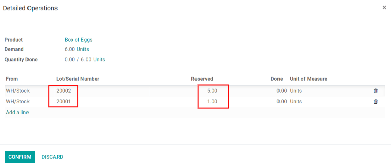

=====================================
Removal Strategies (FIFO, LIFO, FEFO)
=====================================

For companies with warehouses, **Removal Strategies** are typically defined for specific picking
operations. This helps companies to select the best products, optimize the distance workers need to
travel when picking items for orders, and account for quality control purposes, such as moving
products with expiration date.

When a product needs to be moved, Odoo finds available products that can be assigned to the
transfer. The way Odoo assigns these products depends on the :guilabel:`Removal Strategy` defined in
the :guilabel:`Product Category` or on the :guilabel:`Location`.

To change the :guilabel:`Removal Strategy`, go to :menuselection:`Inventory app --> Configuration
--> Locations or Product Categories`. Click on a :guilabel:`Location` or
:guilabel:`Product Category`, and then click :guilabel:`Edit`. Change the :guilabel:`Force Removal
Strategy` by clicking on the :guilabel:`drop-down menu` and selecting the desired removal strategy.
After selecting the new removal strategy, click :guilabel:`Save`.

.. image:: removal/product-category-location.png
   :align: center
   :alt: Change the Force Removal Strategy for either the Product Categories or Locations.

What happens inside the warehouse?
==================================
Most warehouses share the same important areas: receiving docks and sorting areas, storage
locations, picking and packing areas, and shipping/loading docks. While all products entering or
leaving the warehouse might go through each of these locations at some point, removal strategies can
have an effect on which products are taken, from where, and when.

.. image:: removal/empty-dock.png
   :align: center
   :alt: Empty stock waiting for deliveries at the docks.

Here, vendor trucks unload pallets of goods at the docks. Then, operators scan the products in the
receiving area with the reception date and, if the product has an expiration date, the expiration
date. After that, products are stored in their respective locations.

In Odoo, this is done either in the *Inventory* or *Barcode* app. In either app, in the default
Kanban view, click or tap :guilabel:`Receipts`, then, click or tap on the individual receipt to
validate it. Next, in the *Inventory* app, click :guilabel:`Edit`, then enter the received quantity
in the :guilabel:`Done` column. Finally, click :guilabel:`Validate` to receive the products. If
using the *Barcode* app, scan the product(s), update the quantity, and finally, tap
:guilabel:`Validate`. After products are received in Odoo, the products can be moved to their
respective storage locations.

.. image:: removal/entering-stocks.png
   :align: center
   :alt: Products entering stock via the receiving area.

Next, several orders for the same product are made, but in this example, the goods weren't received
on the same day and they don't have the same expiration date. In that situation, logically, sending
those with the closest expiration date is preferred. Depending on the chosen removal strategy, Odoo
generates a transfer with the products that fit the settings best.

.. image:: removal/packing-products.png
   :align: center
   :alt: Products being packed at the packing area for delivery, taking expiration dates into
         account.

.. note::
   To pick for delivery, the product's lot/serial number can be found on the transfer form.

How each removal strategy works
===============================

Removal strategies determine which products are taken from the warehouse when orders are confirmed.
This is why selecting the correct removal strategies to best suit the needs of the warehouse is
important.

First In, First Out (FIFO)
--------------------------

When using a :guilabel:`First In, First Out (FIFO)` strategy, a demand for a product triggers a
removal rule, which requests a transfer for the lot/serial number that entered the stock first.
For example, imagine there are three lots of nails in the warehouse. Those three have the following
lot numbers: 00001, 00002, 00003, each with five boxes of nails in it.

Lot 00001 entered the stock on May 23, lot 00002 on May 25, and lot 00003 on June 1. A customer
orders six boxes on June 11.

Using the :abbr:`FIFO (First In, First Out)` removal strategy, a transfer is requested for the five
boxes from lot 00001 and one of the boxes in lot 00002, since lot 00001 entered the stock first. The
box from lot 00002 is taken next because it has the oldest receipt date after lot 00001.

So, for every order of a product with the FIFO strategy selected, Odoo requests a transfer for the
products that have been in stock for the longest time.

To view the serial numbers being selected for a sales order, go to the :guilabel:`Sales app` and
click the sales order in question. In the sales order, click the :guilabel:`Delivery` smart button
in the top right. In the :guilabel:`Operations` tab, click the :guilabel:`Detailed Operations` icon
in the far right for the product in question. The :guilabel:`Detailed Operations` window appears,
and displays the lot numbers selected for that specific product for the delivery order.

Below displays the lot numbers for the nails example:

.. image:: removal/fifo-nails-picking.png
   :align: center
   :alt: The detailed operations shows which lots are being selected for the picking.

Last In, First Out (LIFO)
-------------------------

Similar to the :abbr:`FIFO (First In, First Out)` method, the :guilabel:`Last In, First Out (LIFO)`
removal strategy moves products based on the date they entered a warehouse's stock.  Instead of
removing the oldest stock on-hand, however, it targets the **newest** stock on-hand to enter the
warehouse for removal.

Here, a demand for a product triggers a removal rule that requests a transfer for the lot/serial
number that has most recently entered the stock.

To view all products with lots/serial numbers assigned to them, navigate to
:menuselection:`Inventory app --> Products  --> Lots/Serial Numbers`. This reveals a page with
drop-down menus of all products assigned lots or serial numbers, filtered by *product* by default.
To change the category these products are filtered by, click :guilabel:`Product` (in the search bar,
in the top right of the page) to remove the default filter, and select a new filter (if desired).

For example, imagine there are three lots of screws in the warehouse. Those three have the following
numbers: 10001, 10002, and 10003, each with 10 boxes of screws in it.

Lot 10001 entered the stock on June 1st, lot 10002 on June 3rd, and lot 10003 on June 6th. A
customer orders seven boxes on June 8th.

Using the :abbr:`LIFO (Last In, First Out)` removal strategy, a transfer is requested for seven
boxes from lot 10003 because that lot is the last one to have entered the stock.

.. image:: removal/lifo-nails.png
   :align: center
   :alt: The detailed operations shows which lots are being selected for the picking.

Every time an order for products with the :abbr:`LIFO (Last In, First Out)` method is placed, a
transfer is created for the **last** lot that entered the warehouse's inventory.

.. Warning::
   In many countries, the :abbr:`LIFO (Last In, First Out)` removal strategy in banned, since it can
   potentially result in old, expired, or obsolete products being delivered to customers.

First Expired, First Out (FEFO)
-------------------------------

While the :abbr:`FIFO (First In, First Out)` and :abbr:`LIFO (Last In, First Out)` methods target
products for removal based on date of entry into the warehouse, the First Expired, First Out (FEFO)
method targets products for removal based on their assigned expiration dates.

To view all products with lots/serial numbers assigned to them, navigate to
:menuselection:`Inventory app --> Products --> Lots/Serial Numbers`. This reveals a page with
drop-down menus of all products assigned lots or serial numbers, filtered by *product* by default.

.. image:: removal/lot-serial.png
   :align: center
   :alt: Click on Products, then Lots/Serial Numbers to display all the products with lots or serial
         numbers.

To change the category these products are filtered by, click :guilabel:`Product` (in the search bar,
in the top right of the page) to remove the default filter, and select a new filter (if desired).

To view all products with expiration dates, click the :guilabel:`additional options icon` (two-dots)
on the far right of the page, and click the checkbox next to :guilabel:`Expiration Date`. Then,
locate the :guilabel:`Expiration Date` column in any of the drop-downs on the page.

         the column visible.

There are three lots of six-egg boxes (in this specific case, don't forget to use units of measure).
Those three lots have the following lot numbers: 20001, 20002, and 20003, each with five boxes in
it.

Lot 20001 entered the stock on July 1st and expires on July 15th, lot 20002 entered on July 2nd and
expires on July 14th, and lot 20003 entered on July 3rd and expires on July 21st. A customer orders
six boxes on July 5th.

Using the :abbr:`FEFO (First Expiry, First Out)` method, a transfer is requested for the five boxes
from lot 20002 and one from lot 20001.

All the boxes in lot 20002 are transferred because they have the earliest expiration date. The
transfer also requests one box from lot 20001 because it has the next closest expiration date after
lot 20002.

Using the :abbr:`FEFO (First Expiry, First Out)` removal strategy, every sales order that includes
products with this removal strategy assigned ensures that transfers are requested for products with
the expiration date soonest to the order date.

Using removal strategies
========================

To differentiate some units of products from others, the units need to be tracked, either by
:guilabel:`Lot` or by :guilabel:`Serial Number`. To do so, go to :menuselection:`Inventory -->
Configuration --> Settings`. Then, activate the :guilabel:`Storage Location`, :guilabel:`Multi-Step
Routes`, and :guilabel:`Lots & Serial Numbers` settings.

.. image:: Removal/traceability.png
   :align: center
   :alt: :alt: Traceability settings.

.. image:: Removal/warehouse-settings.png
   :align: center
   :alt: :alt: Warehouse settings.

.. note::
   To use the :abbr:`FEFO (First Expiry, First Out)` removal strategy, *expiration dates* need to be
   activated, as well. To enable this, go to :menuselection:`Inventory app --> Configuration -->
   Settings`, scroll down to the :guilabel:`Traceability` section, and click the checkbox next to
   :guilabel:`Expiration Dates`. Remember to click :guilabel:`Save` to save all changes.

Now, specific removal strategies can be defined on product categories. To do this, go to
:menuselection:`Inventory app --> Configuration --> Product Categories`, and choose a product
category to define the removal strategy on.

.. image:: Removal/product-category-removal.png
   :align: center
   :alt: :alt: Removal strategy on a product category.

FIFO (First In, First Out)
--------------------------

As explained earlier, the :abbr:`FIFO (First In, First Out)` removal strategy implies that products
which entered a warehouse's stock first move out first. Companies should use this method if they are
selling products with short demand cycles, such as clothes, to ensure they are not stuck with
outdated styles in stock.

In this example, there are three lots of white shirts. The shirts are from the All/Clothes category,
where :guilabel:`FIFO` is set as the removal strategy. In the :guilabel:`Inventory Valuation
Report`, the three different receipts are listed with the amounts.

.. image:: removal/inventory-valuation.png
   :align: center
   :alt: View of the lots of white shirts in the inventory valuation report.

Lot 000001 contains five shirts, lot 000002 contains three shirts, and lot 000003 contains two
shirts.

Go to the *Sales* app and click :guilabel:`Create` to create an :abbr:`SO (Sales Order)`. Next,
select a :guilabel:`Customer` from the drop-down menu. Then click :guilabel:`Add a product` in the
:guilabel:`Order Lines` tab. Select the :guilabel:`White Shirt` from the drop-down menu, or type in
the name of the product in the field. Enter `6.00` in the :guilabel:`Quantity` field, then click
:guilabel:`Save`, then click :guilabel:`Confirm`.

         Shirt as the product, and update the quantity to 6.00.

Once the sales order is confirmed, the delivery order will be created and linked to the picking, and
the oldest lot numbers will be reserved thanks to the FIFO strategy. All five shirts from lot 000001
and one shirt from lot 000002 will be selected to be sent to the customer.

.. image:: removal/reserved-lots-fifo.png
   :align: center
   :alt: Two lots being reserved for a sales order with the FIFO strategy.

LIFO (Last In, First Out)
-------------------------

As explained earlier, the :abbr:`LIFO (Last In, First Out)` removal strategy works in the
**opposite** manner from the :abbr:`FIFO (First In, First Out)` strategy. With this method, the
products that are received **last** are intended to move out first. This method is mostly used for
products without a shelf life, and no time-sensitive factors, such as expiration dates.

To test this example using the :abbr:`LIFO (Last In, First Out)` strategy, first navigate to
:menuselection:`Inventory app --> Configuration --> Product Categories`, and select a product
category to edit. This reveals a product category form.

Once on the product category form, under the :guilabel:`Logistics` section, change the
:guilabel:`Force Removal Strategy` to :guilabel:`Last In First Out (LIFO)`.

.. image:: removal/last-in-first-out.png
   :align: center
   :alt: Last in first out strategy set up as forced removal strategy.

Then, :guilabel:`Create` a sales order for four white shirts and :guilabel:`Confirm` it. Check that
the reserved products are from lots 000003 and 000002 by looking at the :guilabel:`Detailed
Operations` in the  :guilabel:`Sales Order`.

.. image:: removal/reserved-lots-lifo.png
   :align: center
   :alt: Two lots being reserved for sale with the LIFO strategy.

FEFO (First Expired, First Out)
-------------------------------

As explained earlier, the :abbr:`FEFO (First Expiry, First Out)` removal strategy differs from the
:abbr:`FIFO (First In, First Out)` and :abbr:`LIFO (Last In, First Out)` strategies, because it
targets products for removal based on **expiration dates** instead of their warehouse receipt dates.

.. note::
   For more information about expiration dates, reference
   :doc:`the related doc <../../management/lots_serial_numbers/expiration_dates>`.

Once the expiration dates feature is activated, it's possible to define different expiration dates
for individual serialized products, **or** lot numbers containing many products.

Expiration dates can be set by going to :menuselection:`Inventory app --> Products --> Lots/Serial
Numbers`, or they can be entered when validating the received products.

.. image:: removal/removal-date.png
   :align: center
   :alt: View of the removal date for 0000001.

Lots are picked based on their removal date, from earliest to latest. Lots without a removal date
defined are picked after lots with removal dates.

.. important::
   If products are not removed from stock when they should be, lots that are past the expiration
   date may still be picked for delivery orders!

To test this example using the :abbr:`LIFO (Last In, First Out)` strategy, first navigate to
:menuselection:`Inventory app --> Configuration --> Product Categories`, and select a product
category to edit. This reveals a product category form.

Once on the product category form, under the :guilabel:`Logistics` section, change the
:guilabel:`Force Removal Strategy` to :guilabel:`First Expiry First Out (FEFO)`.

.. image:: Removal/fefo.png
   :align: center
   :alt: FEFO forced removal strategy.

For this particular example, there are three different lots of hand cream.

.. list-table::
   :header-rows: 1
   :stub-columns: 1

   * - Lot/Serial No
     - Product
     - Expiration Date
     - Amount In Stock
   * - 0000001
     - Hand Cream
     - 09/30
     - 20
   * - 0000002
     - Hand Cream
     - 11/30
     - 10
   * - 0000003
     - Hand Cream
     - 10/31
     - 10

When a sales order for 25 units of Hand Cream is created, Odoo automatically reserves the lots with
the closest expiration date, 20 from lot 0000001 and 5 from lot 0000003.

.. image:: Removal/pick-hand-cream.png
   :align: center
   :alt: Hand cream lot numbers selected for the sales order.
