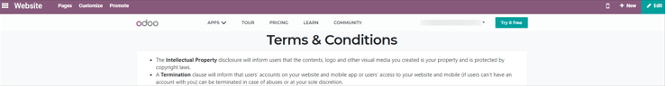

====================
Terms and conditions
====================

Specifying terms and conditions is essential to establish important contractual points, such as
payment terms, limitations of liability, and delivery terms between customers and sellers.

Every seller must declare all formal information concerning products and company policy.
Conversely, each customer must take note of all these conditions before committing to anything.

With Odoo *Sales*, it's very easy to include default terms and conditions on every quotation, sales
order, and invoice.

Default terms and conditions
============================

Configuration
-------------

Go to :menuselection:`Accounting app --> Configuration --> Settings`, scroll to the
:guilabel:`Customer Invoices` heading, and check the box beside the :guilabel:`Default Terms &
Conditions` feature to activate it. Then, click :guilabel:`Save`.

.. image:: terms_and_conditions/terms-conditions-setting.png
   :align: center
   :alt: How to enable Default Terms and Conditions on Odoo Sales.

.. note::
   Please note that this feature is activated via the settings of the *Accounting* app, and **not**
   in the settings of the *Sales* app.

Default terms and conditions on quotations, sales orders, and invoices
----------------------------------------------------------------------

In the settings of the *Accounting* application, after activating the :guilabel:`Default Terms &
Conditions` feature, a field appears beneath the feature. In this field, specific terms and
conditions can be entered.

.. image:: terms_and_conditions/terms-conditions-setting-field.png
   :align: center
   :alt: Default Terms and Conditions on quotation on Odoo Sales.

These specified terms and conditions subsequently appear on every quotation, sales order, and
invoice.

Default terms and conditions on quotation templates
---------------------------------------------------

Default terms and conditions can be applied to quotation templates, as well, depending on the
specific needs of the business. This is useful when various terms and conditions are used within
a company.

First, navigate to the :menuselection:`Sales app --> Configuration --> Quotation Templates` to view
all the quotation templates on the :guilabel:`Quotation Templates` page. From here, either select a
template or create a new one, via the :guilabel:`Create` button.

Once on the desired quotation template form page, click :guilabel:`Edit`, and enter in specific
terms and conditions that should be applied to this quotation template, at the bottom of the
:guilabel:`Lines` tab. Once done, click :guilabel:`Save` to save all changes.

.. image:: terms_and_conditions/terms-conditions-lines-tab.png
   :align: center
   :alt: Add Default Terms and Conditions to quotation templates on Odoo Sales.

.. important::
   Be sure to check out the documentation about quotation templates
   (:doc:`/applications/sales/sales/send_quotations/quote_template`), to better understand the
   nuances involved with each step of this feature.

General terms and conditions
============================

General terms and conditions on a website
-----------------------------------------

Use the Odoo *Website* application to create a general terms and conditions page. To do that, first
navigate to the front-end of the website, via :menuselection:`Website app --> Go to Website`. From
here, click :menuselection:`New + --> Page`, give the terms and conditions page a title in the
pop-up form that appears.

Then, decide if this page should be accessible via the main Website header menu, via the
:guilabel:`Add to menu` toggle in the pop-up, and click :guilabel:`Continue`.

Doing so, reveals a blank page on the website that can be fully customized and edited with Odoo's
drag-and-drop building blocks. Use those building blocks to add the specific terms and conditions
to the page, and click :guilabel:`Save` to save all changes.

Don't forget to publish the page, via the :guilabel:`Unpublished` > :guilabel:`Published` toggle at
the top of the page. Unpublished pages will **not** be accessible to visitors.

Below, is an example of a basic terms and conditions page on an Odoo website:

This terms and conditions page can be placed in the footer of all documents, if necessary. To do
that, access the layout by navigating to :menuselection:`Settings app --> Business Documents
heading`, and clicking :guilabel:`Configure Document Layout` (located beneath :guilabel:`Document
Layout`).

Doing so reveals a :guilabel:`Create your document layout` template pop-up form. On this form, in
the :guilabel:`Footer` field, enter the URL for the terms and conditions page located on the
website. It's good practice to also provide a brief title prefacing the URL, so customers/clients
are aware of what the link leads to when they see it on the footer of documents.

.. image:: terms_and_conditions/terms-conditions-footer-field.png
   :align: center
   :alt: General Terms and Conditions in business documents.

General terms and conditions as email attachments
-------------------------------------------------

Odoo provides the ability to attach an external document, containing general terms and
conditions, when quotations are sent by email to customers.

.. image:: terms_and_conditions/terms-conditions-attach-file.png
   :align: center
   :alt: General Terms and conditions as attachment in emails.

General terms and conditions as attachments in quotation templates
------------------------------------------------------------------

Create and edit email templates to set a default terms and conditions attachment for all quotation
emails sent in the future.

To do so, navigate to :menuselection:`Sales app --> Configuration --> Quotation Templates` and
create a new quotation template  (via the :guilabel:`Create` button), or modify an existing one.

On the desired quotation template form page, click :guilabel:`Edit` and, under the
:guilabel:`Confirmation` tab, there are options to activate an :guilabel:`Online Signature`,
:guilabel:`Online Payment`, as well as a :guilabel:`Confirmation Mail`.

Clicking the :guilabel:`Confirmation Mail` field, reveals a drop-down, from which an email template
can be chosen or created. To create a new email template from here, start typing the title of this
new template, and then select :guilabel:`Create and Edit...`, which reveals a :guilabel:`Create:
Confirmation Mail` pop-up form.

On this pop-up form, customize the email message in a number of different ways, but be sure to
click :guilabel:`Attachments` at the bottom of the :guilabel:`Content` tab to add the desired
terms and conditions attachement to the mailing. Once done, click :guilabel:`Save` to save all
changes.

.. image:: terms_and_conditions/terms-conditions-create-edit.png
   :align: center
   :alt: General Terms and conditions as attachment in quotation templates.

.. seealso::
   - :doc:`/applications/sales/sales/send_quotations/quote_template`
   - :doc:`/applications/sales/sales/send_quotations/get_signature_to_validate`
   - :doc:`/applications/sales/sales/send_quotations/get_paid_to_validate`
