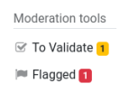
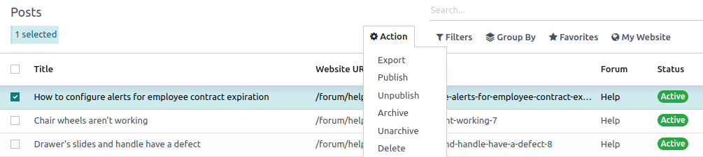

=====
Forum
=====

Odoo Forum enables you to connect with your community, give visitors' websites the information they
need and provide outstanding customer satisfaction.

.. seealso::
   - `Forum <https://www.odoo.com/app/forum>`_
   - `eLearning <https://www.odoo.com/app/elearning>`_
   - :doc:`Website documentation <website>`

Configuration
=============

Forum is not automatically installed with :guilabel:`Website`. To enable it, go to :guilabel:`Apps`,
search :guilabel:`Forum` module, and install it.

.. note::
   You can manage **Forum** on both the **front end** and the **back end**. The **front end** allows
   you to create a new forum quickly from your website, while the **back end** allows you to work
   directly from the app. It gives the same options as the front end, but it also provides access to
   more advanced configurations and allows collaboration.

Front-end forum management
==========================

Forum creation
--------------

From your website, click on :guilabel:`+NEW` and on :guilabel:`Forum` to create a new forum. A new
page pops up. Fill in the following information:

- :guilabel:`Forum Name`: Add the name of your forum;
- :guilabel:`Forum Mode`: Select :guilabel:`Questions` (only one answer allowed) or
  :guilabel:`Discussions` (multiple answers allowed);
- :guilabel:`Privacy`: Select :guilabel:`Public` (your forum is public), :guilabel:`Signed In` (your
  forum is visible for signed in users only), or :guilabel:`Some users` (your forum and its content
  is hidden for non-members of selected group).

Click :guilabel:`SAVE`. Your forum is now created.

.. note::
   You can also create a forum from the :guilabel:`Website` application by going to
   :menuselection:`Website --> Configuration --> Forum: Forums` and clicking :guilabel:`New`.

New post creation
-----------------

Click :guilabel:`New Post` to create a new post and fill in the following information:

- :guilabel:`Title`: Add a title to your question;
- :guilabel:`Description`: Add a description to your question. Type "/" to use a command and open
  the powerbox;
- :guilabel:`Tags`: Add tags to help filter questions and answers related to the same topic.

Click :guilabel:`Post Your Question`. A new window pops up inviting you to share your question on
social networks.

.. tip::
   Most questions posted on social media platforms receive a response within 5 hours. However, if
   the same questions are shared on two different social networks, the chances of obtaining an
   answer are significantly higher.

.. note::
   Only logged-in users can post questions and answer existing ones to avoid one-time participants
   and spam.

Manage your posts
-----------------

Go to your forum to see questions or discussions available.

A menu bar offers several options:

- :guilabel:`Topics`: By default, all topics are displayed;
- :guilabel:`People`: Display the people that created questions/discussions and small statistical
  information related to :guilabel:`XP` (= :ref:`Karma gains <forum/karma-gains>`),
  :guilabel:`Badges`, and :guilabel:`Certifications`;
- :guilabel:`Tags`: See the tags used and retrieve specific questions or discussions that have been
  tagged;
- :guilabel:`Badges`: In addition to building your credibility through your questions and answers,
  you can reward your active contributors with :ref:`badges <forum/badges>` according to their
  participation. Badges are visible on both your profile page and your posts;
- :guilabel:`About`: Provide guidelines to answer any questions users might have.

You can also refine your search by selecting:

- :guilabel:`All`: To display all questions/discussions for this forum;
- :guilabel:`Solved`: To only display solved questions/discussions;
- :guilabel:`Unsolved`: To only display unsolved questions/discussions;
- :guilabel:`Unanswered`: To only display unanswered questions/discussions.

Interacting with posts
----------------------

When a post is created, you can :guilabel:`answer`, :guilabel:`comment` and :guilabel:`share` it on
social networks.

As the creator of the forum, you also have the possibility to :guilabel:`Edit`, :guilabel:`Close`,
:guilabel:`Delete`, :guilabel:`Flag`, or :guilabel:`View Ticket`, by clicking on ⋮.

You can also :guilabel:`Follow` or :guilabel:`Unfollow` a post by clicking the bell.

Moderation tools
----------------

Use the :guilabel:`Moderation tools` :guilabel:`To validate` posts or to see posts that have been
:guilabel:`Flagged`.

.. note::
   You need enough karma points to be able to moderate. The number of karma points required can be
   updated by going to :guilabel:`Karma Related Rights: Moderate posts`.

Back-end forum management
=========================

Go to :menuselection:`Website --> Configuration --> Forum` to access your forum's advanced features:
:ref:`Forums <forum/forums>`, :ref:`Ranks <forum/ranks>`, :ref:`Tags <forum/tags>`, :ref:`Badges
<forum/badges>`, :ref:`Close Reasons <forum/close-reasons>`.

.. _forum/forums:

Forums
------

You can manage your forums by going to :menuselection:`Website --> Configuration --> Forum: Forums`.

Click :guilabel:`New` to create a forum or click an existing one to update it. The following
information must be completed:

- :guilabel:`Forum name`: Add a name to your forum;
- :guilabel:`Website`: Select one of your websites if you want your forum to be restricted to this
  website.

3 tabs are available: :ref:`Options <forum/options>`, :ref:`Karma Gains <forum/karma-gains>`,
:ref:`Karma Related Rights <forum/karma-related-rights>`.

.. _forum/options:

Options
~~~~~~~

From this tab you can set the order and visibility of your website.

- :guilabel:`Default Sort`: Select :guilabel:`Newest`, :guilabel:`Last Updated`,
  :guilabel:`Most Voted`, :guilabel:`Relevance`, :guilabel:`Answered`.

- :guilabel:`Privacy`:

   - :guilabel:`Public`: Forum is public;
   - :guilabel:`Signed in`: Forum is visible for signed in users;
   - :guilabel:`Some users`: Forum and their content are hidden for non members of selected group.

You also have the possibility to add a short :guilabel:`Description visible on your website`
dashboard.

.. _forum/karma-gains:

Karma gains
~~~~~~~~~~~

Karma points are given to your forum's active participants to keep them involved and provide them
access to new functionalities like voting, commenting, and editing when they reach a certain Karma
level.

.. note::
   The number of points is set by default. You can modify it by clicking on it. Each new user
   automatically receives three points when their e-mail address is validated.

.. tip::
   If you have the **eLearning** app, completing quizzes can grant you points.

.. _forum/karma-related-rights:

Karma related rights
~~~~~~~~~~~~~~~~~~~~

Go to the :guilabel:`Karma Related Rights` tab to set up a moderation system with Karma points to
give your most active members access to more functionalities and to reduce spamming messages. Click
on a number to edit it.

Get details on your forum's existing posts by clicking on the :guilabel:`Posts` smart button. Select
a post and click the :guilabel:`Action` button to :guilabel:`Export`, :guilabel:`Publish`,
:guilabel:`Unpublish`, :guilabel:`Archive`, :guilabel:`Unarchive` or :guilabel:`Delete` a specific
post.

.. _forum/ranks:

Ranks
-----

You can manage :guilabel:`Ranks` by going to :menuselection:`Website --> Configuration --> Forum:
Ranks`. Click :guilabel:`New` to create a new rank. Fill in the :guilabel:`Rank Name`, add the
:guilabel:`Required Karma`, a :guilabel:`Description` and if you want, fill in the
:guilabel:`Motivational` tab to encourage your users.

.. _forum/tags:

Tags
----

:guilabel:`Tags` can be managed by going to :menuselection:`Website --> Configuration --> Forum:
Tags`. Click :guilabel:`New` to create a new tag, and select the :guilabel:`Forum` it is related to.

.. _forum/badges:

Badges
------

Grant badges to your members for their questions, answers, shares, likes, and votes to reward the
most active ones. Badges appear on your profile page and your posts. You can manage badges by going
to :menuselection:`Website --> Configuration --> Forum: Badges`.

.. _forum/close-reasons:

Close Reasons
-------------

By going to :menuselection:`Website --> Configuration --> Forum: Close Reasons`, you retrieve your
posts close reasons. You can close a post directly from the question or discussion, by clicking on
the ⋮, and :guilabel:`Close`.
