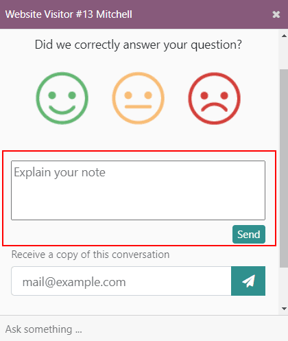
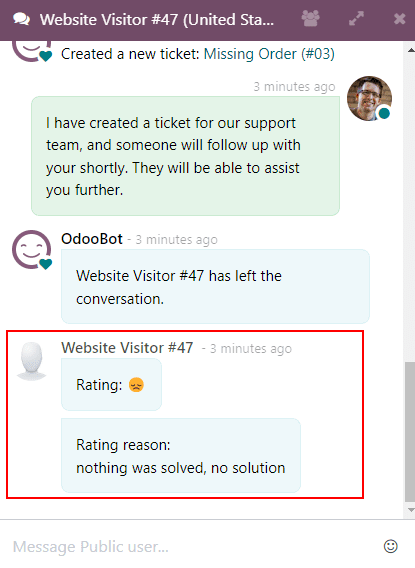
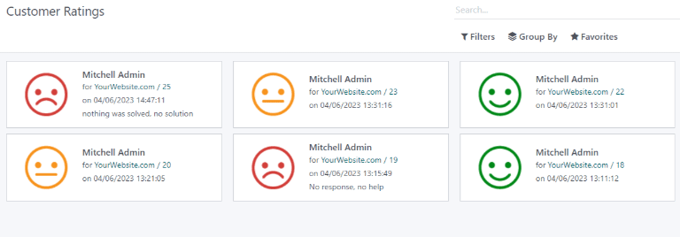
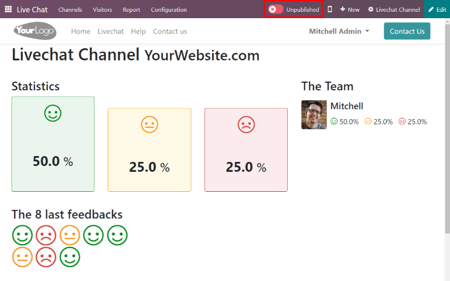
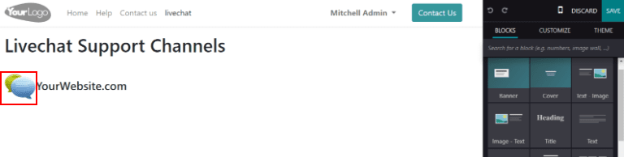
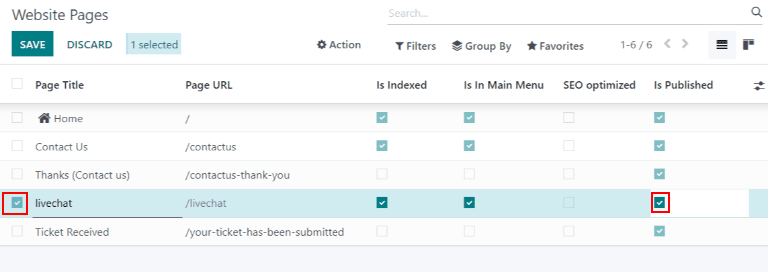
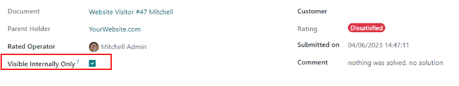

=======
Ratings
=======

At the end of a *Live Chat* conversation, customers have the opportunity to rate the quality of
service they have received from the live chat *operators*. This rating, which is delivered directly
through the chat window, allows operators to receive immediate feedback on their performance. It
also allows customers the chance to share any final comments before closing the conversation.

Rate live chat conversations
============================

Customers end a *live chat* conversation by clicking the :guilabel:`X` in the upper right hand
corner of the chat window. At that point, the chat window will be replaced with a text bubble,
that reads- *Did we correctly answer your question?*. This question is followed by three colored
icons, which represent the following ratings:

 - *Green smiling face* - Satisfied
 - *Yellow neutral face* - Okay
 - *Red frowning face* - Dissatisfied

.. image:: ratings/live-chat-ratings-faces.png
   :align: center
   :alt: View of the chat window from a user's side for Odoo Live Chat.

.. note::
  When customers end a conversation, a field with the note :guilabel:`Receive a copy of this
  conversation` appears under the *ratings* icons. Customers can enter their email either before or
  after they submit a rating.

If the customer selects :guilabel:`Satisfied` (*Green smiling face*), they are presented with a
thank you message, and a link to :guilabel:`Close the Conversation`.

If the customer selects either :guilabel:`Okay` (*Yellow neutral face*) or :guilabel:`Dissatisfied`
(*Red frowning face*), a text box will appear. Customers can add any comments in this text box to
explain why they chose this rating.

This message will be sent to the live chat operator, along with the rating icon.

It can also be viewed in the :guilabel:`Customer Ratings` report which can be found under
:menuselection:`Live Chat --> Report --> Customer Ratings`.

Publish customer ratings
========================

After a customer rating has been submitted, it can then be published to the website. Ratings are
broken down by channel, and individual operator (if applicable).

.. note::
   The customer notes that accompany the rating are *not* published to the website, they are kept
   internal. Only a statistical overview of the performance of operators for the *channel*.

To publish a channel's ratings on the website, first navigate to a live chat channel's record by
going to the :menuselection:`Live Chat` app and clicking on the kanban card for that team. Then
click on the :guilabel:`Go to Website` smart button. This will open the :guilabel:`Live Chat
Channel Statistics` page.

In the upper right corner of the page, click the red :guilabel:`Unpublished` slider so that it
reads :guilabel:`Published`.

Add ratings page to site
------------------------

Once the ratings page has been published, it has to be added to the website. To do this, go to
:menuselection:`Dashboard --> Website --> Site --> Pages --> New`.

This will open a :guilabel:`New Page` window. In the :guilabel:`Page Title` field, enter
`livechat`. Click :guilabel:`Create`.

.. important::
   The page *must* be named `livechat` in order for the database to recognize and connect the
   ratings page. The page title can be changed later under the :guilabel:`Menu Editor` .

The newly created webpage will open, with the :guilabel:`Webpage Editor` open in the right panel.
The page will list out the names of the :guilabel:`Live Chat Channels` whose ratings pages have
been published. Next to the channel name is a speech bubble icon, which when click will take the
visitor to the ratings page.

Make any desired changes or additions to this page, then click save on the :guilabel:`Webpage
Editor`.

To publish the `livechat` webpage, return to the list of webpages by navigating to
:menuselection:`Site --> Pages`. Click the checkbox to the left of `livechat` in the list of pages
to select the page. Then, click the checkbox under the column labeled :guilabel:`Is Published`.
Then click :guilabel:`Save`.

Hide individual ratings
-----------------------

Ratings are set to be published by default. However, individual ratings can be manually selected to
be hidden from the public. The rating will still be included in internal reports, and can still be
viewed by internal teams. However, public website visitors and portal users will not have access.

To hide a rating, first go to :menuselection:`Live Chat --> Reports --> Customer Ratings`. Click on
the kanban card for a rating to be hidden. On the rating's detail page, check the box labeled
:guilabel:`Visible Internally Only`.

.. seealso::
   - :doc:`get_started`
   - :doc:`responses`
